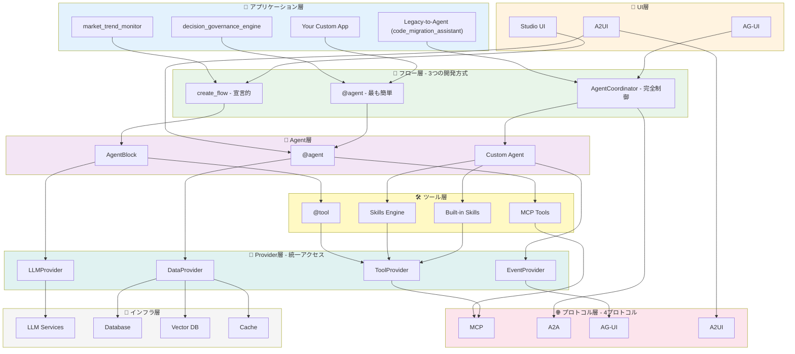
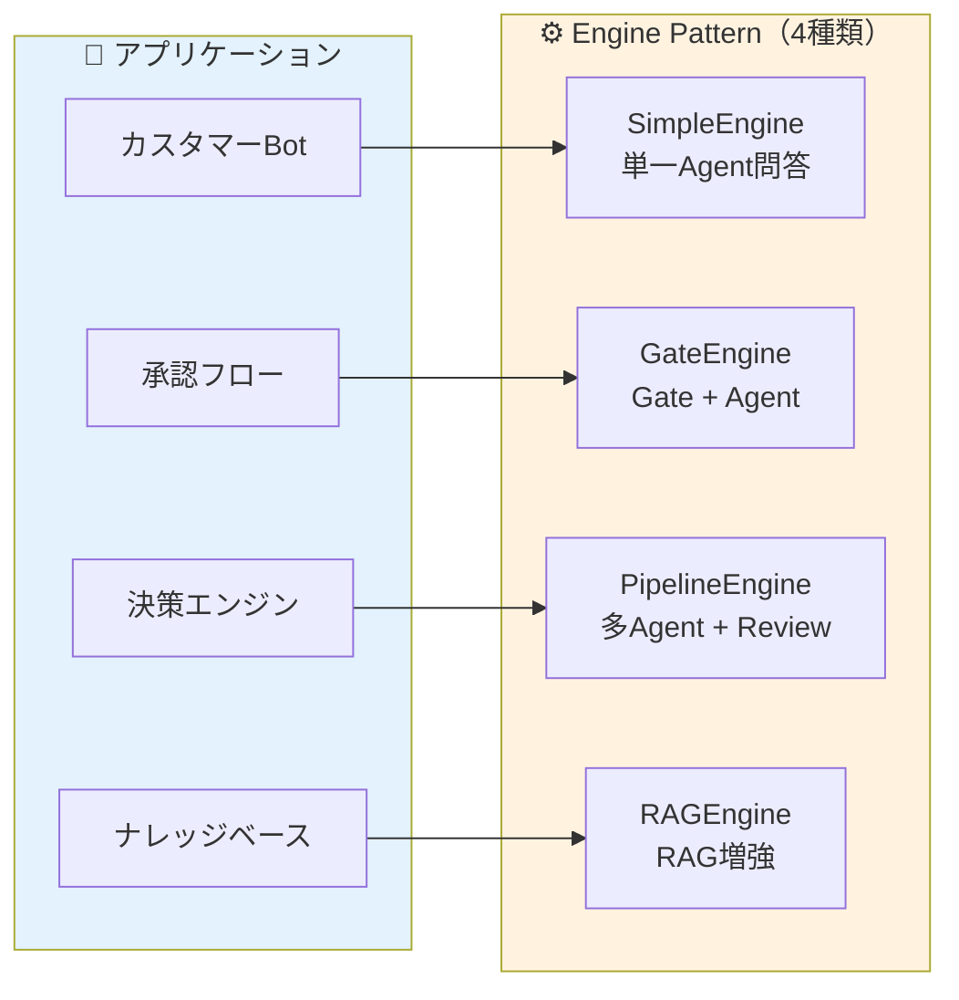

# AgentFlow

<div align="center">

**軽量 AI エージェント開発フレームワーク**

_PocketFlow ベースの統一プロトコルインターフェース_

[](https://www.python.org/downloads/)
[](tests/)
[](htmlcov/)
[](LICENSE)
[](https://github.com/astral-sh/ruff)

[ドキュメント](docs/) | [サンプル](examples/) | [貢献ガイド](CONTRIBUTING.md)

**Languages**: [English](README_EN.md) | [简体中文](README_ZH.md) | 日本語

</div>

---

## ⚠️ プロジェクトステータス

> **注意**: このプロジェクトは現在開発中です。
>
> - ✅ **自動テスト**: 434 テスト、92.46% カバレッジ
> - 🚧 **本番環境**: 使用前に十分なテストを実施してください

---

## 🎯 AgentFlow とは

**MCP / A2A / AG-UI / A2UI** の 4 プロトコルを統一インターフェースで提供する軽量 AI エージェントフレームワーク。

### 🏗️ フレームワークアーキテクチャ

AgentFlow は **8層アーキテクチャ** で構成され、各層が明確に分離されています。



**レイヤー詳細説明**:

| レイヤー | 主要コンポーネント | 役割 | 選択基準 |
|---------|-----------------|------|---------|
| 📱 **アプリケーション層** | decision_governance_engine, market_trend_monitor, code_migration_assistant (Legacy-to-Agent) | 実際のビジネスアプリケーション | ビジネス要件に応じて選択 |
| 🎨 **UI層** | Studio UI, A2UI, AG-UI | ビジュアルエディタ、宣言式UI生成、リアルタイム進捗表示 | ユーザー体験要件に応じて選択 |
| 🔄 **フロー層** | @agent, create_flow, AgentCoordinator | **3つの開発方式**（簡単→複雑） | 複雑度に応じて選択 |
| 🤖 **Agent層** | AgentBlock, @agent, Custom Agent | Agent実装（基底クラス/デコレータ/カスタム） | 実装方式に応じて選択 |
| 🛠️ **ツール層** | @tool, MCP Tools, Skills, Built-in | ツール統合（メソッド/MCP/自動進化/内蔵） | 機能要件に応じて選択 |
| 🔌 **Provider層** | LLMProvider, DataProvider, EventProvider, ToolProvider | **統一アクセスインターフェース**（約定優先） | 自動選択（デフォルト値あり） |
| 🌐 **プロトコル層** | MCP, A2A, AG-UI, A2UI | 4つの標準プロトコル | 統合要件に応じて自動適用 |
| 💾 **インフラ層** | LLM Services, DB, Vector DB, Cache | 外部サービス・データストア | 環境変数で自動検出 |

**データフロー例**:

```
ユーザーリクエスト
  ↓
アプリケーション層（decision_governance_engine）
  ↓
フロー層（create_flow）
  ↓
Agent層（GatekeeperAgent → DaoAgent → ...）
  ↓
ツール層（@tool / MCP / Skills）
  ↓
Provider層（LLMProvider / DataProvider）
  ↓
インフラ層（OpenAI / PostgreSQL）
  ↓
結果を返す
```

### 🔧 Core Interface Layer（v0.4.0 NEW）

AgentFlow v0.4.0 では、安定した **Core Interface Layer** を導入しました。
Studio / CLI / SDK / API 全ての消費者が統一されたインターフェースを通じてコア機能にアクセスします。

```
┌─────────────────────────────────────────────────────────────────┐
│                    Consumer Layer（消費者層）                    │
│  ┌──────────┐   ┌──────────┐   ┌──────────┐   ┌──────────┐     │
│  │ Studio   │   │   CLI    │   │   SDK    │   │   API    │     │
│  │  (UI)    │   │(Command) │   │   (TS)   │   │ (REST)   │     │
│  └────┬─────┘   └────┬─────┘   └────┬─────┘   └────┬─────┘     │
└───────┼──────────────┼──────────────┼──────────────┼───────────┘
        │              │              │              │
        └──────────────┴──────┬───────┴──────────────┘
                              │
                              ▼
┌─────────────────────────────────────────────────────────────────┐
│                    Services Layer（サービス層）                  │
│                    agentflow/services/                          │
│  ┌────────────────────────┐   ┌────────────────────────┐       │
│  │    PublishService      │   │    PreviewService      │       │
│  │ ・generate_code()      │   │ ・run()                │       │
│  │ ・preview_code()       │   │ ・run_stream()         │       │
│  │ ・export_zip()         │   │ ・run_debug()          │       │
│  │ ・deploy()             │   │ ・validate()           │       │
│  │ ・publish()            │   │                        │       │
│  └────────────────────────┘   └────────────────────────┘       │
└─────────────────────────────────┬───────────────────────────────┘
                                  │
                                  ▼
┌─────────────────────────────────────────────────────────────────┐
│                Core Interface Layer（核心接口層・安定）          │
│                agentflow/core/interfaces/                       │
│  ┌────────────────┐  ┌────────────────┐  ┌────────────────┐    │
│  │ ICodeGenerator │  │IDeployExecutor │  │IWorkflowRunner │    │
│  │   Protocol     │  │   Protocol     │  │   Protocol     │    │
│  └────────────────┘  └────────────────┘  └────────────────┘    │
│  ┌────────────────┐  ┌────────────────┐                        │
│  │ IConfigManager │  │ Types/Enums    │                        │
│  │   Protocol     │  │                │                        │
│  └────────────────┘  └────────────────┘                        │
└─────────────────────────────────┬───────────────────────────────┘
                                  │
                                  ▼
┌─────────────────────────────────────────────────────────────────┐
│                Implementation Layer（実装層）                    │
│  ┌─────────────┐   ┌─────────────┐   ┌─────────────┐          │
│  │  codegen/   │   │   deploy/   │   │    flow/    │          │
│  │ CodeGenerator│   │DeployExecutor│   │FlowExecutor │          │
│  └─────────────┘   └─────────────┘   └─────────────┘          │
└─────────────────────────────────────────────────────────────────┘
```

#### 核心インターフェース一覧

| インターフェース | 場所 | 説明 | 主要メソッド |
|-----------------|------|------|-------------|
| **ICodeGenerator** | `core/interfaces/code_generator.py` | ワークフロー→コード生成 | `generate()`, `preview()`, `export_zip()` |
| **IDeployExecutor** | `core/interfaces/deploy_executor.py` | コード→デプロイ実行 | `deploy()`, `deploy_sync()`, `validate_config()` |
| **IConfigManager** | `core/interfaces/config_manager.py` | 設定テンプレート管理 | `get_template()`, `get_required_fields()`, `validate()` |
| **IWorkflowRunner** | `core/interfaces/workflow_runner.py` | ワークフロー実行 | `run()`, `run_stream()`, `run_debug()` |

#### 核心データ型

| 型 | 説明 |
|----|------|
| `WorkflowDefinition` | Studio保存形式のワークフロー定義 |
| `CodeOutputType` | 出力タイプ（FRONTEND / BACKEND / FULLSTACK） |
| `DeployTarget` | デプロイ先（VERCEL / DOCKER / AWS_LAMBDA / GITHUB_ACTIONS） |
| `GeneratedCode` | 生成されたコード（files, entry_point, commands） |
| `DeployConfig` | デプロイ設定（credentials, settings, env_vars） |
| `ConfigField` | UI用設定フィールド（name, type, required, options） |

#### 実装クラス一覧

| 実装クラス | 場所 | 実装インターフェース | 説明 |
|-----------|------|---------------------|------|
| **CodeGenerator** | `agentflow/codegen/generator.py` | `ICodeGenerator` | コード生成器 |
| **BackendBuilder** | `agentflow/codegen/builders/backend.py` | - | FastAPI バックエンド生成 |
| **FrontendBuilder** | `agentflow/codegen/builders/frontend.py` | - | React フロントエンド生成 |
| **FullstackBuilder** | `agentflow/codegen/builders/fullstack.py` | - | 全栈アプリ生成 |
| **DeployExecutor** | `agentflow/deploy/executor.py` | `IDeployExecutor` | デプロイ統合実行器 |
| **VercelTarget** | `agentflow/deploy/targets/vercel.py` | `BaseDeployTarget` | Vercel デプロイ |
| **DockerTarget** | `agentflow/deploy/targets/docker.py` | `BaseDeployTarget` | Docker ビルド＆プッシュ |
| **AWSLambdaTarget** | `agentflow/deploy/targets/aws_lambda.py` | `BaseDeployTarget` | AWS Lambda デプロイ |
| **GitHubActionsTarget** | `agentflow/deploy/targets/github_actions.py` | `BaseDeployTarget` | CI/CD ワークフロー生成 |
| **ConfigManager** | `agentflow/deploy/config/manager.py` | `IConfigManager` | 設定テンプレート管理 |
| **PreviewService** | `agentflow/services/preview_service.py` | `IWorkflowRunner` | プレビュー実行サービス |
| **PublishService** | `agentflow/services/publish_service.py` | - | 統一発布サービス |

#### 使用例

```python
from agentflow.services import PublishService, PreviewService
from agentflow.core.interfaces import CodeOutputType, DeployTarget

# PublishService - コード生成＆デプロイ
publish = PublishService()

# コード生成
code = await publish.generate_code(workflow, CodeOutputType.FULLSTACK)

# ZIP エクスポート
zip_buffer = await publish.export_zip(workflow, CodeOutputType.BACKEND)

# デプロイ（ストリーム）
async for event in publish.deploy(code, DeployTarget.VERCEL, config):
    print(f"{event.progress}%: {event.message}")

# PreviewService - ワークフロー実行
preview = PreviewService()

# ストリーム実行
async for event in preview.run_stream(workflow, inputs):
    print(f"{event.type}: {event.message}")

# デバッグ実行
async for event in preview.run_debug(workflow, inputs, breakpoints=["node-1"]):
    if event.breakpoint_hit:
        print(f"Variables: {event.variables}")
```

#### Studio API エンドポイント

| エンドポイント | メソッド | 説明 |
|---------------|---------|------|
| `/api/preview/run` | POST | ワークフロー同期実行 |
| `/api/preview/stream` | POST | ワークフローSSE実行 |
| `/api/publish/export` | POST | ZIP エクスポート |
| `/api/publish/preview` | POST | 生成コードプレビュー |
| `/api/publish/deploy` | POST | 同期デプロイ |
| `/api/publish/deploy/stream` | POST | SSE デプロイ |
| `/api/publish/targets` | GET | サポートターゲット一覧 |
| `/api/publish/config-fields/{target}` | GET | 動的設定フィールド |

---

### ✨ 主な特徴

| 特徴 | 説明 |
|------|------|
| 🚀 **軽量** | コアコード ~500 行 |
| 🎯 **@agent デコレータ** | 1行でAgent定義、設定ゼロ (v0.2.0 NEW) |
| 🔧 **統一Provider** | LLM/Tool/Data/Eventの統一アクセス (v0.2.0 NEW) |
| 🔌 **4 プロトコル** | MCP / A2A / AG-UI / A2UI 統合 |
| 💬 **Channels** | Telegram/Slack/Discord 多平台統合 (v1.1.0 NEW) |
| 🎨 **自動アダプター** | `@auto_adapt` でプロトコル自動変換 |
| 🧠 **Skills 自動進化** | 使うほど強くなる |
| 📦 **CLI** | `agentflow init/run/create` |
| 🔒 **型安全** | 100% 型アノテーション |
| ⚡ **非同期** | 完全非同期 I/O |
| 🤖 **Auto-Agent** | 統一ツール・Agentレジストリ、能力ベースマッチング、Skills統合 (v1.8.1 NEW) |

### 🤖 Auto-Agent + Skills 統合（v1.8.1 NEW）

統一ツール・Agentレジストリを通じた、能力ベースの自動Agent選択システム：

```
タスク要件 → AgentRegistry検索 → 最適Agent選択 → ツール自動バインド → 実行
```

```python
from agentflow import agent
from agentflow.engines import SimpleEngine
from agentflow.core.tool_discovery import ToolDiscoveryService
from agentflow.core.tool_registry import get_global_tool_registry

# Step 1: Skills を自動発見してツールとして登録
service = ToolDiscoveryService(get_global_tool_registry())
await service.discover_skills_from_engine()  # ビルトインスキルを自動発見

# Step 2: @agent でAgent定義（AgentRegistry に自動登録）
@agent(skills=["rag", "chatbot"])
class MyAgent:
    """RAG と Chatbot スキルを使用する Agent."""
    system_prompt = "あなたは親切なアシスタントです"

# Step 3: SimpleEngine で実行（スキルを自動バインド）
engine = SimpleEngine(agent=MyAgent, skills=["rag"])
result = await engine.run({"query": "質問"})
```

**Skills の探索パス（現在の正規構成）:**
```
agentflow/skills/builtin/      # フレームワーク提供スキル
~/.agentflow/skills/           # ユーザー定義スキル（ローカル）
apps/*/skills/                 # アプリ固有スキル
```

詳細は [Auto-Agent アーキテクチャ](docs/auto-agent-architecture.md) を参照。

### 🎯 Skills 自動進化システム（NEW）

Claude Code Skills 完全互換の自動進化能力システム：

```
ユーザー要求 → スキルマッチング → 存在すれば実行
                               → 存在しなければ自動生成 → 検証 → 固化
= 使うほど強くなる
```

```python
from agentflow.skills import SkillEngine

engine = SkillEngine(auto_learn=True)
result = await engine.resolve("PDFからテキストを抽出")

if result.generated:
    print(f"🆕 新スキル自動生成: {result.skill.name}")
```

詳細は [Skills ガイド](docs/guide-skills.md) を参照。

### 💬 Channels - 多平台メッセージ統合（v1.1.0 NEW）

類似 [moltbot](https://github.com/moltbot/moltbot) の多平台 AI チャットボット機能：

```python
from agentflow.channels import MessageGateway, TelegramAdapter
from agentflow import ChatBotSkill, WebSocketHub

# 統一ゲートウェイ
hub = WebSocketHub()
chatbot = ChatBotSkill()
gateway = MessageGateway(hub, chatbot)

# プラットフォーム登録
gateway.register_channel("telegram", TelegramAdapter(token=TOKEN))
gateway.register_channel("slack", SlackAdapter(token=TOKEN))
gateway.register_channel("discord", DiscordAdapter(token=TOKEN))

# メッセージルーティング: Platform → Agent → Platform
response = await gateway.route_message("telegram", "user_123", "Hello")
```

**対応プラットフォーム**:
- ✅ Telegram (webhook + polling)
- ✅ Slack (Event API + Block Kit)
- ✅ Discord (Gateway + Embeds)
- 🔜 WhatsApp, Teams, Signal（拡張可能）

詳細は [Channels ガイド](docs/channels.md) | [Messaging Hub サンプル](apps/messaging_hub/) を参照。

### 🤖 LLM プロバイダー（松耦合設計）

**設計原則**: Agent/サービスは具体的なプロバイダー・モデルを知る必要がありません。
環境変数からAPIキーを設定するだけで自動検出されます。

| プロバイダー | 環境変数 | 対応モデル |
|-------------|---------|-----------|
| **OpenAI** | `OPENAI_API_KEY` | GPT-4o, o1, o3-mini, GPT-4o-realtime（音声） |
| **Anthropic** | `ANTHROPIC_API_KEY` | Claude 3.5 Sonnet/Haiku, Claude 4（予定） |
| **Google** | `GOOGLE_API_KEY` | Gemini 2.0 Flash, Gemini 1.5 Pro（200万トークン） |
| **DeepSeek** | `DEEPSEEK_API_KEY` | DeepSeek V3, DeepSeek R1（推論） |
| **Ollama** | `OLLAMA_BASE_URL` | Llama 3.3, Qwen 2.5, Mistral Large（ローカル） |
| **LocalAI** | `LOCALAI_BASE_URL` | 任意のGGUF/GGML（ローカル・デフォルト） |

### 🧭 Platform Runtime（マルチテナント向け）

AgentFlow はプラットフォーム運用を前提に、**明示的な初期化**と**実行コンテキスト**を提供します。

```python
from agentflow import init_agentflow, RuntimeContext, use_runtime_context, get_llm
from agentflow.config import AgentFlowSettings

# 1) 明示的に初期化（.env 読み込みは任意）
init_agentflow(load_env=True)

# 2) テナントごとの設定を作成
tenant_settings = AgentFlowSettings(openai_api_key="sk-...", openai_model="gpt-4o")
ctx = RuntimeContext(tenant_id="tenant-001", settings=tenant_settings)

# 3) コンテキスト内で実行
with use_runtime_context(ctx):
    llm = get_llm(context=ctx)
    response = await llm.chat([{"role": "user", "content": "hello"}])
```

詳細は `docs/ja/PLATFORM_RUNTIME_GUIDE.md` を参照してください。

```python
# ✅ 推奨: get_llm() 松耦合 API
from agentflow import get_llm

# プロバイダー/モデル不明でOK - 環境変数から自動検出
llm = get_llm()
response = await llm.chat([{"role": "user", "content": "Hello!"}])
print(response["content"])

# Agent 内での使用例
class MyAgent(AgentBlock):
    async def run(self, input_data):
        llm = get_llm(temperature=0.3)  # 分析タスク向け低温度
        result = await llm.chat([{"role": "user", "content": "..."}])
        return result["content"]

# ストリーミング
llm = get_llm()
async for chunk in llm.stream([{"role": "user", "content": "..."}]):
    print(chunk, end="", flush=True)

# 高度なルーティング（コスト最適化・フォールバック）
from agentflow.llm import create_router_from_env
router = create_router_from_env()  # 複数プロバイダー自動管理
```

### 🗄️ データベース（松耦合設計）

**設計原則**: Agent/サービスは具体的なDB実装を知る必要がありません。

| データベース | 環境変数 | 特徴 |
|-------------|---------|------|
| **Supabase** | `SUPABASE_URL` + `SUPABASE_KEY` | RLS、リアルタイム、500MB無料 |
| **PostgreSQL** | `DATABASE_URL` | 汎用、SSL対応 |
| **Turso** | `TURSO_URL` + `TURSO_AUTH_TOKEN` | エッジ対応、9GB無料 |

```python
# ✅ 推奨: get_db() 松耦合 API
from agentflow import get_db

# プロバイダー/接続情報不明でOK - 環境変数から自動検出
db = get_db()
await db.connect()

# CRUD 操作
users = await db.select("users", filters={"status": "active"})
new_user = await db.insert("users", {"email": "test@example.com"})
await db.update("users", {"name": "Updated"}, filters={"id": 1})
await db.delete("users", filters={"id": 1})
```

### 🔍 ベクトルDB & Embedding（松耦合設計）

| サービス | 環境変数 | 用途 |
|----------|---------|------|
| **Pinecone** | `PINECONE_API_KEY` | クラウドベクトルDB |
| **Qdrant** | `QDRANT_URL` | セルフホストベクトルDB |
| **ChromaDB** | `CHROMA_PERSIST_DIR` | ローカルベクトルDB |
| **OpenAI Embedding** | `OPENAI_API_KEY` | text-embedding-3-small |
| **SentenceTransformer** | `USE_LOCAL_EMBEDDING` | ローカル埋め込み |

```python
# ✅ 推奨: get_vectordb() / get_embedding() 松耦合 API
from agentflow import get_vectordb, get_embedding

# VectorDB（Pinecone/Qdrant/ChromaDB 自動検出）
vdb = get_vectordb()
await vdb.connect()
await vdb.add(["doc1", "doc2"], ids=["1", "2"])
results = await vdb.search("query text", top_k=5)

# Embedding（OpenAI/SentenceTransformer 自動検出）
emb = get_embedding()
vector = await emb.embed_text("Hello world")
vectors = await emb.embed_batch(["text1", "text2"])
```

### 🏗️ 内蔵 Production-Ready Skills

| スキル | 説明 | 対応サービス |
|--------|------|------------|
| 🗄️ **database-manager** | DB統合管理、CRUD、RLS | Supabase / Turso / PostgreSQL |
| 💳 **stripe-payment** | 決済・サブスク管理 | Stripe Checkout / Billing |
| 🚀 **deployment-manager** | デプロイ・環境管理 | Vercel / Cloudflare Pages |
| 🔐 **auth-provider** | 認証・セッション管理 | Supabase Auth / Clerk |
| 🔄 **model-router** | 複数LLM切替・コスト最適化 | 全プロバイダー対応 |

詳細は [内蔵 Skills ガイド](docs/guide-builtin-skills.md) を参照。

### 🧠 協調パターン

| パターン | 説明 |
|---------|------|
| **Supervisor** | 監督者が動的にワーカー選択 |
| **Hierarchical** | 階層的タスク分解 |
| **Sequential/Concurrent** | 順次/並行実行 |

## 📦 インストール

### 前提条件

| 要件 | バージョン | 確認コマンド |
|------|-----------|-------------|
| **Python** | 3.13+ | `python --version` |
| **pip** | 最新 | `pip --version` |
| **Node.js** | 18+ (Studio UI 使用時) | `node --version` |
| **Git** | 最新 | `git --version` |

### フレームワークのインストール

```bash
# 1. リポジトリをクローン
git clone https://github.com/your-org/agentflow.git
cd agentflow

# 2. Python 環境を作成（Conda 推奨）
conda create -n agentflow python=3.13 -y
conda activate agentflow

# 3. フレームワークをインストール
pip install -e ".[dev]"

# 4. インストール確認
python -c "import agentflow; print(agentflow.__version__)"
```

### オプション: Studio UI（フロントエンド）

```bash
# フロントエンド依存関係をインストール
cd studio && npm install

# 開発サーバー起動
npm run dev  # http://localhost:5173
```

### Studio のパス区分（重要）

`studio/` と `agentflow/studio/` は役割が異なります。

| パス | 役割 | 主な機能 |
|------|------|---------|
| `studio/` | Studio フロントエンド (React/Vite) | 画面描画、ノード編集、API/WebSocket クライアント |
| `agentflow/studio/` | Studio バックエンド (FastAPI) | `/api` ルーター、ワークフロー保存、プレビュー/公開API |

### オプション: 追加機能

```bash
# Memvid 高性能長期記憶
pip install -e ".[dev,memvid]"

# 全機能
pip install -e ".[dev,memvid,channels]"
```

### 環境変数設定

```bash
# .env ファイルを作成（.env.example からコピー）
cp .env.example .env

# 最低限必要な設定
OPENAI_API_KEY=               # または ANTHROPIC_API_KEY

# 長期知識記憶（任意）
# - 保存先はカレントディレクトリ相対（デフォルト: memory/knowledge）
# - 設定は環境変数/.env で変更（プロセス再起動推奨）
# KNOWLEDGE_BACKEND=auto        # auto/memvid/memory
# KNOWLEDGE_STORAGE_PATH=memory/knowledge
# KNOWLEDGE_AUTO_PERSIST=true
```

---

## 🚀 クイックスタート

AgentFlow は **3つの開発方式** を提供します。用途に応じて最適な方法を選択してください。

### 方式1: @agent デコレータ（最も簡単・推奨）

**特徴**: 設定ゼロ、1行でAgent定義、すぐに使える

```python
from agentflow import agent, tool, AgentClient

@agent  # デコレータ一つでAgent定義
class QAAgent:
    """質問応答Agent - 設定ゼロで動作"""
    
    system_prompt = "あなたは親切なアシスタントです"
    
    @tool  # ツールを自動登録
    def search_database(self, query: str) -> list:
        """DBを検索"""
        return []  # 実際のDB検索

# 呼び出し（同期）
result = await AgentClient.get("QAAgent").invoke({"question": "..."})

# ストリーム（SSE）
async for chunk in AgentClient.get("QAAgent").stream({"question": "..."}):
    print(chunk)
```

**適用シーン**: 
- ✅ 単一Agentの簡単なタスク
- ✅ プロトタイプ開発
- ✅ クイックスタート

---

### 方式2: create_flow（複数Agent協調 - チェーンビルダー）

**特徴**: 宣言的チェーンAPI、Gate/Review/並行実行、REVISE回退、進捗追跡

```python
from agentflow import create_flow

# 複雑なワークフロー（Gate + Review + REVISE）
flow = (
    create_flow("decision-engine")
    .gate(GatekeeperAgent, check=lambda r: r["is_acceptable"])  # 条件分岐
    .then(ClarificationAgent)                                     # 順次実行
    .then(DaoAgent, FaAgent, ShuAgent, QiAgent, ids=["dao", "fa", "shu", "qi"])
    .review(
        ReviewAgent,
        retry_from="dao",      # REVISE時はdaoに回退
        max_revisions=2,       # 最大2回修正
        on_pass=lambda ctx: generate_report(ctx)
    )
    .build()
)

# 同期実行
result = await flow.run({"question": "新規事業AとBのどちらに投資すべきか"})

# SSEストリーム（進捗付き）
async for event in flow.run_stream({"question": "..."}):
    print(f"{event['type']}: {event.get('node_name', '')}")
    # flow_start → node_start → node_complete → ... → flow_complete

# 記憶システム
flow.memory.remember("key", "value")
value = flow.memory.recall("key")
```

**適用シーン**:
- ✅ 複数Agentの協調処理（Gate→Agent→Review）
- ✅ 条件分岐が必要なワークフロー
- ✅ 審査・回退ロジックが必要な場合
- ✅ SSE進捗表示が必要な場合

---

### 方式3: AgentCoordinator（完全制御）

**特徴**: 最大の柔軟性、カスタムロジック、高度な制御

```python
from agentflow.patterns.multi_agent import AgentCoordinator, SharedContext
from agentflow.patterns.supervisor import SupervisorCoordinator

# Sequential協調
coordinator = AgentCoordinator(
    agents=[Agent1(), Agent2(), Agent3()],
    pattern="sequential",
    shared_context=SharedContext(enable_memory=True)
)
result = await coordinator.execute({"task": "..."})

# Supervisorパターン（動的選択）
supervisor = SupervisorCoordinator(
    supervisor=SupervisorAgent(),
    workers={
        "research": ResearchAgent(),
        "write": WriteAgent(),
        "review": ReviewAgent(),
    },
    max_iterations=10
)
result = await supervisor.execute("タスク")
```

**適用シーン**:
- ✅ 複雑なビジネスロジック
- ✅ カスタム協調パターン
- ✅ エンタープライズ級アプリケーション

---

### 方式4: Engine Pattern（配置即用・NEW）

**特徴**: 4種類の予定義パターン、配置だけで使用可能、90%のAIアプリシーンをカバー



#### 4種類のEngine Pattern

| Pattern | 適用シーン | フロー構造 |
|---------|-----------|-----------|
| **SimpleEngine** | 単一Agent問答、ChatBot | Agent → Response |
| **GateEngine** | 権限チェック、コンプライアンス | Gate → Agent → Response |
| **PipelineEngine** | 多ステップ審査、決策フロー | Gate → [Agents] → Review → Report |
| **RAGEngine** | ナレッジベース、文書QA | RAG検索 → Agent → Response |

#### 使用例

```python
from agentflow.engines import SimpleEngine, GateEngine, PipelineEngine, RAGEngine

# 1. SimpleEngine - 最もシンプル
engine = SimpleEngine(agent=QAAgent)
result = await engine.run({"question": "こんにちは"})

# 2. GateEngine - 前置チェック付き
engine = GateEngine(
    gate_agent=ComplianceChecker,
    main_agent=ApprovalAgent,
    gate_check=lambda r: r.get("compliant", False),
)

# 3. PipelineEngine - 複雑なフロー
engine = PipelineEngine(
    stages=[
        {"name": "gate", "agent": GatekeeperAgent, "gate": True},
        {"name": "analysis", "agents": [DaoAgent, FaAgent, ShuAgent], "parallel": True},
        {"name": "review", "agent": ReviewAgent, "review": True, "retry_from": "analysis"},
    ],
    max_revisions=2,
    report_generator=my_report_generator,
)

# 4. RAGEngine - ナレッジベース増強
engine = RAGEngine(
    agent=KnowledgeAgent,
    vector_store="company_docs",
    top_k=5,
)

# 共通API: run() / run_stream()
result = await engine.run(inputs)
async for event in engine.run_stream(inputs):
    print(event)  # AG-UI イベント
```

**適用シーン**:
- ✅ 高速プロトタイプ開発
- ✅ 標準パターンの再利用
- ✅ 配置ベースのAIアプリ構築

---

詳細は [クイックスタート](docs/quickstart.md) を参照。

---

## 🎨 使用シナリオ

AgentFlow は3つの操作方法を提供します。用途に応じて最適な方法を選択してください。

### 1. 🖱️ Studio UI（ビジュアルエディタ）

**コードを書かずに、ブラウザ上でドラッグ&ドロップでワークフローを作成**

- ✅ **初心者向け**: プログラミング知識不要
- ✅ **視覚的**: ワークフローを視覚的に理解・編集
- ✅ **迅速**: 数分でワークフローを作成

**使用例**: 複数のエージェントを接続して複雑な処理フローを構築

📖 [Studio UI 操作ガイド](docs/guide-studio-ui.md) - インストール、使用、注意事項、ベストプラクティス

---

### 2. ⚡ CLI（コマンドライン）

**ターミナルから素早くエージェントを実行・管理**

- ✅ **高速**: GUI なしで高速に操作
- ✅ **自動化**: スクリプト化・バッチ処理に最適
- ✅ **シンプル**: コマンド1つで実行

**使用例**: バッチ処理、CI/CD パイプライン、サーバー環境での実行

📖 [CLI 操作ガイド](docs/guide-cli.md) - インストール、使用、注意事項、ベストプラクティス

---

### 3. 🐍 コーディング（Python）

**Python コードでエージェントを開発・カスタマイズ**

- ✅ **柔軟性**: 完全なカスタマイズが可能
- ✅ **型安全**: 100% 型アノテーション対応
- ✅ **拡張性**: プロトコル統合・協調パターンが利用可能

**使用例**: カスタムエージェントの開発、複雑なロジックの実装、プロトコル統合

📖 [コーディングガイド](docs/guide-coding.md) - インストール、使用、注意事項、ベストプラクティス

---

## 🛠️ App 開発手順

新規 App を作成する際の標準手順:

### Step 1: テンプレートから基盤生成

```bash
# 対話モードで新規 App 作成
python -m agentflow.cli template generate fullstack-app apps/my_new_app -i

# またはパラメータ指定
python -m agentflow.cli template generate fullstack-app apps/my_new_app \
  -p app_name=my_new_app \
  -p app_title="My New App" \
  -p db_name=my_new_app_db
```

### Step 2: ポート自動設定（衝突回避）

```bash
# ポート管理ツールで .env を自動生成
python -m agentflow.tools.port_manager my_new_app apps/my_new_app

# 結果: 他の App と衝突しないポートが自動割り当て
# DB_MAIN_PORT=5435, API_PORT=8001, etc.
```

### Step 3: コンテナ起動 & マイグレーション

```bash
cd apps/my_new_app
docker-compose up -d
alembic upgrade head
```

### Step 4: 開発開始

```bash
uvicorn api:app --reload --port ${API_PORT}
```

詳細は [ポート管理ガイド](docs/PORT_MANAGEMENT.md) を参照。

---

## 🏢 Apps とフレームワークの関係

### 概要

`apps/` ディレクトリには、AgentFlow フレームワークを使用した**サンプルアプリケーション**が含まれています。
これらは独立したアプリケーションであり、フレームワークの使用方法を示すリファレンス実装です。

```
agentflow/                    # フレームワーク本体
├── agents/                   # Agent基盤
├── engines/                  # Engine Pattern（SimpleEngine, PipelineEngine, etc.）
├── providers/                # 松耦合Provider（LLM, DB, VectorDB）
├── skills/                   # Skills Engine
└── ...

apps/                         # サンプルアプリケーション（独立）
├── decision_governance_engine/   # PipelineEngine 活用例
├── market_trend_monitor/         # マルチAgent データ収集例
├── code_migration_assistant/     # Legacy-to-Agent Platform (旧 code_migration_assistant)
├── faq_system/                   # FAQ システム例
├── messaging_hub/                # Channels 統合例
└── platform/                     # マルチテナントプラットフォーム例
```

### 重要なポイント

| ポイント | 説明 |
|---------|------|
| **独立性** | 各 App は他の App に依存しません。個別に動作可能です |
| **参照実装** | フレームワークの使用方法を示すサンプルコードです |
| **カスタマイズ可能** | 自由にコピー・改変して独自のアプリを構築できます |
| **フレームワーク依存** | Apps は `agentflow` フレームワークをインポートして使用します |

### App の使い方

```python
# Apps はフレームワークをインポートして使用
from agentflow import SimpleEngine, agent, get_llm
from agentflow.engines import PipelineEngine

# 例: decision_governance_engine の実行
from apps.decision_governance_engine.engine import DecisionEngine

engine = DecisionEngine()
result = await engine.run({"question": "投資判断をしたい"})
```

### App 一覧

| App | 説明 | 使用パターン |
|-----|------|-------------|
| **decision_governance_engine** | 多Agent 意思決定支援システム | PipelineEngine + Gate + Review |
| **market_trend_monitor** | 市場トレンド分析 | マルチAgent データ収集 |
| **Legacy-to-Agent** | 旧システム現代化プラットフォーム | MCP/AgentFlow 統合 |
| **faq_system** | FAQ 検索システム | RAG + NL2SQL |
| **messaging_hub** | マルチプラットフォームチャット | Channels 統合 |
| **platform** | マルチテナントプラットフォーム | RuntimeContext |

### 新規 App の作成

新しい App を作成する場合は、テンプレートを使用できます：

```bash
# テンプレートから新規 App を生成
python -m agentflow.cli template generate fullstack-app apps/my_app -i
```

詳細は「🛠️ App 開発手順」セクションを参照してください。

---

## 📚 ドキュメント

| ドキュメント | 説明 |
|------------|------|
| [Studio UI 操作ガイド](docs/guide-studio-ui.md) | ビジュアルエディタでの操作 |
| [CLI 操作ガイド](docs/guide-cli.md) | コマンドラインでの操作 |
| [コーディングガイド](docs/guide-coding.md) | Python コードでの開発 |
| [Skills ガイド](docs/guide-skills.md) | 自動進化システム |
| [内蔵 Skills ガイド](docs/guide-builtin-skills.md) | DB/決済/認証/デプロイ（NEW） |
| [LLM ルーター](docs/guide-llm-router.md) | マルチモデル切替（NEW） |
| [ポート管理](docs/PORT_MANAGEMENT.md) | App ポート自動管理（NEW） |
| [アーキテクチャ](docs/architecture.md) | 設計思想・構成 |
| [Auto-Agent](docs/auto-agent-architecture.md) | 統一ツール・Agentレジストリ (v1.8.0 NEW) |
| [Agent Lightning Alignment](docs/design/AGENT_LIGHTNING_ALIGNMENT_DESIGN.md) | Agent Lightning 着想の実装方針（NEW） |
| [プロトコル](docs/protocols.md) | MCP/A2A/AG-UI/A2UI |
| [API](docs/api.md) | API リファレンス |
| [CLI](docs/cli.md) | コマンド一覧 |
| [クイックスタート](docs/quickstart.md) | 入門ガイド |
| [開発規範](docs/DEVELOPMENT_STANDARDS_JA.md) | コーディング規約 |

---

## 🤝 貢献

AgentFlow への貢献を歓迎します！

- [貢献ガイドライン](CONTRIBUTING.md) - ローカル開発環境のセットアップ、テスト提出、プルリクエストの手順
- [変更履歴](CHANGELOG.md)

---

## その他

他の優秀な AI エージェント開発フレームワーク:

- [agno](https://github.com/agno-agi/agno) - 高性能 AI エージェントフレームワーク

---

## 謝辞

本プロジェクトの実行/学習分離、トレース標準化、報酬信号設計は  
[Microsoft Agent Lightning](https://github.com/microsoft/agent-lightning) の思想とアーキテクチャに着想を得ています。

---

## 📄 ライセンス

[MIT License](LICENSE)

---

<div align="center">

**AgentFlow で AI エージェント開発を加速！**

Made with ❤️ by the AgentFlow Team

</div>
