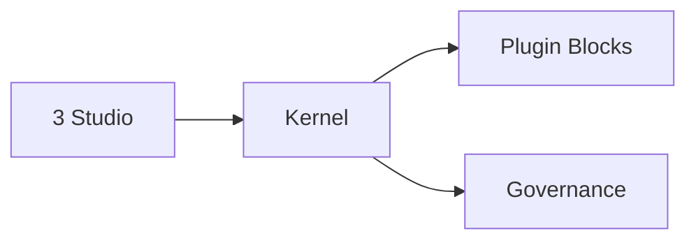

# AgentFlow

**3 Studio 製品線 + Kernel Plugin 基盤**

- Migration Studio
- Enterprise FAQ Studio
- Computer Assistant Studio

言語: [English](README_EN.md) | [简体中文](README_ZH.md) | 日本語

## 製品方針

1. 顧客導線を単純化する（テンプレート選択 → 設定 → 実行 → 成果物）
2. 機能拡張は Plugin First で行う
3. Kernel は安定境界のみを保持する

## アーキテクチャ

## API

- Studio: `/api/studios/*`
- Framework: `/api/studios/framework/*`

## クイックスタート

1. `conda activate agentflow`
2. `pip install -e "[apps,dev]"`
3. `python -m apps.platform.main serve --port 8000`
4. `cd apps/platform/frontend && npm install && npm run dev`

## 実行前チェック（必須）

- 既定実行環境は `conda activate agentflow`。
- コマンド実行前に `code-rules/CLAUDE.md` と対象 app README を確認する。
- 文書で環境が確定できない場合のみ、顧客に確認する。
- 確定した内容はルール/READMEへ追記し、同じ確認を繰り返さない。

## ドキュメント

- 目次: `docs/index.md`
- 外部向け: `docs/external/README.md`
- 内部向け: `docs/internal/README.md`
- 技術構成: `docs/architecture.md`
