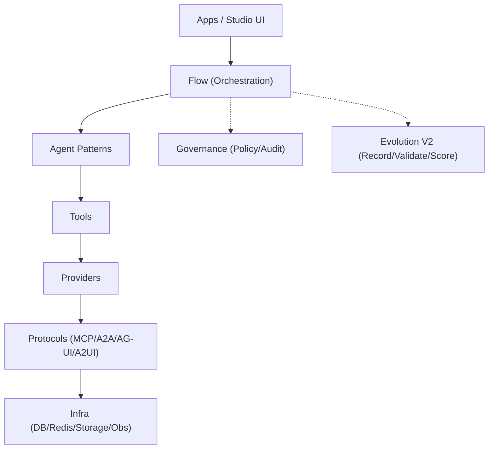
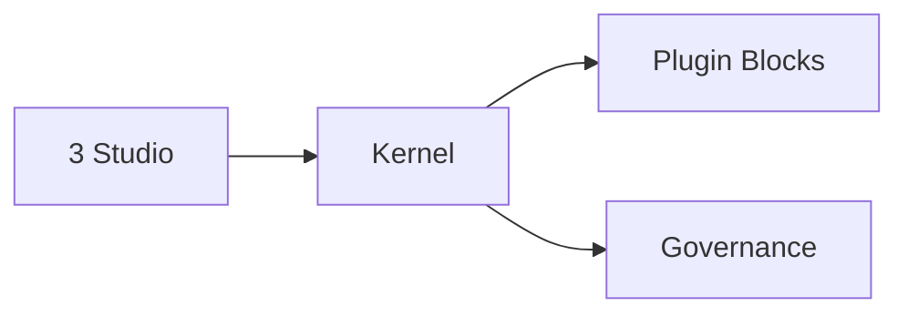
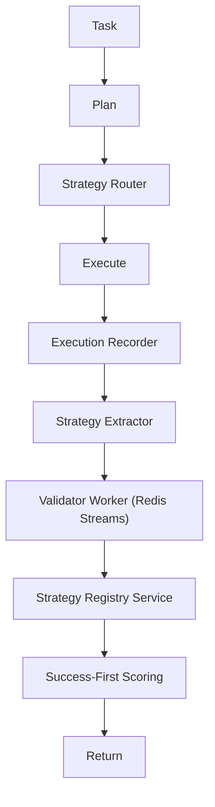

# AgentFlow

**3 Studio 製品線 + Kernel Plugin 基盤**

- Migration Studio
- Enterprise FAQ Studio
- Computer Assistant Studio

言語: [English](README_EN.md) | [简体中文](README_ZH.md) | 日本語

## 概要

AgentFlow は **MCP / A2A / AG-UI / A2UI** を統一インターフェースで扱う軽量 AI エージェントフレームワークです。  
`agentflow/` を安定した Kernel とし、`apps/` は用途別に最適化された「製品アプリ（Studio / Platform）」として提供します。

## 製品方針

1. 顧客導線を単純化する（テンプレート選択 → 設定 → 実行 → 成果物）
2. 機能拡張は Plugin First で行う
3. Kernel は安定境界のみを保持する

## apps 設計の初衷（高凝集・低結合）

- Kernel は Orchestration / Agent / Tool / Protocol の安定境界のみを保持し、拡張は `plugins/` の Blocks として提供する
- apps は「実行可能な製品単位」（設定・監査・UI・運用を含む）として独立に開発・配布できる
- `apps/platform` は Control Plane として apps の作成/設定/実行/観測を集約する

## 技術アーキテクチャ（8層 + 横断）

- Apps / UI（Studio UI / CLI / SDK）
- Flow（Task/Plan/Route/Execute）
- Agent（Patterns / Coordinator）
- Tool（Tool bindings / MCP tools）
- Provider（LLM / Storage / 3rd party）
- Protocol（MCP / A2A / AG-UI / A2UI）
- Infra（DB / Redis / Queue / Observability）
- Kernel（上記を安定境界として保持）

横断: Governance（Policy/Audit）、Evolution（Self-Evolution V2）



## リポジトリ構造

- `agentflow/`: Kernel（フロー/Agent/Tool/Protocol）
- `apps/`: 製品アプリ（Studio / Platform など）
- `plugins/`: 拡張（Blocks / Tools / Providers）
- `contracts/`: 互換性を固定する JSON 契約（versioned）
- `docs/`: 外部/内部ドキュメント
- `tests/`: テスト

## アーキテクチャ



## Evolution V2（2026-02）

`Task -> Plan -> Strategy Router -> Execute -> Record -> Extract -> Validate -> Register -> Score -> Return`



## API

- Studio: `/api/studios/*`
- Framework: `/api/studios/framework/*`

## クイックスタート

###  開発環境セットアップ（統一手順）

Platform 単体ではなく、リポジトリ全体の開発環境をセットアップします。

```bash
cd <repo-root>
bash setup_dev.sh
```
1. python -m apps.platform.main serve --port 8000
2. cd apps/platform/frontend && npm install && npm run dev

## ドキュメント

- 目次: `docs/index.md`
- 外部向け: `docs/external/README.md`
- 内部向け: `docs/internal/README.md`
- 技術構成: `docs/architecture.md`
