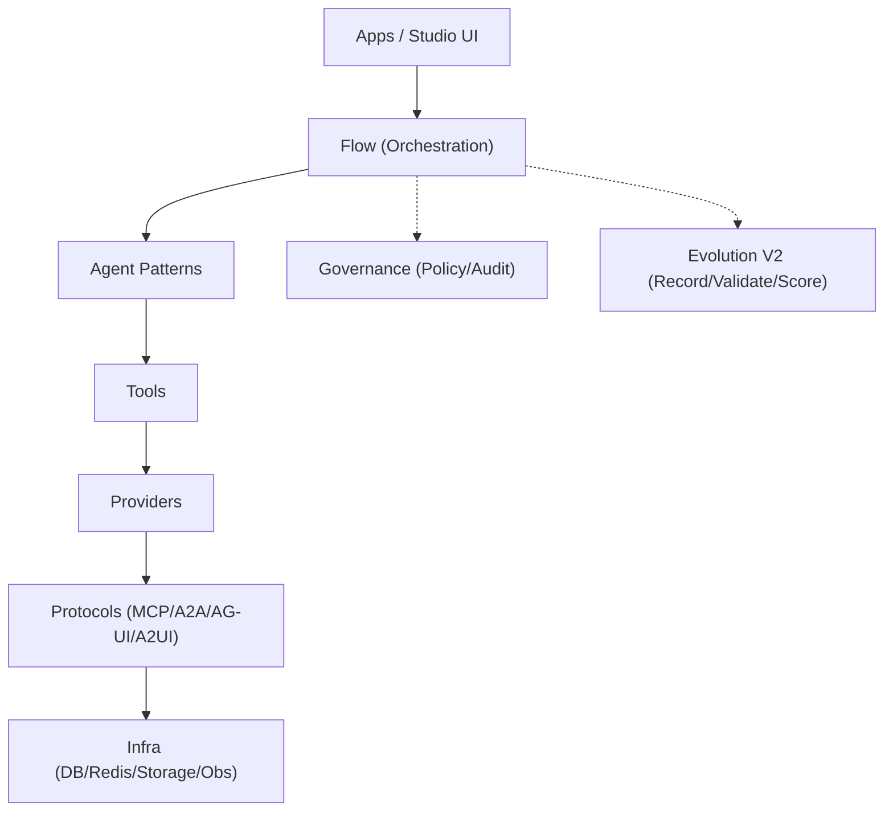
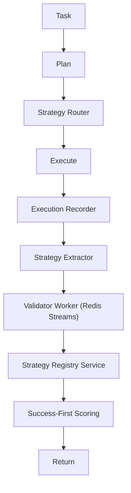

# AgentFlow

**AI エージェント開発のための基盤・プラットフォーム** — MCP / A2A / AG-UI / A2UI を統一インターフェースで扱う軽量フレームワーク。

**言語**: [English](README_EN.md) | [简体中文](README_ZH.md) | 日本語

---

## 概要

AgentFlow は **MCP / A2A / AG-UI / A2UI** を統一インターフェースで扱う軽量 AI エージェントフレームワークです。  
`agentflow/` を安定した Kernel とし、`apps/` は用途別に最適化された「製品アプリ（Studio / Platform）」として提供します。

## 製品方針

AgentFlow は、複数プロトコルとエージェント協調を**一つの API 面**で扱える基盤です。業務向けには **3 Studio 製品線**（Migration Studio / Enterprise FAQ Studio / Computer Assistant Studio）で提供し、開発向けには Kernel（`agentflow`）と Plugin による拡張を前提としています。

## apps 設計の初衷（高凝集・低結合）

- Kernel は Orchestration / Agent / Tool / Protocol の安定境界のみを保持し、拡張は `plugins/` の Blocks として提供する
- apps は「実行可能な製品単位」（設定・監査・UI・運用を含む）として独立に開発・配布できる
- `apps/platform` は Control Plane として apps の作成/設定/実行/観測を集約する

## 技術アーキテクチャ（8層 + 横断）

- Apps / UI（Studio UI / CLI / SDK）
- Flow（Task/Plan/Route/Execute）
- Agent（Patterns / Coordinator）
- Tool（Tool bindings / MCP tools）
- Provider（LLM / Storage / 3rd party）
- Protocol（MCP / A2A / AG-UI / A2UI）
- Infra（DB / Redis / Queue / Observability）
- Kernel（上記を安定境界として保持）

横断: Governance（Policy/Audit）、Evolution（Self-Evolution V2）



## リポジトリ構造

- `agentflow/`: Kernel（フロー/Agent/Tool/Protocol）
- `apps/`: 製品アプリ（Studio / Platform など）
- `plugins/`: 拡張（Blocks / Tools / Providers）
- `contracts/`: 互換性を固定する JSON 契約（versioned）
- `docs/`: 外部/内部ドキュメント
- `tests/`: テスト

## アーキテクチャ

---

## 2. 主な機能

- **Engine 実行**: `SimpleEngine`（単一 Agent）、`PipelineEngine`（多段・Review ループ）、`GateEngine`（入口審査）、`RAGEngine`（検索拡張）、`PEVEngine`（Plan-Execute-Verify）
- **Agent 定義**: `@agent` デコレータ、`AgentBlock` 継承、`AgentClient.get("名前").invoke(...)` による呼び出し
- **フロー構築**: `create_flow(...).gate(...).then(...).parallel(...).review(...).build()`
- **松結合 Provider**: `get_llm()` / `get_vectordb()` / `get_db()` / `get_embedding()` で環境に応じた実装を取得
- **チャネル**: 多プラットフォームメッセージ統合（MessageGateway / MessageChannelAdapter）
- **HITL**: 承認・中断・再開（ApprovalManager / Checkpointer / interrupt）
- **Context Engineering**: トークン予算、ターン圧縮、RetrievalGate、KeyNotes 等
- **組み込み Skills**: database-manager / stripe-payment / deployment-manager / auth-provider 等（オプション）

---

## 3. 技術アーキテクチャ

**8層構成**（上から下）: アプリケーション → UI → フロー → Agent → ツール → Provider → プロトコル → インフラ。上位は下位のみに依存し、契約は `agentflow/__init__.py` の公開 API を経由します。

## Evolution V2（2026-02）

`Task -> Plan -> Strategy Router -> Execute -> Record -> Extract -> Validate -> Register -> Score -> Return`



## API

---

## 4. 基盤・Platform・App の役割

###  開発環境セットアップ（統一手順）

Platform 単体ではなく、リポジトリ全体の開発環境をセットアップします。

```bash
cd <repo-root>
bash setup_dev.sh
```
1. python -m apps.platform.main serve --port 8000
2. cd apps/platform/frontend && npm install && npm run dev

- **ドキュメント**: 目次 [docs/index.md](docs/index.md)、対外 [docs/external/README.md](docs/external/README.md)、対内 [docs/internal/README.md](docs/internal/README.md)、3 Studio [docs/studios.md](docs/studios.md)
- **リポジトリ**: [GitHub](https://github.com/liushuang393/serverlessAIAgents) | [Issues](https://github.com/liushuang393/serverlessAIAgents/issues)
- **ライセンス**: [MIT License](LICENSE)

実行/訓練の分離やトレース設計の一部は [Microsoft Agent Lightning](https://github.com/microsoft/agent-lightning) の思想を参考にしています。
