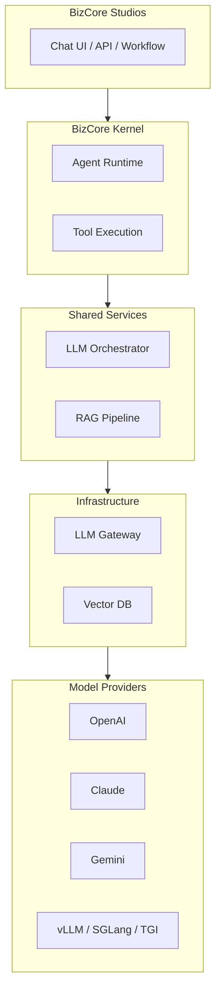

# BizCore AI

**BizCore AI は、AI 時代および将来の AGI に対応する企業向け業務開発基盤であり、分層アーキテクチャにより AI システムの複雑性を吸収し、開発者が継続的に業務実装へ集中できる状態を実現する。**

**言語**: [English](README_EN.md) | [简体中文](README_ZH.md) | 日本語

---

## なぜ BizCore AI か

AI モデルは急速に進化し、プロトコルは継続的に変化し、業務アプリは爆発的に増加する。
この不確定な未来に対して、**基盤がシステム複雑度を引き受け、開発者は業務実装に集中する** という分業が不可欠です。

BizCore AI はこの哲学を実現する **全スタック企業開発基盤** です。

---

## 7コア層 + Apps外層

BizCore AI は 7 つのコア層と、その外側にある `apps/` 製品層で構成されます。

```
┌─────────────────────────────────────────────┐
│  BizCore Studios (Apps)                     │  ← 製品装配・交付層（コア外）
│  Migration / FAQ / Assistant / Custom Apps  │
├─────────────────────────────────────────────┤
│  BizCore Control Plane                      │  ← 管理・観測・配信
├─────────────────────────────────────────────┤
│  BizCore Domain                             │  ← 業務ドメイン・業界テンプレート
├─────────────────────────────────────────────┤
│  BizCore Harness (Governance)               │  ← ガバナンス・信頼性・評価
├─────────────────────────────────────────────┤
│  BizCore Kernel (Runtime)                   │  ← 実行エンジン・Agent・フロー
├─────────────────────────────────────────────┤
│  Shared Services                            │  ← 共通機能（Gateway/RAG/Access）
├─────────────────────────────────────────────┤
│  Infrastructure                             │  ← 低レベル基盤（LLM/Storage/Cache）
├─────────────────────────────────────────────┤
│  Contracts                                  │  ← プロトコル・インターフェース定義
└─────────────────────────────────────────────┘
```

| 層 | ディレクトリ | 役割 |
|---|---|---|
| **Contracts** | `contracts/` | 全層共通のプロトコル・型・インターフェース定義（Versioned） |
| **Infrastructure** | `infrastructure/` | LLM Provider、Storage、Cache、Queue、Sandbox 等の低レベル基盤 |
| **Shared** | `shared/` | LLM Gateway、RAG、Access Control、Trace、Audit 等の共通サービス |
| **BizCore Kernel** | `kernel/` | Agent Runtime、Flow Engine、Orchestration、Protocol 実装 |
| **BizCore Harness** | `harness/` | Governance、Policy、Approval、Budget、Evaluation、Guardrails |
| **BizCore Domain** | `domain/` | 業界/業務ドメインのモデル、インターフェース、テンプレート、ルール |
| **BizCore Control Plane** | `control_plane/` | Platform Control Plane — 発見、ライフサイクル、配信、運用 UI/API |
| **BizCore Studios** | `apps/*/` | 製品層。3 Studios と custom apps を装配する外側レイヤー |

> **設計原則**: `contracts / infrastructure / shared / kernel / harness / domain` は `apps/` に依存しない。`domain` は `control_plane` に依存しない。`control_plane` は下位層を統合するが、下位層の正本入口にはならない。

---

## 主な機能

### 実行エンジン（BizCore Kernel）

- **Engine パターン**: `SimpleEngine`（単一 Agent）/ `PipelineEngine`（多段・Review）/ `GateEngine`（入口審査）/ `RAGEngine`（検索拡張）/ `PEVEngine`（Plan-Execute-Verify）
- **Agent 定義**: `@agent` デコレータ / `AgentBlock` 継承 / `AgentClient.get("名前").invoke(...)`
- **フロー構築**: `create_flow(...).gate(...).then(...).parallel(...).review(...).build()`
- **統一プロトコル**: MCP / A2A / AG-UI / A2UI を単一 API 面で利用

### ガバナンス（BizCore Harness）

- **ポリシーエンジン**: 実行前後の判定・制約を宣言的に設定
- **HITL**: 承認・中断・再開（ApprovalManager / Checkpointer / interrupt）
- **Context Engineering**: トークン予算、ターン圧縮、RetrievalGate、KeyNotes
- **評価・監査**: Evaluation、Replay、Budget 管理

### 管理（BizCore Platform）

- **App ライフサイクル**: 作成 → 設定 → 実行 → 観測 → 配信
- **LLM 一元管理**: Provider / Model / Secret / Local Engine を Platform から統合管理
- **統一 API**: `/api/studios/*` と `/api/studios/framework/apps/*` を正規経路として提供

### 業務アプリ（BizCore Studios）

- **Migration Studio**: コード移行・モダナイゼーション
- **Enterprise FAQ Studio**: RAG ベースの FAQ・ナレッジ管理
- **Computer Assistant Studio**: 汎用 AI アシスタント・自動化

---

## LLM 推論基盤（Gateway 統一）

BizCore AI の LLM 呼び出しは Provider 直呼びを禁止し、`LLM Orchestrator → LLM Gateway` に統一します。


```mermaid
flowchart TB

subgraph APP["BizCore Studios"]
UI[Chat UI / API / Workflow]
end

subgraph KERNEL["BizCore Kernel"]
Runtime[Agent Runtime]
Tools[Tool Execution]
end

subgraph SHARED["Shared Services"]
Orchestrator[LLM Orchestrator]
RAG[RAG Pipeline]
end

subgraph INFRA["Infrastructure"]
Gateway[LLM Gateway]
Vector[Vector DB]
end

subgraph PROVIDER["Model Providers"]
OpenAI[OpenAI]
Claude[Claude]
Gemini[Gemini]
Local[vLLM / SGLang / TGI]
end

APP --> KERNEL
KERNEL --> SHARED
SHARED --> INFRA
INFRA --> PROVIDER
```

---

## リポジトリ構造

### 7コア層
- `contracts/`: プロトコル・インターフェース定義（Versioned）
- `infrastructure/`: 低レベル基盤（LLM Provider / Storage / Cache / Queue）
- `shared/`: 共通サービス（Gateway / RAG / Access / Trace / Audit）
- `kernel/`: Agent Runtime / Flow Engine / Orchestration / Protocol
- `harness/`: Governance / Policy / Approval / Budget / Evaluation
- `domain/`: 業界/業務ドメインの正規実装
- `control_plane/`: BizCore Control Plane の正規実装

### 製品層
- `apps/`: BizCore Studios と custom apps。7コア層の外側で製品を構成する

### 移行メモ
- 旧 import / 設定名は移行期間中に一部残るが、正本実装は `contracts/`, `infrastructure/`, `shared/`, `kernel/`, `harness/`, `domain/`, `control_plane/` に集約する

### 開発・運用
- `plugins/`: 拡張機能（Blocks / Tools / Providers）
- `docs/`: 外部/内部ドキュメント、設計資料
- `tests/`: 自動テストスイート（Unit / Integration / E2E）
- `code-rules/`: 統一コーディング規約と Lint ルール
- `scripts/`: 開発・保守用ユーティリティスクリプト

---

## 技術スタック

| 領域 | 技術 |
|---|---|
| **バックエンド** | Python 3.13+, FastAPI, Pydantic, Uvicorn |
| **フロントエンド** | React, Vite, TypeScript, ESLint, Prettier |
| **AI プロトコル** | MCP, A2A, AG-UI, A2UI |
| **インフラ** | Supabase / PostgreSQL / Turso, Pinecone / Qdrant, Redis |
| **品質** | Ruff, mypy, pytest（80%+ カバレッジ）, ESLint, tsc |

---

## クイックスタート

### 前提条件

| ツール | バージョン | 用途 |
|---|---|---|
| Python | 3.13+ | バックエンド実行 |
| conda | 任意 | 推奨仮想環境（`agentflow`） |
| Docker + Docker Compose | 任意 | DB・ミドルウェア起動 |
| Node.js | 18+ | フロントエンド起動 |

### 1. 環境セットアップ

```bash
# conda 環境（推奨）
conda create -n agentflow python=3.13 -y
conda activate agentflow

# 依存パッケージのインストール
pip install -e ".[apps,dev]"
```

### 2. Docker でデータベースを起動

```bash
# auth_service 用 PostgreSQL（ポート 5438）
cd shared/auth_service && docker compose up auth-db -d && cd ../..

# faq_system 用 PostgreSQL（ポート 5433）+ Qdrant（ポート 6333）
cd apps/faq_system && docker compose up faq-db qdrant -d && cd ../..
```

### 3. 各サービスをローカル起動

ターミナルを 3 つ開き、それぞれ `conda activate agentflow` を実行してから以下を実行します。

#### auth_service（ポート 8010）

```bash
python -m shared.auth_service.main
# ヘルスチェック: curl http://localhost:8010/health
```

#### faq_system（ポート 8005）

```bash
python -m apps.faq_system.main
# ヘルスチェック: curl http://localhost:8005/api/health
# API ドキュメント: http://localhost:8005/docs
```

#### dev_studio / control_plane（ポート 8900）

```bash
python -m control_plane.main serve
# ヘルスチェック: curl http://localhost:8900/health
```

### 4. フロントエンド起動（任意）

```bash
# auth_service フロントエンド（ポート 3000）
cd shared/auth_service/frontend && npm install && npm run dev

# faq_system フロントエンド（ポート 3004）
cd apps/faq_system/frontend && npm install && npm run dev

# control_plane フロントエンド（ポート 3200）
cd control_plane/frontend && npm install && npm run dev
```

### サービス一覧

| サービス | バックエンド | フロントエンド | 説明 |
|---|---|---|---|
| auth_service | http://localhost:8010 | http://localhost:3000 | 認証・ユーザー管理 |
| faq_system | http://localhost:8005 | http://localhost:3004 | RAG ベース FAQ・ナレッジ管理 |
| dev_studio | http://localhost:8900 | http://localhost:3200 | 開発支援・コントロールプレーン |

---

## ドキュメント・リンク

- **ドキュメント**: [docs/index.md](docs/index.md) | [対外](docs/external/README.md) | [対内](docs/internal/README.md) | [Studios](docs/studios.md)
- **リポジトリ**: [GitHub](https://github.com/liushuang393/serverlessAIAgents) | [Issues](https://github.com/liushuang393/serverlessAIAgents/issues)
- **ライセンス**: [MIT License](LICENSE)

---

> 実行/訓練の分離やトレース設計の一部は [Microsoft Agent Lightning](https://github.com/microsoft/agent-lightning) の思想を参考にしています。
