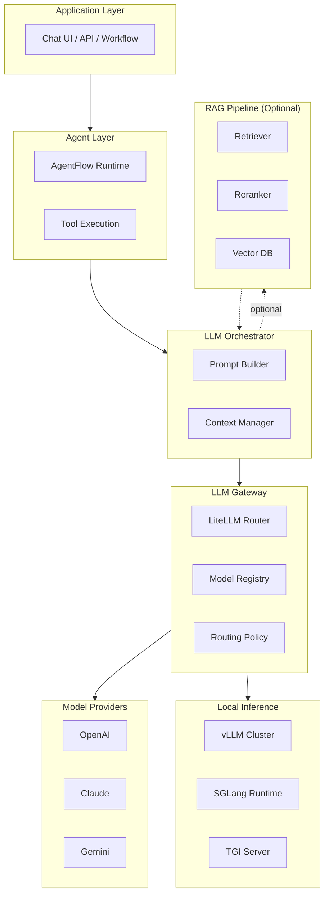
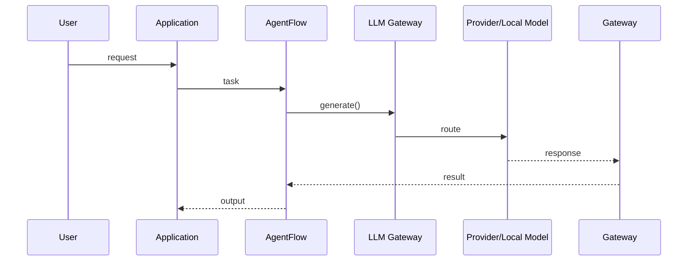
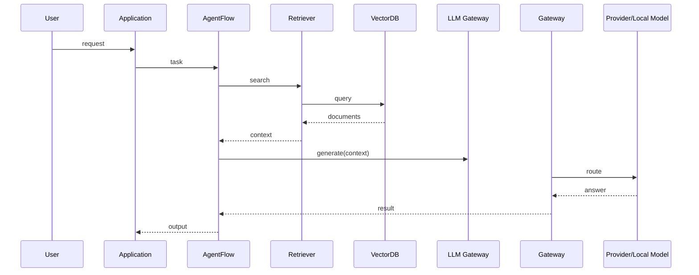

# AgentFlow

**AI エージェント開発のための基盤・プラットフォーム** — MCP / A2A / AG-UI / A2UI を統一インターフェースで扱う軽量フレームワーク。

**言語**: [English](README_EN.md) | [简体中文](README_ZH.md) | 日本語

---

## 概要

AgentFlow は **MCP / A2A / AG-UI / A2UI** を統一インターフェースで扱う軽量 AI エージェントフレームワークです。  
`agentflow/` を安定した Kernel とし、`apps/` は用途別に最適化された「製品アプリ（Studio / Platform）」として提供します。

## 製品方針

AgentFlow は、複数プロトコルとエージェント協調を**一つの API 面**で扱える基盤です。業務向けには **3 Studio 製品線**（Migration Studio / Enterprise FAQ Studio / Computer Assistant Studio）で提供し、開発向けには Kernel（`agentflow`）と Plugin による拡張を前提としています。

## apps 設計の初衷（高凝集・低結合）

- Kernel は Orchestration / Agent / Tool / Protocol の安定境界のみを保持し、拡張は `plugins/` の Blocks として提供する
- apps は「実行可能な製品単位」（設定・監査・UI・運用を含む）として独立に開発・配布できる
- `apps/platform` は Control Plane として apps の作成/設定/実行/観測を集約する

## LLM 推論基盤アーキテクチャ（Gateway 統一）

AgentFlow の LLM 呼び出しは Provider 直呼びを禁止し、`LLM Orchestrator -> LLM Gateway` に統一します。


```mermaid
flowchart TB

subgraph APP["Application Layer"]
UI[Chat UI / API / Workflow]
end

subgraph AGENT["Agent Layer"]
AgentFlow[AgentFlow Runtime]
Tools[Tool Execution]
end

subgraph ORCH["LLM Orchestrator"]
Prompt[Prompt Builder]
Context[Context Manager]
end

subgraph RAG["RAG Pipeline (Optional)"]
Retriever[Retriever]
Rerank[Reranker]
VectorDB[Vector DB]
end

subgraph GATEWAY["LLM Gateway"]
Router[LiteLLM Router]
Registry[Model Registry]
Policy[Routing Policy]
end

subgraph PROVIDER["Model Providers"]
OpenAI[OpenAI]
Claude[Claude]
Gemini[Gemini]
end

subgraph LOCAL["Local Inference"]
vLLM[vLLM Cluster]
SGLang[SGLang Runtime]
TGI[TGI Server]
end

APP --> AGENT
AGENT --> ORCH
ORCH --> GATEWAY

ORCH -. optional .-> RAG
RAG -.-> ORCH

GATEWAY --> PROVIDER
GATEWAY --> LOCAL
```

### 呼び出し関係図（RAG なし）


```mermaid
sequenceDiagram

User->>Application: request
Application->>AgentFlow: task
AgentFlow->>LLM Gateway: generate()
LLM Gateway->>Provider/Local Model: route
Provider/Local Model-->>Gateway: response
Gateway-->>AgentFlow: result
AgentFlow-->>Application: output
```

### 呼び出し関係図（RAG あり）


```mermaid
sequenceDiagram

User->>Application: request
Application->>AgentFlow: task

AgentFlow->>Retriever: search
Retriever->>VectorDB: query
VectorDB-->>Retriever: documents

Retriever-->>AgentFlow: context

AgentFlow->>LLM Gateway: generate(context)
Gateway->>Provider/Local Model: route
Provider/Local Model-->>Gateway: answer
Gateway-->>AgentFlow: result
AgentFlow-->>Application: output
```

## Platform 主導 LLM 管理

- Provider / Model / secret / local engine 配備の正本は `apps/platform` の `LLM Management` です。
- secret 解決順は `Platform 暗号化保存 > ENV > .env > unavailable` です。app 側で provider API Key を直参照する前提にはしません。
- app は `app_config.json` の `contracts.llm` で `provider` と `model_id` を宣言し、runtime は Platform catalog に存在する model だけを解決します。
- modality は `text` / `embedding` / `image` / `speech_to_text` / `text_to_speech` を統一契約にしています。
- `vLLM / SGLang / TGI` の Docker 配備は Platform から実行し、compose は `.agentflow/llm_backends/<engine-id>/` に生成されます。
- `LLM_PROVIDER` / `OPENAI_MODEL` / `OPENAI_EMBEDDING_MODEL` などの env は互換 fallback として残しますが、Platform 管理 app の正本ではありません。

### app 実装ルール

- `get_llm()` / `get_embedding()` / 画像 / 音声呼び出しは `contracts.llm` を経由して model alias を解決します。
- app ごとの共通既定は `contracts.llm.defaults`、agent 個別上書きは `contracts.llm.agent_overrides` を使います。
- Platform catalog に存在しない `provider` / `model_id` を app が参照した場合、その app は未設定として扱われます。
- FAQ など埋め込みを使う app は `embedding` を、音声 app は `speech_to_text` / `text_to_speech` を manifest に明示します。

## リポジトリ構造

### コアコンポーネント
- `agentflow/`: Kernel（エンジン/Agentパターン/プロトコル）
- `apps/`: 製品アプリ（Studio / Platform / 業務アプリ）
- `plugins/`: 拡張機能（Blocks / Tools / Providers）
- `contracts/`: 互換性を保証する JSON 契約定義（Versioned）
- `docs/`: 外部/内部ドキュメント、設計資料
- `tests/`: 自動テストスイート（Unit/Integration/E2E）
- `examples/`: 実装サンプルとデモコード

### ツール & ガバナンス
- `.agent/`, `.agentflow/`: エージェントの動作ログと内部データ
- `.github/`: CI/CD ワークフローとテンプレート
- `code-rules/`: 統一コーディング規約と Lint ルール
- `scripts/`: 開発・保守用ユーティリティスクリプト
- `Makefile`: タスク自動化コマンド集

### 設定 & 環境
- `pyproject.toml`: プロジェクト全体の依存関係と設定
- `requirements.txt`: Python パッケージリスト（補足用）
- `.env.example`: 環境変数のテンプレート

### 開発・検証用
- `.kiro/`, `.sisyphus/`: 内部仕様案（Specs）とエージェント用メモ
- `mcp_client/`, `mcp_servers/`: MCP プロトコル固有の実装
- `studio/`: 旧 Studio フロントエンド（`apps/platform` へ移行中）

## アーキテクチャ

---

## 2. 主な機能

- **Engine 実行**: `SimpleEngine`（単一 Agent）、`PipelineEngine`（多段・Review ループ）、`GateEngine`（入口審査）、`RAGEngine`（検索拡張）、`PEVEngine`（Plan-Execute-Verify）
- **Agent 定義**: `@agent` デコレータ、`AgentBlock` 継承、`AgentClient.get("名前").invoke(...)` による呼び出し
- **フロー構築**: `create_flow(...).gate(...).then(...).parallel(...).review(...).build()`
- **松結合 Provider**: `get_llm()` / `get_vectordb()` / `get_db()` / `get_embedding()` で環境に応じた実装を取得
- **チャネル**: 多プラットフォームメッセージ統合（MessageGateway / MessageChannelAdapter）
- **HITL**: 承認・中断・再開（ApprovalManager / Checkpointer / interrupt）
- **Context Engineering**: トークン予算、ターン圧縮、RetrievalGate、KeyNotes 等
- **組み込み Skills**: database-manager / stripe-payment / deployment-manager / auth-provider 等（オプション）

---

## 3. 技術アーキテクチャ

LLM 系の呼び出しは Application/Agent 層から直接 Provider API を使用せず、必ず LiteLLM Gateway を経由します。RAG は optional ですが、有効時も無効時も同じ LLM API 契約（`generate` / `stream` / `tool_call`）を維持します。

## API

---

## 4. 基盤・Platform・App の役割

###  開発環境セットアップ（統一手順）

Platform 単体ではなく、リポジトリ全体の開発環境をセットアップします。

```bash
cd <repo-root>
bash setup_dev.sh
```
1. python -m apps.platform.main serve --port 8000
2. cd apps/platform/frontend && npm install && npm run dev

- **ドキュメント**: 目次 [docs/index.md](docs/index.md)、対外 [docs/external/README.md](docs/external/README.md)、対内 [docs/internal/README.md](docs/internal/README.md)、3 Studio [docs/studios.md](docs/studios.md)
- **リポジトリ**: [GitHub](https://github.com/liushuang393/serverlessAIAgents) | [Issues](https://github.com/liushuang393/serverlessAIAgents/issues)
- **ライセンス**: [MIT License](LICENSE)

実行/訓練の分離やトレース設計の一部は [Microsoft Agent Lightning](https://github.com/microsoft/agent-lightning) の思想を参考にしています。
