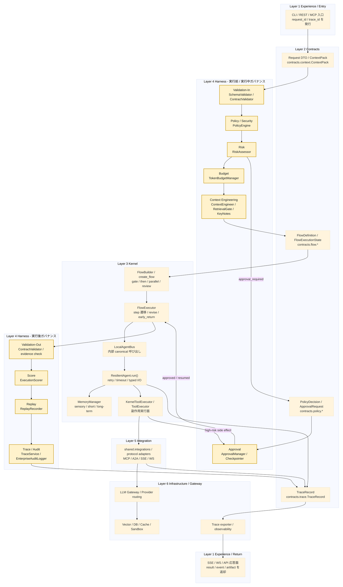
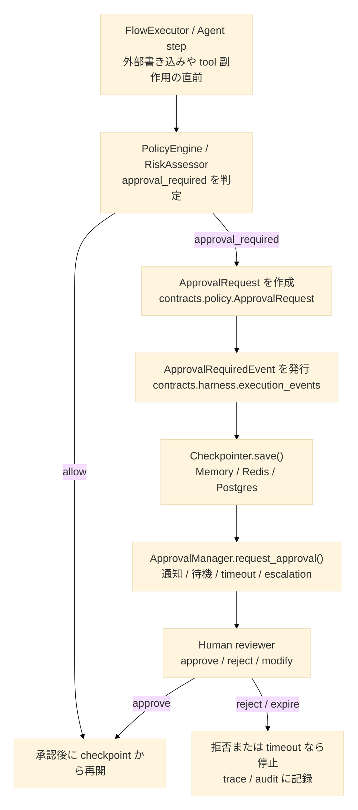
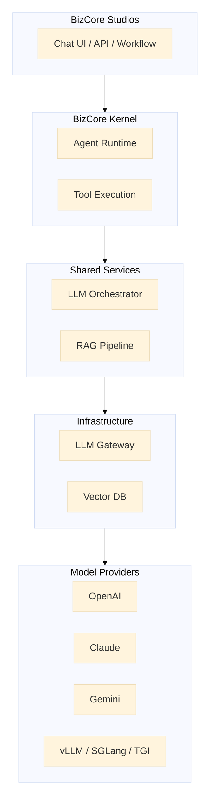

# BizCore AI

**BizCore AI は、AI 時代および将来の AGI 時代に向けた企業向け業務開発基盤であり、分層アーキテクチャによって AI システムの複雑性を吸収し、開発者が継続的に業務実装へ集中できる状態を実現します。**

**言語**: [English](README_EN.md) | [简体中文](README_ZH.md) | 日本語

---

## なぜ BizCore AI か

AI モデルは急速に進化し、プロトコルは継続的に変化し、業務アプリは爆発的に増加しています。  
この不確実な未来に対しては、**基盤がシステム複雑度を引き受け、開発者は業務実装に集中する** という分業が不可欠です。

BizCore AI は、この思想を実現する **全スタック企業開発基盤** です。

---

## アーキテクチャ

BizCore AI は、静的な分層構造と実行時の経路を混ぜず、複数の視点から理解する必要があります。

### A. 静的アーキテクチャ - 8層（7つのコア層 + Apps 外層）

BizCore AI は全体で 8 層構成です。7 つのコア層に加え、`apps/` が最外側のプロダクト組み立て層として存在します。

```
┌─────────────────────────────────────────────┐
│  BizCore Studios (Apps)                     │  ← プロダクト組み立て層（コア層の外側）
│  Migration / FAQ / Assistant / Custom Apps  │
├─────────────────────────────────────────────┤
│  BizCore Control Plane                      │  ← 管理・観測・配信
├─────────────────────────────────────────────┤
│  BizCore Domain                             │  ← 業務ドメイン / 業界テンプレート
├─────────────────────────────────────────────┤
│  BizCore Harness (Governance)               │  ← ガバナンス / 信頼性 / 評価
├─────────────────────────────────────────────┤
│  BizCore Kernel (Runtime)                   │  ← 実行エンジン / Agent / Flow
├─────────────────────────────────────────────┤
│  Shared Services                            │  ← 共通サービス（Gateway/RAG/Access）
├─────────────────────────────────────────────┤
│  Infrastructure                             │  ← 低レベル基盤（LLM/Storage/Cache）
├─────────────────────────────────────────────┤
│  Contracts                                  │  ← プロトコル・インターフェース定義
└─────────────────────────────────────────────┘
```

| 層 | ディレクトリ | 役割 |
| --- | --- | --- |
| **Contracts** | `contracts/` | 全層共有のプロトコル・型・インターフェース定義（Versioned） |
| **Infrastructure** | `infrastructure/` | LLM Provider、Storage、Cache、Queue、Sandbox などの低レベル基盤 |
| **Shared** | `shared/` | LLM Gateway、RAG、Access Control、Trace、Audit などの共通サービス |
| **BizCore Kernel** | `kernel/` | Agent Runtime、Flow Engine、Orchestration、Protocol 実装 |
| **BizCore Harness** | `harness/` | Governance、Policy、Approval、Budget、Evaluation、Guardrails |
| **BizCore Domain** | `domain/` | 業界 / 業務ドメインのモデル、インターフェース、テンプレート、ルール |
| **BizCore Control Plane** | `control_plane/` | 発見、ライフサイクル、配信、運用 UI/API を担うプラットフォーム制御面 |
| **BizCore Studios** | `apps/*/` | Migration / FAQ / Assistant / custom app を組み立てるプロダクト層 |

> **設計原則**: `contracts / infrastructure / shared / kernel / harness / domain` は `apps/` に依存してはなりません。`domain` は `control_plane` に依存してはなりません。`control_plane` は下位層を編成できますが、下位層の正本にはなりません。

### B-1. 実行時フロー


```mermaid
%%{init: {'theme': 'base', 'themeVariables': {'fontSize': '18px'}, 'flowchart': {'useMaxWidth': false, 'nodeSpacing': 40, 'rankSpacing': 70, 'diagramPadding': 24}} }%%
flowchart TB
    subgraph L1A["Layer 1 Experience / Entry"]
        direction TB
        entry["CLI / REST / MCP 入口<br/>request_id / trace_id を発行"]
    end

    subgraph L2["Layer 2 Contracts"]
        direction TB
        contract_in["Request DTO / ContextPack<br/>contracts.context.ContextPack"]
        contract_flow["FlowDefinition / FlowExecutionState<br/>contracts.flow.*"]
        contract_policy["PolicyDecision / ApprovalRequest<br/>contracts.policy.*"]
        contract_trace["TraceRecord<br/>contracts.trace.TraceRecord"]
    end

    subgraph L4A["Layer 4 Harness - 実行前 / 実行中ガバナンス"]
        direction TB
        validate_in["Validation-In<br/>SchemaValidator / ContractValidator"]
        policy["Policy / Security<br/>PolicyEngine"]
        risk["Risk<br/>RiskAssessor"]
        budget["Budget<br/>TokenBudgetManager"]
        context["Context Engineering<br/>ContextEngineer / RetrievalGate / KeyNotes"]
        approval_gate["Approval<br/>ApprovalManager / Checkpointer"]
    end

    subgraph L3["Layer 3 Kernel"]
        direction TB
        builder["FlowBuilder / create_flow<br/>gate / then / parallel / review"]
        executor["FlowExecutor<br/>step 遷移 / revise / early_return"]
        bus["LocalAgentBus<br/>内部 canonical 呼び出し"]
        agent["ResilientAgent.run()<br/>retry / timeout / typed I/O"]
        tools["KernelToolExecutor / ToolExecutor<br/>副作用実行面"]
        memory["MemoryManager<br/>sensory / short / long-term"]
    end

    subgraph L5["Layer 5 Integration"]
        direction TB
        integration["shared.integrations / protocol adapters<br/>MCP / A2A / SSE / WS"]
    end

    subgraph L6["Layer 6 Infrastructure / Gateway"]
        direction TB
        gateway["LLM Gateway / Provider routing"]
        storage["Vector / DB / Cache / Sandbox"]
        trace_export["Trace exporter / observability"]
    end

    subgraph L4B["Layer 4 Harness - 実行後ガバナンス"]
        direction TB
        validate_out["Validation-Out<br/>ContractValidator / evidence check"]
        score["Score<br/>ExecutionScorer"]
        replay["Replay<br/>ReplayRecorder"]
        trace_audit["Trace / Audit<br/>TraceService / EnterpriseAuditLogger"]
    end

    subgraph L1B["Layer 1 Experience / Return"]
        direction TB
        return["SSE / WS / API 応答面<br/>result / event / artifact を返却"]
    end

    entry --> contract_in --> validate_in --> policy --> risk --> budget --> context --> contract_flow --> builder --> executor
    executor --> bus --> agent
    agent --> memory
    agent --> tools --> integration --> gateway
    gateway --> storage
    executor --> validate_out --> score --> replay --> trace_audit --> contract_trace --> trace_export --> return
    risk -->|approval_required| contract_policy --> approval_gate
    approval_gate -->|approved / resumed| executor
    tools -->|high-risk side effect| approval_gate
    agent --> contract_trace
    integration --> contract_trace

    classDef harness fill:#FFF2CC,stroke:#C69200,stroke-width:2px,color:#222;
    class validate_in,policy,risk,budget,context,approval_gate,validate_out,score,replay,trace_audit harness;
```

Harness は前後で包むだけの層ではありません。`ContextEngineer`、`TokenBudgetManager`、`ApprovalManager` を実行経路の中に差し込むことで、長い多段処理でも境界・型・証跡を維持します。

この図をもとに契約を強化するなら、最低限固定すべき境界は次のとおりです。

- Entry → Contracts: UI / API / CLI 全体で `ContextPack`、`trace_id`、正規化済み request DTO を必須にする
- Contracts → Kernel: `FlowDefinition`、`FlowExecutionState`、各 step の入出力 schema を固定し、`FlowExecutor` を追跡可能にする
- Kernel → Harness: `PolicyDecision`、`ApprovalRequest`、`ExecutionEvent` を標準化し、承認・拒否・再開・監査が同じ経路を通るようにする
- Kernel / Integration → Trace: すべての step から `TraceRecord` と artifact ID を発行し、Replay / Scoring / Audit の共通証跡にする

### B-2. 文脈・記憶・安全・自己改善ループ


```mermaid
%%{init: {'theme': 'base', 'themeVariables': {'fontSize': '18px'}, 'flowchart': {'useMaxWidth': false, 'nodeSpacing': 40, 'rankSpacing': 70, 'diagramPadding': 24}} }%%
flowchart LR
    task["新規タスク / 次の入力"]
    ctx["ContextEngineer<br/>予算配分 / 圧縮 / KeyNotes 注入"]
    retrieve["RetrievalGate<br/>検索が必要かを判定"]
    mem_recall["MemoryManager.recall()<br/>長短期記憶を再利用"]
    execute["FlowExecutor / ResilientAgent<br/>多段実行"]
    safety["Policy / Risk / Validation<br/>安全性・契約・ドリフト検査"]
    score["ExecutionScorer<br/>品質と精度の評価"]
    replay["ReplayRecorder / TraceService<br/>step 証跡を保存"]
    evolve["EvolutionEngine<br/>戦略抽出 / 候補登録 / スコア更新"]
    next_ctx["次回実行の改善<br/>圧縮規則 / strategy hint / memory importance"]

    task --> ctx --> retrieve
    retrieve -->|yes| mem_recall --> execute
    retrieve -->|no| execute
    execute --> safety --> score --> replay --> evolve --> next_ctx --> ctx
```

このループの目的は単なる成功ではありません。証跡を残し、文脈を賢く圧縮し、成功した戦略を次回に返すことで、多段実行でも精度を落としにくくします。

### C. 横断ガバナンスサブシステム（Harness）

| サブシステム | 何に使うか | 差し込む場所（層 / 段階） | 精度・自律性への寄与 | 主要コンポーネント |
| --- | --- | --- | --- | --- |
| Policy / Security | 実行可否、主体・対象・操作の整合性を判定 | Layer 2→4、入口直後 / tool 実行直前 | 危険または未承認の前進を防ぐ | PolicyEngine, AuthContext, PolicyDecision |
| Risk | 高リスク、高コスト、高影響の分岐を検出 | Layer 4、plan 後 / 実行前 / 配信前 | 承認が必要な経路を明確にし、危険なドリフトを防ぐ | RiskAssessor, RiskAssessment, RiskFactor |
| Approval | 人間承認、待機、再開、timeout 管理 | Layer 4、`interrupt()` 前の停止点 | 非冪等操作の前後で重複実行を防ぐ | ApprovalManager, ApprovalRequest, Checkpointer |
| Validation | schema 違反、必須項目欠落、出力構造の崩れを検出 | Layer 2↔4、入口時 / step 完了時 / 最終出力時 | 多段パイプラインの静かな劣化を防ぐ | SchemaValidator, ContractValidator |
| Budget | token、cost、context window の上限を制御 | Layer 4、prompt 構築前 / retrieval 前 / step 間 | 長い実行でも焦点を維持し、文脈飽和を防ぐ | TokenBudgetManager |
| Context Engineering | 履歴圧縮、要点抽出、検索要否判定、文脈再構成 | Layer 4、各ターン / 各 step 前 | 長文脈で精度が落ちるのを防ぐ | ContextEngineer, RetrievalGate, KeyNotesStore |
| Replay | 実行を再現し、調査・改善に使う | Layer 4、各 step 完了時 / 失敗時 | 精度低下を再現可能にする | ReplayRecorder, ReplayRunner |
| Score | 実行品質を定量評価 | Layer 4、各 step 後 / 最終結果後 | 正確さだけでなく完全性・安全性・コストも評価する | ExecutionScorer, DimensionScore |
| Trace / Audit | span、artifact、意思決定証跡を保存 | Layer 2 / 4 / 6、全 step 横断 | 監査と自己改善の共通証跡面を作る | TraceRecord, TraceService, EnterpriseAuditLogger |

Harness は周辺から眺める受動的な監視層ではなく、Kernel の step 実行に沿って差し込まれる制御層として扱う前提です。

### D. 承認フロー（HITL / 非冪等操作ガード）


```mermaid
%%{init: {'theme': 'base', 'themeVariables': {'fontSize': '18px'}, 'flowchart': {'useMaxWidth': false, 'nodeSpacing': 36, 'rankSpacing': 64, 'diagramPadding': 24}} }%%
flowchart TD
    step["FlowExecutor / Agent step<br/>外部書き込みや tool 副作用の直前"]
    policy["PolicyEngine / RiskAssessor<br/>approval_required を判定"]
    req["ApprovalRequest を作成<br/>contracts.policy.ApprovalRequest"]
    event["ApprovalRequiredEvent を発行<br/>contracts.harness.execution_events"]
    save["Checkpointer.save()<br/>Memory / Redis / Postgres"]
    wait["ApprovalManager.request_approval()<br/>通知 / 待機 / timeout / escalation"]
    human["Human reviewer<br/>approve / reject / modify"]
    resume["承認後に checkpoint から再開"]
    reject["拒否または timeout なら停止<br/>trace / audit に記録"]

    step --> policy
    policy -->|allow| resume
    policy -->|approval_required| req --> event --> save --> wait --> human
    human -->|approve| resume
    human -->|reject / expire| reject
```

非冪等操作は `interrupt()` より前に実行してはいけません。必ず `ApprovalRequest` を作成し、`Checkpointer` で停止点を保存してから承認待ちに入ることで、再開時の副作用重複を防ぎます。

---

## 主な機能

### 実行エンジン（BizCore Kernel）

- **Engine パターン**: `SimpleEngine`（単一 Agent）/ `PipelineEngine`（多段・Review）/ `GateEngine`（入口審査）/ `RAGEngine`（検索拡張）/ `PEVEngine`（Plan-Execute-Verify）
- **Agent 定義**: `@agent` デコレータ / `AgentBlock` 継承 / `AgentClient.get("name").invoke(...)`
- **フロー構築**: `create_flow(...).gate(...).then(...).parallel(...).review(...).build()`
- **統一プロトコル**: MCP / A2A / AG-UI / A2UI を単一 API 面で利用

### ガバナンス（BizCore Harness）

- **ポリシーエンジン**: 実行前後の判定と制約を宣言的に設定
- **HITL**: 承認・中断・再開（ApprovalManager / Checkpointer / interrupt）
- **Context Engineering**: トークン予算、ターン圧縮、RetrievalGate、KeyNotes
- **評価・監査**: Evaluation、Replay、Budget 管理

### 管理（BizCore Platform）

- **App ライフサイクル**: 作成 → 設定 → 実行 → 観測 → 配信
- **LLM 一元管理**: Provider / Model / Secret / Local Engine を Platform が中央管理
- **統一 API**: `/api/studios/*` と `/api/studios/framework/apps/*` を正規経路として提供

### 業務アプリ（BizCore Studios）

- **Migration Studio**: コード移行とモダナイゼーション
- **Enterprise FAQ Studio**: RAG ベース FAQ とナレッジ管理
- **Computer Assistant Studio**: 汎用 AI アシスタントと自動化

---

## LLM 推論基盤（Gateway 統一）

BizCore AI は Provider SDK の直接呼び出しを禁止し、すべての LLM リクエストを `LLM Orchestrator → LLM Gateway` 経由に統一します。


```mermaid
%%{init: {'theme': 'base', 'themeVariables': {'fontSize': '18px'}, 'flowchart': {'useMaxWidth': false, 'nodeSpacing': 40, 'rankSpacing': 70, 'diagramPadding': 24}} }%%
flowchart TB

subgraph APP["BizCore Studios"]
UI[Chat UI / API / Workflow]
end

subgraph KERNEL["BizCore Kernel"]
Runtime[Agent Runtime]
Tools[Tool Execution]
end

subgraph SHARED["Shared Services"]
Orchestrator[LLM Orchestrator]
RAG[RAG Pipeline]
end

subgraph INFRA["Infrastructure"]
Gateway[LLM Gateway]
Vector[Vector DB]
end

subgraph PROVIDER["Model Providers"]
OpenAI[OpenAI]
Claude[Claude]
Gemini[Gemini]
Local[vLLM / SGLang / TGI]
end

APP --> KERNEL
KERNEL --> SHARED
SHARED --> INFRA
INFRA --> PROVIDER
```

### 実行時デフォルトと運用上の注意

- app が `contracts.llm` を定義しない場合、テキスト生成の既定経路は settings の単一固定モデルではなく、Gateway の `reasoning` ロールです。既定 alias は `reasoning_claude`（`anthropic / claude-sonnet-4-6`）で、利用不可時は `coding_openai` → `cheap_gemini` → `local_vllm_default` の順にフォールバックします。
- app が `contracts.llm.defaults.text` または `contracts.llm.defaults.embedding` を定義している場合、それらの contract 値が正本です。FAQ のような app は `platform_text_default` と `platform_embedding_default` を明示的に固定することを推奨します。
- app が embedding モデルを固定しない場合、既定のフォールバック順は `OLLAMA_EMBEDDING_MODEL` → `OPENAI_EMBEDDING_MODEL` → ローカル `all-MiniLM-L6-v2` → `mock` です。つまり実際の既定値は環境依存になるため、本番 app は `contracts.llm` で固定するのが妥当です。
- app 設定、runtime 設定、env のいずれにも DB 指定がなければ、既定 DB は `MockDBProvider` です。vector store も未指定なら `MockVectorDBProvider(collection=default)` になります。
- FAQ app は責務ごとに DB を分離しています。`FAQ_DATABASE_URL` / `FAQ_APP_DATABASE_URL` は auth / session 用 `app_db`、`FAQ_SQL_SOURCE_DATABASE_URL` は Text2SQL 用 `sql_source_db`、RAG ingest 元は `contracts.rag.data_sources[]` で表現します。
- RAG 設定の正本は `contracts.rag` です。`services.rag` と `services.vector_db` は移行互換のため残る場合がありますが、runtime 解決では `contracts.rag` を優先します。

---

## リポジトリ構造

### 7つのコア層 + Apps 外層

- `contracts/`: プロトコル・インターフェース定義（Versioned）
- `infrastructure/`: 低レベル基盤（LLM Provider / Storage / Cache / Queue）
- `shared/`: 共通サービス（Gateway / RAG / Access / Trace / Audit）
- `kernel/`: Agent Runtime / Flow Engine / Orchestration / Protocol
- `harness/`: Governance / Policy / Approval / Budget / Evaluation
- `domain/`: 業務ドメインの正本実装
- `control_plane/`: BizCore Control Plane の正本実装

### プロダクト層

- `apps/`: BizCore Studios と custom app。第 8 層として最外側に位置します

### 移行メモ

- 移行期間中は一部の旧 import や設定名が残る場合がありますが、正本実装は `contracts/`、`infrastructure/`、`shared/`、`kernel/`、`harness/`、`domain/`、`control_plane/` に集約されます

### 開発・運用

- `plugins/`: 拡張機能（Blocks / Tools / Providers）
- `docs/`: 外部 / 内部ドキュメントと設計資料
- `tests/`: 自動テストスイート（Unit / Integration / E2E）
- `code-rules/`: 統一コーディング規約と lint ルール
- `scripts/`: 開発・保守用ユーティリティスクリプト

---

## 技術スタック

| 領域 | 技術 |
| --- | --- |
| **バックエンド** | Python 3.13+, FastAPI, Pydantic, Uvicorn |
| **フロントエンド** | React, Vite, TypeScript, ESLint, Prettier |
| **AI プロトコル** | MCP, A2A, AG-UI, A2UI |
| **インフラ** | Supabase / PostgreSQL / Turso, Pinecone / Qdrant, Redis |
| **品質** | Ruff, mypy, pytest（80%+ カバレッジ）, ESLint, tsc |

---

## クイックスタート

> 各 app（FAQ System、Decision Governance Engine など）のセットアップは、それぞれの README.md を参照してください。  
> ここでは共有基盤（auth_service + control_plane）の起動手順のみを記載します。

### 前提条件

| ツール | バージョン | 用途 |
| --- | --- | --- |
| Python | 3.13+ | バックエンド実行 |
| conda | 任意 | 推奨仮想環境（`agentflow`） |
| Docker + Docker Compose | 最新 | DB とコンテナ起動 |
| Node.js | 18+ | フロントエンド開発 |

### 1. 環境セットアップ

```bash
# conda 環境の作成と有効化（推奨）
conda create -n agentflow python=3.13 -y
conda activate agentflow

# 依存関係のインストール
pip install -e ".[apps,dev]"
```

### 2. auth_service（認証基盤）

SQLite（ローカル開発）と PostgreSQL（Docker / 本番）の両方に対応しています。

#### ローカル起動（SQLite、DB 手順不要）

```bash
conda activate agentflow

# auth_service 起動（ポート 8010）
python -m shared.auth_service.main
# ヘルスチェック: curl http://localhost:8010/health

# フロントエンド起動（別ターミナル・ポート 3000）
cd shared/auth_service/frontend && npm install && npm run dev
```

#### Docker 起動（PostgreSQL）

```bash
cd shared/auth_service
docker compose up --build -d
# ヘルスチェック: curl http://localhost:8010/health
# 停止: docker compose down
```

### 3. control_plane（プラットフォーム管理）

control_plane はデフォルトで SQLite を使用するため、DB の事前準備は不要です。

#### ローカル起動

```bash
conda activate agentflow

# control_plane 起動（ポート 8900）
python -m control_plane.main serve
# ヘルスチェック: curl http://localhost:8900/health

# フロントエンド起動（別ターミナル・ポート 3200）
cd control_plane/frontend && npm install && npm run dev
```

### 4. dev_studio（開発支援）

コード生成、CI/CD 設定、品質分析などの開発支援ツールです。

#### ローカル起動

```bash
conda activate agentflow
python -m apps.dev_studio.main
# ヘルスチェック: curl http://localhost:8011/health
```

#### Docker 起動

```bash
cd apps/dev_studio
docker compose up --build -d
# ヘルスチェック: curl http://localhost:8011/health
# 停止: docker compose down
```

### サービス一覧

| サービス | バックエンド | フロントエンド | 説明 |
| --- | --- | --- | --- |
| auth_service | http://localhost:8010 | http://localhost:3000 | 認証・ユーザー管理 |
| control_plane | http://localhost:8900 | http://localhost:3200 | プラットフォーム管理 |

### アプリ呼び出しパターン一覧

> 規約詳細: [`code-rules/project/calling-patterns.md`](code-rules/project/calling-patterns.md)

| アプリ | BE パターン | FE 通信 | 説明 |
| --- | --- | --- | --- |
| FAQ System | A + C | fetch + SSE | A2AHub 経由 Agent + チャットストリーム |
| Decision Governance Engine | B-1 + B-2 | fetch + SSE (EventSource) | PipelineEngine による 8 Agent 順次パイプライン |
| Code Migration Assistant | B-2 | fetch + SSE (EventSource) | BaseEngine による 9 Agent 非同期パイプライン |
| Market Trend Monitor | B-1 | fetch | kernel Flow による 7 Agent フロー |
| Messaging Hub | B-Coordinator | fetch + WS | ResilientAgent + A2AHub によるマルチチャネル Agent |
| Legacy Modernization GEO | B-2 | fetch + SSE (EventSource) | BaseEngine による 11 ステージ並列パイプライン |
| Design Skills Engine | B-1 | — | PipelineEngine による画像生成パイプライン |
| Developer Studio | A | — | Service 直接呼び出し（API 専用） |
| Orchestration Guardian | A | — | A2AHub 経由 Agent（検証 API 専用） |

**パターン凡例**: A = 単発処理、B-1 = 同期パイプライン、B-2 = 非同期パイプライン + SSE、B-Coordinator = 意図分類→ルーティング、C = リアルタイム対話

### アプリ別 README

| アプリ | README | 説明 |
| --- | --- | --- |
| FAQ System | [apps/faq_system/README.md](apps/faq_system/README.md) | RAG ベース FAQ・ナレッジ管理 |
| Decision Governance Engine | [apps/decision_governance_engine/README.md](apps/decision_governance_engine/README.md) | 意思決定支援システム |
| Code Migration Assistant | [apps/code_migration_assistant/README.md](apps/code_migration_assistant/README.md) | コード移行支援 |

---

## ドキュメント・リンク

- **ドキュメント**: [docs/index.md](docs/index.md) | [対外](docs/external/README.md) | [対内](docs/internal/README.md) | [Studios](docs/studios.md)
- **リポジトリ**: [GitHub](https://github.com/liushuang393/serverlessAIAgents) | [Issues](https://github.com/liushuang393/serverlessAIAgents/issues)
- **ライセンス**: [MIT License](LICENSE)

---

## 謝辞 — 活用しているオープンソース技術

BizCore AI の開発は、以下の優れたオープンソースプロジェクト、ツール、設計思想の支えなしには成立しませんでした。  
各コミュニティとコントリビューターの皆様に深く感謝申し上げます。

### 🏗️ フレームワーク層

| プロジェクト | 役割 | ライセンス |
| --- | --- | --- |
| [FastAPI](https://github.com/fastapi/fastapi) | 高性能非同期 Web API フレームワーク（Kernel / Control Plane 基盤） | MIT |
| [Pydantic v2](https://github.com/pydantic/pydantic) | 型安全なデータ検証と schema 定義（Contracts 層） | MIT |
| [SQLAlchemy](https://github.com/sqlalchemy/sqlalchemy) | ORM と DB 抽象化（Control Plane / Auth Service） | MIT |
| [Alembic](https://github.com/sqlalchemy/alembic) | データベースマイグレーション管理 | MIT |
| [Uvicorn](https://github.com/encode/uvicorn) | ASGI サーバー（FastAPI 実行ランタイム） | BSD-3-Clause |
| [React](https://github.com/facebook/react) | フロントエンド UI フレームワーク | MIT |
| [Vite](https://github.com/vitejs/vite) | 高速フロントエンドビルドツール | MIT |
| [TypeScript](https://github.com/microsoft/TypeScript) | 型安全なフロントエンド開発言語 | Apache 2.0 |

### 🤖 AI プロトコル層

| プロジェクト | 役割 | 提供元 |
| --- | --- | --- |
| [Model Context Protocol (MCP)](https://modelcontextprotocol.io/) | AI ツール統合プロトコル（Layer 5 Integration 標準） | Anthropic |
| [Agent-to-Agent Protocol (A2A)](https://github.com/google-a2a/A2A) | Agent 間通信と委譲のプロトコル | Google |
| [AG-UI Protocol](https://github.com/ag-ui-protocol/ag-ui) | Agent → UI リアルタイムストリーミングプロトコル | Open Standard |

### 🛠️ ツール・インフラ層

| プロジェクト | 役割 | ライセンス |
| --- | --- | --- |
| [Qdrant](https://github.com/qdrant/qdrant) | 高性能ベクトルデータベース（RAG Pipeline） | Apache 2.0 |
| [Redis](https://github.com/redis/redis) | 分散キャッシュとメッセージキュー | BSD-3-Clause |
| [PostgreSQL](https://www.postgresql.org/) | リレーショナルデータベース | PostgreSQL License |
| [Supabase](https://github.com/supabase/supabase) | マネージド PostgreSQL + BaaS | Apache 2.0 |
| [Ruff](https://github.com/astral-sh/ruff) | 超高速 Python linter / formatter | MIT |
| [mypy](https://github.com/python/mypy) | Python 静的型チェッカー | MIT |
| [pytest](https://github.com/pytest-dev/pytest) | Python テストフレームワーク | MIT |
| [ESLint](https://github.com/eslint/eslint) / [Prettier](https://github.com/prettier/prettier) | フロントエンドコード品質と整形ツール | MIT |
| [Docker](https://www.docker.com/) | コンテナ化とデプロイ基盤 | Apache 2.0 |

### 🧩 組み込みスキル

BizCore Studios に同梱される以下のスキルは、オープンソースツールとサービスを土台として実装されています。

#### web-content-fetcher（Web 正文抽出）

| プロジェクト | 役割 | ライセンス |
| --- | --- | --- |
| [Jina Reader](https://github.com/jina-ai/reader) | URL からクリーンな Markdown 本文を抽出するクラウドサービス（第一選択） | Apache 2.0 |
| [Scrapling](https://github.com/D4Vinci/Scrapling) | 反 bot 対応の Python Web スクレイピングライブラリ（二次フォールバック） | MIT |
| [html2text](https://github.com/Alir3z4/html2text) | HTML → Markdown 変換ライブラリ | GPL-3.0 |

#### design-skills（デザイン画像生成）

| プロジェクト | 役割 | ライセンス |
| --- | --- | --- |
| [ComfyUI](https://github.com/comfyanonymous/ComfyUI) | ローカル GPU 画像生成バックエンド（第一選択） | GPL-3.0 |
| [Stable Diffusion XL (SDXL)](https://github.com/Stability-AI/generative-models) | ローカル推論で使用する高品質テキスト→画像モデル | CreativeML Open RAIL++-M |
| [OpenAI gpt-image-1](https://platform.openai.com/docs/guides/images) | ComfyUI が使えない場合のクラウドフォールバック | — (Commercial API) |

#### minimalist-entrepreneur-skills（起業フレームワークスキル集）

Sahil Lavingia（Gumroad 創業者）の著書『The Minimalist Entrepreneur』に基づく起業支援スキルパックで、`apps/messaging_hub` で利用されています。

| プロジェクト | 役割 | ライセンス |
| --- | --- | --- |
| [slavingia/skills](https://github.com/slavingia/skills) | 起業フレームワークスキル集（10 スキル）の原典リポジトリ | MIT |
| [『The Minimalist Entrepreneur』](https://www.minimalistentrepreneur.com/) — Sahil Lavingia | スキルの思想的基盤となる書籍 | — |

### 💡 設計思想・アーキテクチャ参考

| 思想 / 参考元 | 概要 |
| --- | --- |
| [Microsoft Agent Lightning](https://github.com/microsoft/agent-lightning) | BizCore の実行 / 訓練分離モデルと分散トレース設計に影響を与えた |
| **Clean Architecture** — Robert C. Martin | 分層分離と依存方向の原則。BizCore の層設計の基盤 |
| **ReAct Pattern** — Yao et al., 2022 | Reasoning + Acting を組み合わせた Agent ループ設計。Kernel runtime の理論基盤 |
| **RAG (Retrieval-Augmented Generation)** — Lewis et al., 2020 | 検索拡張によるナレッジ統合。RAGEngine / RetrievalGate の理論的基盤 |
| **HITL (Human-in-the-Loop)** | AI ガバナンスに人間監督を組み込む設計思想（Harness / ApprovalManager の基盤） |
| **Gateway Pattern** — Enterprise Integration Patterns | LLM アクセスの中央集約、フォールバック、可観測性設計の基盤 |
| **Contract-First Design** | 実装前にインターフェースを定義して層を疎結合にする設計思想。`contracts/` の哲学 |
| **12-Factor App** — Heroku | 設定外部化、ステートレス、ログ標準化に適用されるクラウドネイティブ設計原則 |
| **Micro-kernel Agent（100 行プロトタイプ）** — 内製 | `@agent` デコレータによる最小 Agent 定義パターンの原型。約 100 行の実験実装から始まり、現在の `kernel/agent_decorator.py`（Skills 統合、Pydantic schema、AgentRegistry / A2AHub 登録）へ進化した |
