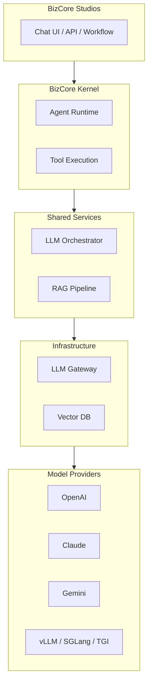

# BizCore AI

**BizCore AI は、AI 時代および将来の AGI に対応する企業向け業務開発基盤であり、分層アーキテクチャにより AI システムの複雑性を吸収し、開発者が継続的に業務実装へ集中できる状態を実現する。**

**言語**: [English](README_EN.md) | [简体中文](README_ZH.md) | 日本語

---

## なぜ BizCore AI か

AI モデルは急速に進化し、プロトコルは継続的に変化し、業務アプリは爆発的に増加する。
この不確定な未来に対して、**基盤がシステム複雑度を引き受け、開発者は業務実装に集中する** という分業が不可欠です。

BizCore AI はこの哲学を実現する **全スタック企業開発基盤** です。

---

## アーキテクチャ

BizCore AI のアーキテクチャは **3 つの視点** で理解する。混ぜて 1 枚図にしないこと。

### A. 静的アーキテクチャ — 7層構成

| Layer | ディレクトリ                          | 名称                     | 役割                                                                   |
| ----- | ------------------------------------- | ------------------------ | ---------------------------------------------------------------------- |
| 1     | Web UI / REST API / SDK / CLI         | Experience / Entry       | ユーザー・外部システムからの入口。業務ロジックを持たない               |
| 2     | `contracts/`                          | Contracts                | 唯一の canonical 契約層。全層が参照可能、二重 schema 禁止              |
| 3     | `kernel/`                             | Kernel                   | 実行中核。planner / router / flow runtime / state / tool executor 抽象 |
| 4     | `harness/`                            | Harness                  | 横断ガバナンス・品質・安全・検証の専用層                               |
| 5     | `kernel/protocols/` + 外部 adapter    | Integration              | MCP / A2A / OpenAPI — 接続・変換・認証・伝達に専念                     |
| 6     | `infrastructure/` + `shared/gateway/` | Infrastructure / Gateway | LLM Gateway・外部技術基盤。LLM 呼び出しは Gateway のみ                 |
| 7     | `control_plane/` + `apps/`            | Platform / Apps          | アプリ提供・運用・開発支援                                             |

**依存方向ルール:**

- Experience → Contracts → Kernel → Integration / Infrastructure
- Harness は Kernel の上で横断制御する
- Platform / Apps は Kernel / Harness / Integration を使う側
- Integration は接続のみ、Infrastructure は最下層
- **禁止**: provider SDK の直叩き / platform→apps 知識逆流 / shared に publish・deploy・codegen / domain に executable agent / harness が kernel 具体実装へ密結合 / MCP に主編排

### B. 実行時フロー

```
Request → CLI / API / MCP Entry (Layer 1)
  → Contract Validation (Layer 2)
  → Harness Pre-Check: Policy / Budget / Risk (Layer 4)
  → Kernel Plan / Route / Execute (Layer 3)
    → Integration: MCP / A2A 外部接続 (Layer 5)
    → Infrastructure: LLM Gateway 呼出 (Layer 6)
  → Harness Post-Check: Score / Validate / Trace (Layer 4)
  → Response Return (Layer 1)
```

Harness は実行の前後で介入し、Policy・Budget・Risk を事前検査、Score・Validate・Trace を事後検査する。

### C. 横断ガバナンスサブシステム（Harness）

| サブシステム        | 責務               | 主要コンポーネント               |
| ------------------- | ------------------ | -------------------------------- |
| Replay              | 実行再現           | ReplayRecorder, ReplayRunner     |
| Score               | 品質評価           | ExecutionScorer                  |
| Risk                | リスク評価         | RiskAssessor                     |
| Approval            | 承認ワークフロー   | ApprovalManager, Checkpoint      |
| Audit               | 監査記録           | AuditTrail                       |
| Trace               | 実行追跡           | TraceContract（contracts/ 定義） |
| Validation          | 入出力検証         | InputValidator, OutputValidator  |
| Budget              | トークン予算       | TokenBudgetManager               |
| Context Engineering | コンテキスト最適化 | ContextEngineer, RetrievalGate   |

### CLI-First 実行モデル

CLI は **Entry（Layer 1 の入口）** と **Runtime（Layer 3 の実行手段）** の二面性を持つ。

- すべての CLI は `--json` を持つ
- exit code を安定化、stdout / stderr / event / artifact を分離
- dry-run / trace_id 返却対応
- help を LLM に読ませやすい構造にする

### MCP-Based Integration モデル

MCP は **Layer 5 Integration に限定** する。

- **許可**: 外部ツール公開・接続・認証・伝達
- **禁止**: 主編排・内部契約の中心化・kernel の代替・harness の代替

### Gateway-First LLM Access

LLM 呼び出しは **Infrastructure / Gateway 経由のみ** とする。

- App / Kernel / Harness が provider SDK を直叩きしない
- 認証・予算・fallback・監視を中央集約
- embeddings / rerank / model selection も統一窓口

---

## 主な機能

### 実行エンジン（BizCore Kernel）

- **Engine パターン**: `SimpleEngine`（単一 Agent）/ `PipelineEngine`（多段・Review）/ `GateEngine`（入口審査）/ `RAGEngine`（検索拡張）/ `PEVEngine`（Plan-Execute-Verify）
- **Agent 定義**: `ResilientAgent` 継承 / `app_config.json + AgentFactory` / `@agent` デコレータ
- **内部編排**: `LocalAgentBus` を canonical とし、`LocalA2AHub` は互換レイヤーとして維持
- **フロー構築**: `create_flow(...).gate(...).then(...).parallel(...).review(...).build()`
- **統一プロトコル**: MCP / A2A / AG-UI / A2UI を単一 API 面で利用

### ガバナンス（BizCore Harness）

- **ポリシーエンジン**: 実行前後の判定・制約を宣言的に設定
- **HITL**: 承認・中断・再開（ApprovalManager / Checkpointer / interrupt）
- **Context Engineering**: トークン予算、ターン圧縮、RetrievalGate、KeyNotes
- **評価・監査**: Evaluation、Replay、Budget 管理

### 管理（BizCore Platform）

- **App ライフサイクル**: 作成 → 設定 → 実行 → 観測 → 配信
- **LLM 一元管理**: Provider / Model / Secret / Local Engine を Platform から統合管理
- **統一 API**: `/api/studios/*` と `/api/studios/framework/apps/*` を正規経路として提供

### 業務アプリ（BizCore Studios）

- **Migration Studio**: コード移行・モダナイゼーション
- **Enterprise FAQ Studio**: RAG ベースの FAQ・ナレッジ管理
- **Computer Assistant Studio**: 汎用 AI アシスタント・自動化

---

## LLM 推論基盤（Gateway 統一）

BizCore AI の LLM 呼び出しは Provider 直呼びを禁止し、`LLM Orchestrator → LLM Gateway` に統一します。


```mermaid
flowchart TB

subgraph APP["BizCore Studios"]
UI[Chat UI / API / Workflow]
end

subgraph KERNEL["BizCore Kernel"]
Runtime[Agent Runtime]
Tools[Tool Execution]
end

subgraph SHARED["Shared Services"]
Orchestrator[LLM Orchestrator]
RAG[RAG Pipeline]
end

subgraph INFRA["Infrastructure"]
Gateway[LLM Gateway]
Vector[Vector DB]
end

subgraph PROVIDER["Model Providers"]
OpenAI[OpenAI]
Claude[Claude]
Gemini[Gemini]
Local[vLLM / SGLang / TGI]
end

APP --> KERNEL
KERNEL --> SHARED
SHARED --> INFRA
INFRA --> PROVIDER
```

---

## リポジトリ構造

### 7コア層

- `contracts/`: プロトコル・インターフェース定義（Versioned）
- `infrastructure/`: 低レベル基盤（LLM Provider / Storage / Cache / Queue）
- `shared/`: 共通サービス（Gateway / RAG / Access / Trace / Audit）
- `kernel/`: Agent Runtime / Flow Engine / Orchestration / Protocol
- `harness/`: Governance / Policy / Approval / Budget / Evaluation
- `domain/`: 業界/業務ドメインの正規実装
- `control_plane/`: BizCore Control Plane の正規実装

### 製品層

- `apps/`: BizCore Studios と custom apps。7コア層の外側で製品を構成する

### 移行メモ

- 旧 import / 設定名は移行期間中に一部残るが、正本実装は `contracts/`, `infrastructure/`, `shared/`, `kernel/`, `harness/`, `domain/`, `control_plane/` に集約する

### 開発・運用

- `plugins/`: 拡張機能（Blocks / Tools / Providers）
- `docs/`: 外部/内部ドキュメント、設計資料
- `tests/`: 自動テストスイート（Unit / Integration / E2E）
- `code-rules/`: 統一コーディング規約と Lint ルール
- `scripts/`: 開発・保守用ユーティリティスクリプト

---

## 技術スタック

| 領域               | 技術                                                    |
| ------------------ | ------------------------------------------------------- |
| **バックエンド**   | Python 3.13+, FastAPI, Pydantic, Uvicorn                |
| **フロントエンド** | React, Vite, TypeScript, ESLint, Prettier               |
| **AI プロトコル**  | MCP, A2A, AG-UI, A2UI                                   |
| **インフラ**       | Supabase / PostgreSQL / Turso, Pinecone / Qdrant, Redis |
| **品質**           | Ruff, mypy, pytest（80%+ カバレッジ）, ESLint, tsc      |

---

## クイックスタート

> 各アプリ（FAQ System、Decision Governance Engine 等）の DB 構築・ローカル起動・Docker 発布手順は、各アプリの README.md を参照してください。
> FastAPI 系 app のローカル起動は、原則として各 app の `scripts/dev.py` または `app_config.json` の `runtime.commands.backend_dev` を使ってください。これらの helper は共通 launcher を使い、`明示指定 > app_config.json` の優先順位で host / port を解決し、コード側の第3既定値を持たずに `uvicorn` を起動します。
> ここでは共通基盤（auth_service + control_plane）の起動手順のみ記載します。

### 前提条件

| ツール                  | バージョン | 用途                        |
| ----------------------- | ---------- | --------------------------- |
| Python                  | 3.13+      | バックエンド実行            |
| conda                   | 任意       | 推奨仮想環境（`agentflow`） |
| Docker + Docker Compose | 最新       | DB・コンテナ起動            |
| Node.js                 | 18+        | フロントエンド起動          |

### 1. 環境セットアップ

````bash
この app 単体ではなく、リポジトリ全体の開発環境をセットアップします。

```bash
cd <repo-root>
bash setup_dev.sh
````

<!-- # conda 環境の作成と有効化（推奨）
conda create -n agentflow python=3.13 -y
conda activate agentflow -->

# 依存パッケージのインストール

pip install -e ".[apps,dev]"

````

### 2. auth_service（認証基盤）

auth_service は SQLite（ローカル開発）と PostgreSQL（Docker/本番）の両方に対応しています。

#### ローカル起動（SQLite 自動作成・DB 手順不要）

```bash
conda activate agentflow

# auth_service 起動（ポート 8010）
python -m shared.auth_service.main
# ヘルスチェック: curl http://localhost:8010/health

# フロントエンド起動（別ターミナル・ポート 3000）
cd shared/auth_service/frontend && npm install && npm run dev
````

> SQLite の場合、`shared/auth_service/data/auth_service.db` が自動作成されます。
> PostgreSQL を使用する場合は環境変数 `AUTH_DATABASE_URL` を設定してください。

#### Docker 起動（PostgreSQL）

```bash
cd shared/auth_service
# 全サービス起動（DB + API + 管理画面）
docker compose up --build -d

# ヘルスチェック
curl http://localhost:8010/health

# 停止
docker compose down
```

| サービス      | URL                   | 説明                    |
| ------------- | --------------------- | ----------------------- |
| auth API      | http://localhost:8010 | 認証 API（docs: /docs） |
| auth Admin UI | http://localhost:3010 | 管理画面                |
| auth DB       | localhost:5438        | PostgreSQL              |

### 3. control_plane（プラットフォーム管理）

control_plane は SQLite をデフォルト DB として使用し、DB 手順不要で起動できます。

#### ローカル起動（SQLite 自動作成）

```bash
conda activate agentflow

# control_plane 起動（ポート 8900）
python -m control_plane.main serve --reload
# ヘルスチェック: curl http://localhost:8900/health

# 正式な Control Plane UI（別ターミナル・ポート 3200）
cd control_plane/frontend && npm install && npm run dev

# 旧 Studio UI は experimental 扱い
# cd control_plane/ui/frontend && npm install && npm run dev
```

> SQLite の場合、`control_plane/data/control_plane.db` が自動作成されます。
> PostgreSQL を使用する場合は環境変数 `PLATFORM_DATABASE_URL` を設定してください。

### 4. dev_studio（開発支援）

dev_studio はコード生成・CI/CD 設定・品質分析などの開発支援ツールです。

#### ローカル起動

```bash
conda activate agentflow

# dev_studio 起動（ポート 8011）
python -m apps.dev_studio.main
# ヘルスチェック: curl http://localhost:8011/health
```

#### Docker 起動

```bash
cd apps/dev_studio

# ビルド & 起動
docker compose up --build -d

# ヘルスチェック
curl http://localhost:8011/health

# 停止
docker compose down
```

### サービス一覧（共通基盤）

| サービス | バックエンド | フロントエンド | DB | 説明 |
|---|---|---|---|---|
| auth_service | http://localhost:8010 | http://localhost:3000 | SQLite（ローカル）/ PostgreSQL:5438（Docker） | 認証・ユーザー管理 |
| control_plane | http://localhost:8900 | http://localhost:3200 | SQLite（自動作成） | プラットフォーム管理 |

### アプリ別 README

| アプリ                     | README                                                                                 | 説明                         |
| -------------------------- | -------------------------------------------------------------------------------------- | ---------------------------- |
| FAQ System                 | [apps/faq_system/README.md](apps/faq_system/README.md)                                 | RAG ベース FAQ・ナレッジ管理 |
| Decision Governance Engine | [apps/decision_governance_engine/README.md](apps/decision_governance_engine/README.md) | 意思決定支援                 |
| Code Migration Assistant   | [apps/code_migration_assistant/README.md](apps/code_migration_assistant/README.md)     | コード移行支援               |
| Market Trend Monitor       | [apps/market_trend_monitor/README.md](apps/market_trend_monitor/README.md)             | 市場トレンド監視             |
| Messaging Hub              | [apps/messaging_hub/README.md](apps/messaging_hub/README.md)                           | メッセージング統合           |
| Dev Studio                 | [apps/dev_studio/README.md](apps/dev_studio/README.md)                                 | 開発支援                     |

---

## ドキュメント・リンク

- **ドキュメント**: [docs/index.md](docs/index.md) | [対外](docs/external/README.md) | [対内](docs/internal/README.md) | [Studios](docs/studios.md)
- **リポジトリ**: [GitHub](https://github.com/liushuang393/serverlessAIAgents) | [Issues](https://github.com/liushuang393/serverlessAIAgents/issues)
- **ライセンス**: [MIT License](LICENSE)

---

## 謝辞 — 活用しているオープンソース技術

BizCore AI の開発は、以下のオープンソースプロジェクト・設計思想の恩恵なしには成立しませんでした。
各コミュニティとコントリビューターの皆様に心より感謝申し上げます。

### 🏗️ フレームワーク層

| プロジェクト | 役割 | ライセンス |
| --- | --- | --- |
| [FastAPI](https://github.com/fastapi/fastapi) | 高性能非同期 Web API フレームワーク（Kernel / Control Plane 基盤） | MIT |
| [Pydantic v2](https://github.com/pydantic/pydantic) | 型安全なデータ検証・スキーマ定義（Contracts 全域） | MIT |
| [SQLAlchemy](https://github.com/sqlalchemy/sqlalchemy) | ORM・DB 抽象化（Control Plane / Auth Service） | MIT |
| [Alembic](https://github.com/sqlalchemy/alembic) | データベースマイグレーション管理 | MIT |
| [Uvicorn](https://github.com/encode/uvicorn) | ASGI サーバー（FastAPI 実行ランタイム） | BSD-3-Clause |
| [React](https://github.com/facebook/react) | フロントエンド UI フレームワーク | MIT |
| [Vite](https://github.com/vitejs/vite) | 高速フロントエンドビルドツール | MIT |
| [TypeScript](https://github.com/microsoft/TypeScript) | 型安全なフロントエンド開発言語 | Apache 2.0 |

### 🤖 AI プロトコル層

| プロジェクト | 役割 | 提供元 |
| --- | --- | --- |
| [Model Context Protocol (MCP)](https://modelcontextprotocol.io/) | AI ツール統合プロトコル（Layer 5 Integration の標準） | Anthropic |
| [Agent-to-Agent Protocol (A2A)](https://github.com/google-a2a/A2A) | Agent 間通信・委譲プロトコル | Google |
| [AG-UI Protocol](https://github.com/ag-ui-protocol/ag-ui) | Agent → UI リアルタイムストリーミングプロトコル | Open Standard |

### 🛠️ ツール・インフラ層

| プロジェクト | 役割 | ライセンス |
| --- | --- | --- |
| [Qdrant](https://github.com/qdrant/qdrant) | 高性能ベクターデータベース（RAG Pipeline） | Apache 2.0 |
| [Redis](https://github.com/redis/redis) | 分散キャッシュ・メッセージキュー | BSD-3-Clause |
| [PostgreSQL](https://www.postgresql.org/) | リレーショナルデータベース | PostgreSQL License |
| [Supabase](https://github.com/supabase/supabase) | マネージド PostgreSQL + BaaS | Apache 2.0 |
| [Ruff](https://github.com/astral-sh/ruff) | 超高速 Python リンター・フォーマッター | MIT |
| [mypy](https://github.com/python/mypy) | Python 静的型チェッカー | MIT |
| [pytest](https://github.com/pytest-dev/pytest) | Python テストフレームワーク | MIT |
| [ESLint](https://github.com/eslint/eslint) / [Prettier](https://github.com/prettier/prettier) | フロントエンドコード品質・整形ツール | MIT |
| [Docker](https://www.docker.com/) | コンテナ化・デプロイ基盤 | Apache 2.0 |

### 🧩 組み込みスキル

BizCore Studios に同梱している以下のスキルは、オープンソースツール・サービスをベースに実装しています。

#### web-content-fetcher（Web 正文抽出）

| プロジェクト | 役割 | ライセンス |
| --- | --- | --- |
| [Jina Reader](https://github.com/jina-ai/reader) | URL から Markdown 正文を抽出するクラウドサービス（第一選択） | Apache 2.0 |
| [Scrapling](https://github.com/D4Vinci/Scrapling) | 反クロール対策済みの Python Web スクレイピングライブラリ（第二選択） | MIT |
| [html2text](https://github.com/Alir3z4/html2text) | HTML → Markdown 変換ライブラリ | GPL-3.0 |

#### design-skills（デザイン画像生成）

| プロジェクト | 役割 | ライセンス |
| --- | --- | --- |
| [ComfyUI](https://github.com/comfyanonymous/ComfyUI) | ローカル GPU 画像生成バックエンド（第一選択） | GPL-3.0 |
| [Stable Diffusion XL (SDXL)](https://github.com/Stability-AI/generative-models) | ローカル推論で使用する高品質テキスト → 画像モデル | CreativeML Open RAIL++-M |
| [OpenAI gpt-image-1](https://platform.openai.com/docs/guides/images) | ComfyUI 未起動時のクラウドフォールバック | — (商用 API) |

#### minimalist-entrepreneur-skills（起業フレームワークスキル集）

Sahil Lavingia（Gumroad 創業者）著『The Minimalist Entrepreneur』に基づく起業支援スキルパック。
validate-idea / mvp / pricing / marketing-plan など 10 スキルを収録し、`apps/messaging_hub` で使用しています。

| プロジェクト | 役割 | ライセンス |
| --- | --- | --- |
| [slavingia/skills](https://github.com/slavingia/skills) | ミニマリスト起業フレームワーク（10 スキル）のオリジナルリポジトリ | MIT |
| [『The Minimalist Entrepreneur』](https://www.minimalistentrepreneur.com/) — Sahil Lavingia | スキルの思想的基盤となった書籍 | — |

### 💡 設計思想・アーキテクチャ参考

| 思想・参考元 | 概要 |
| --- | --- |
| [Microsoft Agent Lightning](https://github.com/microsoft/agent-lightning) | 実行/訓練分離・トレース設計の参考元。AgentFlow のランタイム分離モデルに影響を与えた |
| **Clean Architecture** — Robert C. Martin | レイヤー分離・依存方向の原則。7 コア層の設計指針 |
| **ReAct Pattern** — Yao et al., 2022 | Reasoning + Acting を組み合わせた Agent ループ設計 |
| **RAG (Retrieval-Augmented Generation)** — Lewis et al., 2020 | 検索拡張生成によるナレッジ統合。RAGEngine / RetrievalGate の理論的基盤 |
| **HITL (Human-in-the-Loop)** | 人間監督を AI ガバナンスに内包する設計思想。Harness / ApprovalManager の根拠 |
| **Gateway Pattern** — Enterprise Integration Patterns | LLM アクセスの中央集約・フォールバック・オブザーバビリティ設計の根拠 |
| **Contract-First Design** | 契約（インターフェース）を先に定義し、実装を分離する設計原則。`contracts/` 層の哲学 |
| **12-Factor App** — Heroku | クラウドネイティブアプリの設計指針。設定外部化・ステートレス・ログ標準化に適用 |
| **Micro-kernel Agent（100行プロトタイプ）** — 内製 | `@agent` デコレータによる最小限 Agent 定義パターンの原型。当初 100 行程度の実験実装として誕生し、現在の `kernel/agent_decorator.py`（Skills 統合・Pydantic スキーマ・AgentRegistry 連携）に進化 |
