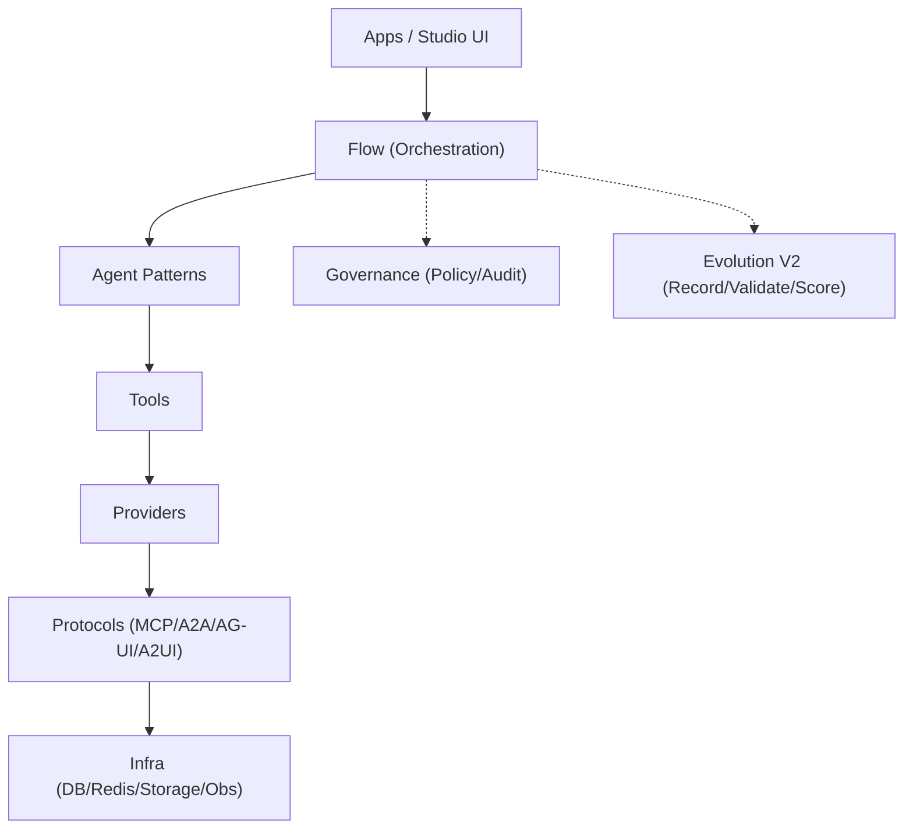
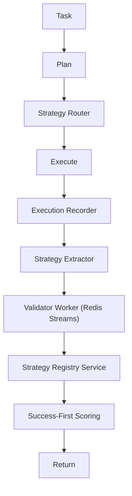

# AgentFlow

**Platform and base for AI agent development** — a lightweight framework with a unified interface for MCP, A2A, AG-UI, and A2UI.

**Languages**: English | [简体中文](README_ZH.md) | [日本語](README.md)

</div>

---

## ⚠️ Project Status

> **Notice**: This project is currently under development.
>
> - ✅ **Automated Tests**: 434 tests, 92.46% coverage
> - 🚧 **Production Use**: Please test thoroughly before use

---

## 🎯 What is AgentFlow

A lightweight AI agent framework providing unified interface for **MCP / A2A / AG-UI / A2UI** protocols.

## 🧩 3 Studio Product Lines (External Surface)

For business-facing delivery, the recommended product narrative is:

- `Migration Studio`
- `Enterprise FAQ Studio`
- `Computer Assistant Studio`

Customer flow is intentionally simplified to:
`Template -> Data/Permission Setup -> Run -> Artifacts`.
See `docs/studios.md` for details.

## 🧠 Design Intent (Apps + Kernel)

- Keep `agentflow/` as a stable Kernel boundary (orchestration/agents/tools/protocols); extend capabilities via plugin blocks first
- Treat `apps/` as deployable product units (UI/config/audit/ops included), not just examples
- Use `apps/platform` as the control plane to create/configure/run/observe apps consistently

## 🏗️ Architecture & App Layering

AgentFlow separates responsibilities into a clear layering model (8 layers), plus cross-cutting governance and evolution:

- Apps / UI (Studio UI / CLI / SDK)
- Flow (Task/Plan/Route/Execute)
- Agent (Patterns / Coordinator)
- Tool (tool bindings / MCP tools)
- Provider (LLM / Storage / 3rd party)
- Protocol (MCP / A2A / AG-UI / A2UI)
- Infra (DB / Redis / Queue / Observability)
- Kernel (stable boundary holding the layers above)

Cross-cutting: Governance (policy/audit), Evolution (Self-Evolution V2)



## 🗂️ Repository Structure

### Core Components
- `agentflow/`: Kernel (Engine, Agent patterns, Protocols)
- `apps/`: Product applications (Platform, Studios, specific apps)
- `plugins/`: Extensions (Blocks, Tools, Providers)
- `contracts/`: Versioned JSON contracts (compatibility boundary)
- `docs/`: External/internal documentation and design docs
- `tests/`: Automated test suite (Unit, Integration, E2E)
- `examples/`: Usage samples and demonstration code

### Tooling & Governance
- `.agent/`, `.agentflow/`: Agent workflows and internal execution data
- `.github/`: CI/CD workflows and GitHub templates
- `code-rules/`: Unified coding standards and linting rules
- `scripts/`: Development and maintenance utility scripts
- `Makefile`: Task automation commands

### Config & Environment
- `pyproject.toml`: Main project configuration and dependencies
- `requirements.txt`: Python package list (supplementary)
- `.env.example`: Template for environment variables

### Incubating & Internal
- `.kiro/`, `.sisyphus/`: Internal specs and agent notepads
- `mcp_client/`, `mcp_servers/`: MCP protocol specific implementations
- `studio/`: Standalone frontend studio (transitioning to `apps/platform`)

## 🧬 Evolution V2 (2026-02)

`Task -> Plan -> Strategy Router -> Execute -> Record -> Extract -> Validate -> Register -> Score -> Return`



### ✨ Key Features

| Feature | Description |
|---------|-------------|
| 🚀 **Lightweight** | Core code ~500 lines |
| 🔌 **4 Protocols** | MCP / A2A / AG-UI / A2UI |
| 🎨 **Auto Adapter** | `@auto_adapt` for protocol conversion |
| 🧠 **Skills Auto-Evolution** | Gets smarter with use |
| 📦 **CLI** | `agentflow init/run/create` |
| 🔒 **Type Safe** | 100% type annotations |
| ⚡ **Async** | Fully asynchronous I/O |

### 🎯 Skills Auto-Evolution System (NEW)

Claude Code Skills compatible auto-evolution capability system:

```
User Request → Skill Matching → Execute if exists
                             → Auto-generate if not → Validate → Persist
= Gets smarter with every use
```

```python
from agentflow.skills import SkillEngine

engine = SkillEngine(auto_learn=True)
result = await engine.resolve("Extract text from PDF")

if result.generated:
    print(f"🆕 New skill auto-generated: {result.skill.name}")
```

See [Skills Guide](docs/guide-skills.md) for details.

### 🏗️ Built-in Production-Ready Skills (NEW)

Enterprise-grade skills ready for production:

| Skill | Description | Supported Services |
|-------|-------------|-------------------|
| 🗄️ **database-manager** | DB management, CRUD, RLS | Supabase / Turso / PostgreSQL |
| 💳 **stripe-payment** | Payment & subscription | Stripe Checkout / Billing |
| 🚀 **deployment-manager** | Deploy & environment mgmt | Vercel / Cloudflare Pages |
| 🔐 **auth-provider** | Auth & session mgmt | Supabase Auth / Clerk |
| 🔄 **model-router** | Multi-LLM routing & cost optimization | OpenAI / Anthropic / Google |

```python
# Database integration
from agentflow.skills.builtin.database_manager import DatabaseManager, SupabaseConfig

db = DatabaseManager(provider="supabase", config=SupabaseConfig(
    url="https://xxx.supabase.co",
    anon_key="eyJ...",
))
await db.connect()
users = await db.select("users", filters={"status": "active"})

# Payment integration
from agentflow.skills.builtin.stripe_payment import StripePayment, StripeConfig

stripe = StripePayment(StripeConfig(secret_key="sk_..."))
session = await stripe.create_checkout_session(
    customer_email="user@example.com",
    line_items=[{"price": "price_xxx", "quantity": 1}],
    mode="subscription",
)

# Multi-model routing
from agentflow.llm import ModelRouter, RoutingStrategy

router = ModelRouter.from_env()  # Load API keys from environment
response = await router.chat(messages)  # Auto-select best model
```

See [Built-in Skills Guide](docs/guide-builtin-skills.md) for details.

### 🧠 Coordination Patterns

| Pattern | Description |
|---------|-------------|
| **Supervisor** | Dynamic worker selection |
| **Hierarchical** | Hierarchical task decomposition |
| **Sequential/Concurrent** | Sequential/Parallel execution |

---

## 📦 Installation

```bash
# Conda environment
conda env create -f environment.yml
conda activate agentflow

# Or pip
pip install -e .
```

---

## 🚀 Quick Start

```bash
# Create project
agentflow init my-agent && cd my-agent

# Run
agentflow run . --input '{"text": "hello"}'
```

See [Quick Start](docs/quickstart.md) for details.

---

## 1. Overview & Features

AgentFlow provides a **single API surface** for multiple protocols and agent coordination. For customers it is delivered as **3 Studio product lines** (Migration Studio, Enterprise FAQ Studio, Computer Assistant Studio); for developers it is built as a Kernel (`agentflow`) with plugin-based extension.

| Feature                    | Description                                                                               |
| -------------------------- | ----------------------------------------------------------------------------------------- |
| **8-layer architecture**   | Clear separation: Application, UI, Flow, Agent, Tools, Provider, Protocol, Infrastructure |
| **4 protocols unified**    | MCP, A2A, AG-UI, A2UI used from one codebase                                              |
| **3 Studio product lines** | Customer journey unified as: template → configuration → run → artifacts                   |
| **Development options**    | `@agent` decorator / `create_flow` / AgentCoordinator for simple to advanced use          |
| **Engine patterns**        | SimpleEngine, PipelineEngine, GateEngine, RAGEngine, PEVEngine ready to use               |
| **Type-safe & async**      | Full type annotations and async/await-first I/O                                           |
| **Skills auto-evolution**  | Plugin system that extends capabilities with use                                          |

---

## 2. Main Capabilities

- **Engine execution**: `SimpleEngine` (single agent), `PipelineEngine` (multi-stage, review loop), `GateEngine` (entry gate), `RAGEngine` (retrieval-augmented), `PEVEngine` (plan–execute–verify)
- **Agent definition**: `@agent` decorator, `AgentBlock` subclassing, invocation via `AgentClient.get("name").invoke(...)`
- **Flow construction**: `create_flow(...).gate(...).then(...).parallel(...).review(...).build()`
- **Loose-coupled providers**: `get_llm()`, `get_vectordb()`, `get_db()`, `get_embedding()` for environment-driven implementations
- **Channels**: Multi-platform message integration (MessageGateway, MessageChannelAdapter)
- **HITL**: Approval, interrupt, resume (ApprovalManager, Checkpointer, interrupt)
- **Context engineering**: Token budget, turn compression, RetrievalGate, KeyNotes, etc.
- **Built-in skills**: database-manager, stripe-payment, deployment-manager, auth-provider, etc. (optional)

---

## 3. Technical Architecture

**8 layers** (top to bottom): Application → UI → Flow → Agent → Tools → Provider → Protocol → Infrastructure. Upper layers depend only on lower layers; contracts are used via the public API in `agentflow/__init__.py`.

**Stack**: Python 3.13+, FastAPI, Pydantic, Uvicorn (backend); React, Vite, TypeScript (Studio and app frontends); MCP, A2A, AG-UI, A2UI (protocols); PocketFlow and related (workflow base). Quality tooling: Ruff, mypy, pytest.

---

## 4. Kernel, Platform, and Apps

| Layer                        | Role                                                                                                                                                           | Examples                                                                                             |
| ---------------------------- | -------------------------------------------------------------------------------------------------------------------------------------------------------------- | ---------------------------------------------------------------------------------------------------- |
| **Kernel (agentflow)**       | Stable API, engines, providers, protocol abstractions. Extension via plugins. Side-effectful operations go through policy and audit.                           | `agentflow` package, public API                                                                      |
| **Platform (apps/platform)** | Execution path for 3 Studios (template → config → run → artifacts) and Framework management API. Canonical APIs: `/api/studios/*`, `/api/studios/framework/*`. | Backend `apps.platform.main`, frontend `apps/platform/frontend`                                      |
| **Apps (apps/\*)**           | Product and sample applications. Apps aligned to Migration / FAQ / Assistant Studios, plus cross-cutting apps (orchestration, messaging, etc.).                | `code_migration_assistant`, `faq_system`, `decision_governance_engine`, `market_trend_monitor`, etc. |

External messaging is aligned to the 3 Studios; protocol names and internal layers are not exposed in business-facing UI.

---

## 5. Quick Start, Docs, License

**Before running**: Default environment is `conda activate agentflow`. Check `code-rules/CLAUDE.md` and the target app’s README before running commands.

```bash
conda activate agentflow
pip install -e ".[apps,dev]"
python -m apps.platform.main serve --port 8000
# In another terminal: cd apps/platform/frontend && npm install && npm run dev
```

- **Documentation**: Index [docs/index.md](docs/index.md), external [docs/external/README.md](docs/external/README.md), internal [docs/internal/README.md](docs/internal/README.md), 3 Studios [docs/studios.md](docs/studios.md)
- **Repository**: [GitHub](https://github.com/liushuang393/serverlessAIAgents) | [Issues](https://github.com/liushuang393/serverlessAIAgents/issues)
- **License**: [MIT License](LICENSE)

Parts of the execution/training decoupling and trace design were inspired by [Microsoft Agent Lightning](https://github.com/microsoft/agent-lightning).
