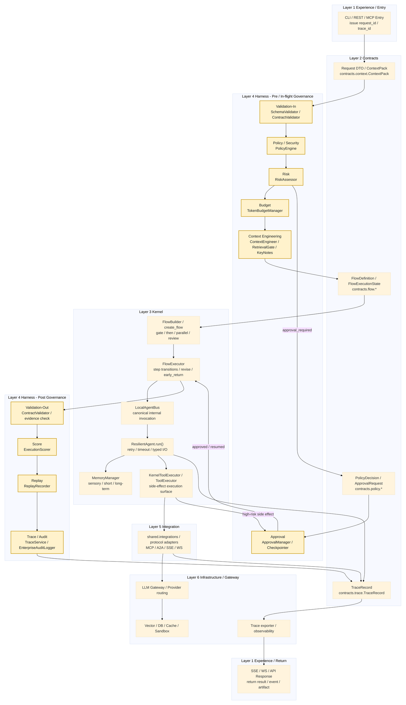
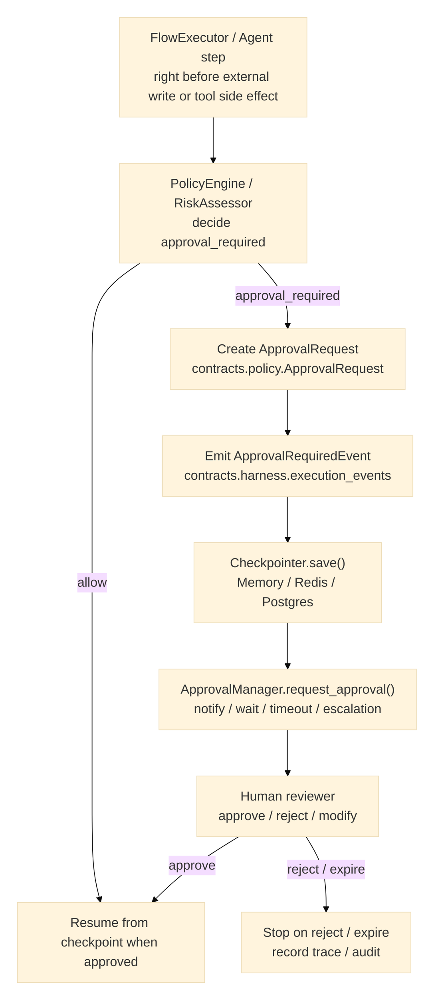
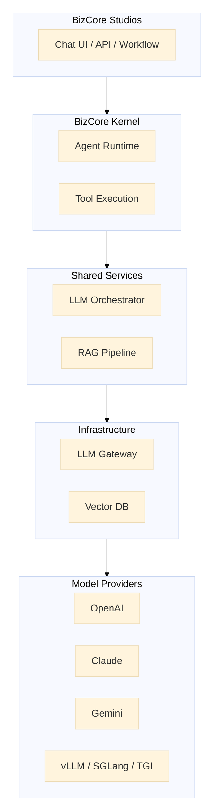

# BizCore AI

**BizCore AI is an enterprise business development foundation for the AI era and the future AGI era, designed to absorb AI system complexity through a layered architecture so developers can continuously focus on business implementation.**

**Languages**: English | [简体中文](README_ZH.md) | [日本語](README.md)

---

## Why BizCore AI

AI models evolve rapidly, protocols continue to advance, and business applications grow explosively.  
In this uncertain future, a clear division is essential: **the foundation absorbs system complexity while developers focus on business implementation**.

BizCore AI is the **full-stack enterprise development foundation** that realizes this philosophy.

---

## Architecture

BizCore AI should be understood from distinct viewpoints rather than compressed into one mixed diagram.

### A. Static Architecture - Eight Layers (Seven Core Layers Plus Apps)

BizCore AI is organized into eight layers in total: seven core layers plus `apps/` as the outer product-assembly layer.

```
┌─────────────────────────────────────────────┐
│  BizCore Studios (Apps)                     │  ← Product Assembly Layer (outside the core)
│  Migration / FAQ / Assistant / Custom Apps  │
├─────────────────────────────────────────────┤
│  BizCore Control Plane                      │  ← Management / Observability / Delivery
├─────────────────────────────────────────────┤
│  BizCore Domain                             │  ← Business Domains / Industry Templates
├─────────────────────────────────────────────┤
│  BizCore Harness (Governance)               │  ← Governance / Reliability / Evaluation
├─────────────────────────────────────────────┤
│  BizCore Kernel (Runtime)                   │  ← Execution Engine / Agents / Flows
├─────────────────────────────────────────────┤
│  Shared Services                            │  ← Common Services (Gateway/RAG/Access)
├─────────────────────────────────────────────┤
│  Infrastructure                             │  ← Low-level Foundation (LLM/Storage/Cache)
├─────────────────────────────────────────────┤
│  Contracts                                  │  ← Protocol & Interface Definitions
└─────────────────────────────────────────────┘
```

| Layer                     | Directory         | Responsibility                                                                     |
| ------------------------- | ----------------- | ---------------------------------------------------------------------------------- |
| **Contracts**             | `contracts/`      | Cross-layer protocol, type, and interface definitions (Versioned)                  |
| **Infrastructure**        | `infrastructure/` | LLM Providers, Storage, Cache, Queue, Sandbox, and other low-level foundations     |
| **Shared**                | `shared/`         | LLM Gateway, RAG, Access Control, Trace, Audit, and other shared services          |
| **BizCore Kernel**        | `kernel/`         | Agent Runtime, Flow Engine, Orchestration, Protocol implementations                |
| **BizCore Harness**       | `harness/`        | Governance, Policy, Approval, Budget, Evaluation, Guardrails                       |
| **BizCore Domain**        | `domain/`         | Industry and business-domain models, interfaces, templates, and rules              |
| **BizCore Control Plane** | `control_plane/`  | The platform control plane for discovery, lifecycle, delivery, and operator UI/API |
| **BizCore Studios**       | `apps/*/`         | Product layer for Migration / FAQ / Assistant / custom apps                        |

> **Design Principle**: `contracts / infrastructure / shared / kernel / harness / domain` must not depend on `apps/`. `domain` must not depend on `control_plane`. `control_plane` can orchestrate lower layers but is not their source of truth.

### B-1. Runtime Flow


```mermaid
%%{init: {'theme': 'base', 'themeVariables': {'fontSize': '18px'}, 'flowchart': {'useMaxWidth': false, 'nodeSpacing': 40, 'rankSpacing': 70, 'diagramPadding': 24}} }%%
flowchart TB
    subgraph L1A["Layer 1 Experience / Entry"]
        direction TB
        entry["CLI / REST / MCP Entry<br/>issue request_id / trace_id"]
    end

    subgraph L2["Layer 2 Contracts"]
        direction TB
        contract_in["Request DTO / ContextPack<br/>contracts.context.ContextPack"]
        contract_flow["FlowDefinition / FlowExecutionState<br/>contracts.flow.*"]
        contract_policy["PolicyDecision / ApprovalRequest<br/>contracts.policy.*"]
        contract_trace["TraceRecord<br/>contracts.trace.TraceRecord"]
    end

    subgraph L4A["Layer 4 Harness - Pre / In-flight Governance"]
        direction TB
        validate_in["Validation-In<br/>SchemaValidator / ContractValidator"]
        policy["Policy / Security<br/>PolicyEngine"]
        risk["Risk<br/>RiskAssessor"]
        budget["Budget<br/>TokenBudgetManager"]
        context["Context Engineering<br/>ContextEngineer / RetrievalGate / KeyNotes"]
        approval_gate["Approval<br/>ApprovalManager / Checkpointer"]
    end

    subgraph L3["Layer 3 Kernel"]
        direction TB
        builder["FlowBuilder / create_flow<br/>gate / then / parallel / review"]
        executor["FlowExecutor<br/>step transitions / revise / early_return"]
        bus["LocalAgentBus<br/>canonical internal invocation"]
        agent["ResilientAgent.run()<br/>retry / timeout / typed I/O"]
        tools["KernelToolExecutor / ToolExecutor<br/>side-effect execution surface"]
        memory["MemoryManager<br/>sensory / short / long-term"]
    end

    subgraph L5["Layer 5 Integration"]
        direction TB
        integration["shared.integrations / protocol adapters<br/>MCP / A2A / SSE / WS"]
    end

    subgraph L6["Layer 6 Infrastructure / Gateway"]
        direction TB
        gateway["LLM Gateway / Provider routing"]
        storage["Vector / DB / Cache / Sandbox"]
        trace_export["Trace exporter / observability"]
    end

    subgraph L4B["Layer 4 Harness - Post Governance"]
        direction TB
        validate_out["Validation-Out<br/>ContractValidator / evidence check"]
        score["Score<br/>ExecutionScorer"]
        replay["Replay<br/>ReplayRecorder"]
        trace_audit["Trace / Audit<br/>TraceService / EnterpriseAuditLogger"]
    end

    subgraph L1B["Layer 1 Experience / Return"]
        direction TB
        return["SSE / WS / API Response<br/>return result / event / artifact"]
    end

    entry --> contract_in --> validate_in --> policy --> risk --> budget --> context --> contract_flow --> builder --> executor
    executor --> bus --> agent
    agent --> memory
    agent --> tools --> integration --> gateway
    gateway --> storage
    executor --> validate_out --> score --> replay --> trace_audit --> contract_trace --> trace_export --> return
    risk -->|approval_required| contract_policy --> approval_gate
    approval_gate -->|approved / resumed| executor
    tools -->|high-risk side effect| approval_gate
    agent --> contract_trace
    integration --> contract_trace

    classDef harness fill:#FFF2CC,stroke:#C69200,stroke-width:2px,color:#222;
    class validate_in,policy,risk,budget,context,approval_gate,validate_out,score,replay,trace_audit harness;
```

Harness is not only a pre/post wrapper. It also injects `ContextEngineer`, `TokenBudgetManager`, and `ApprovalManager` into the live execution path so long multi-step runs stay bounded, typed, and evidence-backed.

If this diagram is used to harden framework contracts, the minimum fixed boundaries are:

- Entry → Contracts: require `ContextPack`, `trace_id`, and normalized request DTOs across UI / API / CLI
- Contracts → Kernel: fix `FlowDefinition`, `FlowExecutionState`, and per-step input/output schemas so `FlowExecutor` remains traceable
- Kernel → Harness: standardize `PolicyDecision`, `ApprovalRequest`, and `ExecutionEvent` so approval, reject, resume, and audit all follow the same path
- Kernel / Integration → Trace: emit `TraceRecord` plus artifact IDs from every step to support Replay, Scoring, and Audit from shared evidence

### B-2. Context, Memory, Safety, and Self-Improvement Loop


```mermaid
%%{init: {'theme': 'base', 'themeVariables': {'fontSize': '18px'}, 'flowchart': {'useMaxWidth': false, 'nodeSpacing': 40, 'rankSpacing': 70, 'diagramPadding': 24}} }%%
flowchart LR
    task["New task / next-step input"]
    ctx["ContextEngineer<br/>budgeting / compression / KeyNotes injection"]
    retrieve["RetrievalGate<br/>decide whether retrieval is needed"]
    mem_recall["MemoryManager.recall()<br/>reuse long / short-term memory"]
    execute["FlowExecutor / ResilientAgent<br/>multi-step execution"]
    safety["Policy / Risk / Validation<br/>safety, contract, drift checks"]
    score["ExecutionScorer<br/>quality and precision evaluation"]
    replay["ReplayRecorder / TraceService<br/>persist step evidence"]
    evolve["EvolutionEngine<br/>extract strategy / register candidate / update score"]
    next_ctx["Next-run improvement<br/>compression rules / strategy hints / memory importance"]

    task --> ctx --> retrieve
    retrieve -->|yes| mem_recall --> execute
    retrieve -->|no| execute
    execute --> safety --> score --> replay --> evolve --> next_ctx --> ctx
```

The goal of this loop is not just successful execution. It is to preserve precision across many steps by retaining evidence, compressing context intelligently, and feeding successful strategies back into the next run.

### C. Cross-Cutting Governance Subsystems (Harness)

| Subsystem | What It Is Used For | Injection Point (Layer / Stage) | Contribution to Precision and Autonomy | Main Components |
| --- | --- | --- | --- | --- |
| Policy / Security | Decide whether an action is allowed and whether subject-resource-action matches policy | Layer 2→4, immediately after entry and before tool execution | Prevents unsafe or unauthorized forward progress | PolicyEngine, AuthContext, PolicyDecision |
| Risk | Detect high-risk, high-cost, or high-impact branches | Layer 4, after planning / before execution / before delivery | Makes approval requirements explicit and blocks risky drift | RiskAssessor, RiskAssessment, RiskFactor |
| Approval | Human approval, waiting, resume, timeout handling | Layer 4, stop-point before `interrupt()` | Prevents duplicate execution around non-idempotent operations | ApprovalManager, ApprovalRequest, Checkpointer |
| Validation | Detect schema violations, missing fields, and output shape drift | Layer 2↔4, at entry, per-step completion, and final output | Keeps multi-step pipelines from silently degrading structure | SchemaValidator, ContractValidator |
| Budget | Enforce token, cost, and context-window ceilings | Layer 4, before prompt build, retrieval, and step transitions | Preserves focus under long execution and prevents context saturation | TokenBudgetManager |
| Context Engineering | Compress history, extract key notes, decide retrieval necessity, rebuild context | Layer 4, on every turn and before each step | Maintains relevance instead of letting long context reduce accuracy | ContextEngineer, RetrievalGate, KeyNotesStore |
| Replay | Reproduce execution for debugging and framework tuning | Layer 4, on each step completion and failure event | Makes precision loss reproducible instead of anecdotal | ReplayRecorder, ReplayRunner |
| Score | Quantify execution quality | Layer 4, after steps and final result | Evaluates completeness, safety, and cost alongside accuracy | ExecutionScorer, DimensionScore |
| Trace / Audit | Persist spans, artifacts, and decision evidence | Layer 2 / 4 / 6, across all steps | Creates a shared evidence plane for audit and self-improvement | TraceRecord, TraceService, EnterpriseAuditLogger |

Harness should be treated as a control layer inserted along Kernel step execution, not as a passive observer around the edges.

### D. Approval Flow (HITL / Non-Idempotent Action Guard)


```mermaid
%%{init: {'theme': 'base', 'themeVariables': {'fontSize': '18px'}, 'flowchart': {'useMaxWidth': false, 'nodeSpacing': 36, 'rankSpacing': 64, 'diagramPadding': 24}} }%%
flowchart TD
    step["FlowExecutor / Agent step<br/>right before external write or tool side effect"]
    policy["PolicyEngine / RiskAssessor<br/>decide approval_required"]
    req["Create ApprovalRequest<br/>contracts.policy.ApprovalRequest"]
    event["Emit ApprovalRequiredEvent<br/>contracts.harness.execution_events"]
    save["Checkpointer.save()<br/>Memory / Redis / Postgres"]
    wait["ApprovalManager.request_approval()<br/>notify / wait / timeout / escalation"]
    human["Human reviewer<br/>approve / reject / modify"]
    resume["Resume from checkpoint when approved"]
    reject["Stop on reject / expire<br/>record trace / audit"]

    step --> policy
    policy -->|allow| resume
    policy -->|approval_required| req --> event --> save --> wait --> human
    human -->|approve| resume
    human -->|reject / expire| reject
```

Do not perform non-idempotent actions before `interrupt()`. Always create an `ApprovalRequest`, persist the stop-point through `Checkpointer`, and only then wait for approval so resume does not duplicate side effects.

---

## Key Features

### Execution Engine (BizCore Kernel)

- **Engine Patterns**: `SimpleEngine` (single Agent) / `PipelineEngine` (multi-stage, Review) / `GateEngine` (entry gate) / `RAGEngine` (retrieval-augmented) / `PEVEngine` (Plan-Execute-Verify)
- **Agent Definition**: `@agent` decorator / `AgentBlock` subclassing / `AgentClient.get("name").invoke(...)`
- **Flow Construction**: `create_flow(...).gate(...).then(...).parallel(...).review(...).build()`
- **Unified Protocols**: MCP / A2A / AG-UI / A2UI via a single API surface

### Governance (BizCore Harness)

- **Policy Engine**: Declaratively configure pre/post-execution checks and constraints
- **HITL**: Approval, interrupt, resume (ApprovalManager / Checkpointer / interrupt)
- **Context Engineering**: Token budget, turn compression, RetrievalGate, KeyNotes
- **Evaluation & Audit**: Evaluation, Replay, Budget management

### Management (BizCore Platform)

- **App Lifecycle**: Create → Configure → Execute → Observe → Deliver
- **Unified LLM Management**: Provider / Model / Secret / Local Engine managed centrally by Platform
- **Unified API**: `/api/studios/*` and `/api/studios/framework/apps/*` as canonical routes

### Business Applications (BizCore Studios)

- **Migration Studio**: Code migration and modernization
- **Enterprise FAQ Studio**: RAG-based FAQ and knowledge management
- **Computer Assistant Studio**: General-purpose AI assistant and automation

---

## LLM Inference Infrastructure (Gateway-First)

BizCore AI forbids direct Provider SDK calls. All LLM requests go through `LLM Orchestrator → LLM Gateway`.


```mermaid
%%{init: {'theme': 'base', 'themeVariables': {'fontSize': '18px'}, 'flowchart': {'useMaxWidth': false, 'nodeSpacing': 40, 'rankSpacing': 70, 'diagramPadding': 24}} }%%
flowchart TB

subgraph APP["BizCore Studios"]
UI[Chat UI / API / Workflow]
end

subgraph KERNEL["BizCore Kernel"]
Runtime[Agent Runtime]
Tools[Tool Execution]
end

subgraph SHARED["Shared Services"]
Orchestrator[LLM Orchestrator]
RAG[RAG Pipeline]
end

subgraph INFRA["Infrastructure"]
Gateway[LLM Gateway]
Vector[Vector DB]
end

subgraph PROVIDER["Model Providers"]
OpenAI[OpenAI]
Claude[Claude]
Gemini[Gemini]
Local[vLLM / SGLang / TGI]
end

APP --> KERNEL
KERNEL --> SHARED
SHARED --> INFRA
INFRA --> PROVIDER
```

### Runtime Defaults and Operational Notes

- If an app does not define `contracts.llm`, the default text-generation path is not a single hard-coded model from settings. It goes through the Gateway `reasoning` role. The default alias is `reasoning_claude` (`anthropic / claude-sonnet-4-6`) with fallback order `coding_openai` → `cheap_gemini` → `local_vllm_default`.
- If an app defines `contracts.llm.defaults.text` or `contracts.llm.defaults.embedding`, those contract values are canonical. Apps such as FAQ should pin `platform_text_default` and `platform_embedding_default` explicitly.
- If an app does not pin an embedding model, the fallback chain is `OLLAMA_EMBEDDING_MODEL` → `OPENAI_EMBEDDING_MODEL` → local `all-MiniLM-L6-v2` → `mock`. That means the actual default is environment-dependent, so production apps should fix it through `contracts.llm`.
- If app config, runtime config, and env all omit the database, the default DB is `MockDBProvider`. If the vector store is also unspecified, the default is `MockVectorDBProvider(collection=default)`.
- The FAQ app now splits databases by responsibility: `FAQ_DATABASE_URL` / `FAQ_APP_DATABASE_URL` for the auth/session `app_db`, `FAQ_SQL_SOURCE_DATABASE_URL` for the Text2SQL `sql_source_db`, and `contracts.rag.data_sources[]` for RAG ingestion sources.
- `contracts.rag` is the canonical RAG source of truth. `services.rag` and `services.vector_db` may remain for transition compatibility, but runtime resolution now prefers `contracts.rag`.

---

## Repository Structure

### Seven Core Layers + Apps Outer Layer

- `contracts/`: Protocol and interface definitions (Versioned)
- `infrastructure/`: Low-level foundation (LLM Provider / Storage / Cache / Queue)
- `shared/`: Shared services (Gateway / RAG / Access / Trace / Audit)
- `kernel/`: Agent Runtime / Flow Engine / Orchestration / Protocol
- `harness/`: Governance / Policy / Approval / Budget / Evaluation
- `domain/`: Canonical business-domain implementation
- `control_plane/`: Canonical BizCore control-plane implementation

### Product Layer

- `apps/`: BizCore Studios and custom apps, serving as the eighth and outermost product layer

### Transition Notes

- Some legacy import and config names may remain during migration, but the canonical implementation is consolidated under `contracts/`, `infrastructure/`, `shared/`, `kernel/`, `harness/`, `domain/`, and `control_plane/`

### Development & Operations

- `plugins/`: Extensions (Blocks / Tools / Providers)
- `docs/`: External/internal documentation and design materials
- `tests/`: Automated test suite (Unit / Integration / E2E)
- `code-rules/`: Unified coding standards and lint rules
- `scripts/`: Development and maintenance utility scripts

---

## Tech Stack

| Area               | Technologies                                            |
| ------------------ | ------------------------------------------------------- |
| **Backend**        | Python 3.13+, FastAPI, Pydantic, Uvicorn                |
| **Frontend**       | React, Vite, TypeScript, ESLint, Prettier               |
| **AI Protocols**   | MCP, A2A, AG-UI, A2UI                                   |
| **Infrastructure** | Supabase / PostgreSQL / Turso, Pinecone / Qdrant, Redis |
| **Quality**        | Ruff, mypy, pytest (80%+ coverage), ESLint, tsc         |

---

## Quick Start

> For app-specific setup (FAQ System, Decision Governance Engine, etc.), see each app's README.md.
> This section covers only the shared infrastructure (auth_service + control_plane).

### Prerequisites

| Tool                    | Version | Purpose                                       |
| ----------------------- | ------- | --------------------------------------------- |
| Python                  | 3.13+   | Backend runtime                               |
| conda                   | Any     | Recommended virtual environment (`agentflow`) |
| Docker + Docker Compose | Latest  | DB and container startup                      |
| Node.js                 | 18+     | Frontend development                          |

### 1. Environment Setup

```bash
# Create and activate conda environment (recommended)
conda create -n agentflow python=3.13 -y
conda activate agentflow

# Install dependencies
pip install -e ".[apps,dev]"
```

### 2. auth_service (Authentication)

Supports both SQLite (local dev) and PostgreSQL (Docker/production).

#### Local Start (SQLite, no DB setup needed)

```bash
conda activate agentflow

# Start auth_service (port 8010)
python -m shared.auth_service.main
# Health check: curl http://localhost:8010/health

# Start frontend (separate terminal, port 3000)
cd shared/auth_service/frontend && npm install && npm run dev
```

#### Docker Start (PostgreSQL)

```bash
cd shared/auth_service
docker compose up --build -d
# Health check: curl http://localhost:8010/health
# Stop: docker compose down
```

### 3. control_plane (Platform Management)

Uses SQLite by default, no DB setup needed.

#### Local Start

```bash
conda activate agentflow

# Start control_plane (port 8900)
python -m control_plane.main serve
# Health check: curl http://localhost:8900/health

# Start frontend (separate terminal, port 3200)
cd control_plane/frontend && npm install && npm run dev
```

### 4. dev_studio (Developer Tools)

Code generation, CI/CD configuration, and quality analysis tools.

#### Local Start

```bash
conda activate agentflow
python -m apps.dev_studio.main
# Health check: curl http://localhost:8011/health
```

#### Docker Start

```bash
cd apps/dev_studio
docker compose up --build -d
# Health check: curl http://localhost:8011/health
# Stop: docker compose down
```

### Service Overview

| Service | Backend | Frontend | Description |
|---|---|---|---|
| auth_service | http://localhost:8010 | http://localhost:3000 | Authentication & user management |
| control_plane | http://localhost:8900 | http://localhost:3200 | Platform management |

### App-specific READMEs

| App                        | README                                                                                 | Description                          |
| -------------------------- | -------------------------------------------------------------------------------------- | ------------------------------------ |
| FAQ System                 | [apps/faq_system/README.md](apps/faq_system/README.md)                                 | RAG-based FAQ & knowledge management |
| Decision Governance Engine | [apps/decision_governance_engine/README.md](apps/decision_governance_engine/README.md) | Decision support system              |
| Code Migration Assistant   | [apps/code_migration_assistant/README.md](apps/code_migration_assistant/README.md)     | Code migration support               |

---

## Documentation & Links

- **Documentation**: [docs/index.md](docs/index.md) | [External](docs/external/README.md) | [Internal](docs/internal/README.md) | [Studios](docs/studios.md)
- **Repository**: [GitHub](https://github.com/liushuang393/serverlessAIAgents) | [Issues](https://github.com/liushuang393/serverlessAIAgents/issues)
- **License**: [MIT License](LICENSE)

---

## Acknowledgements — Open Source Technologies

BizCore AI is built on the shoulders of outstanding open source projects, tools, and design philosophies.
We are deeply grateful to every contributor and community behind them.

### 🏗️ Framework Layer

| Project | Role | License |
| --- | --- | --- |
| [FastAPI](https://github.com/fastapi/fastapi) | High-performance async Web API framework (Kernel / Control Plane) | MIT |
| [Pydantic v2](https://github.com/pydantic/pydantic) | Type-safe data validation and schema definition (Contracts layer) | MIT |
| [SQLAlchemy](https://github.com/sqlalchemy/sqlalchemy) | ORM and database abstraction (Control Plane / Auth Service) | MIT |
| [Alembic](https://github.com/sqlalchemy/alembic) | Database migration management | MIT |
| [Uvicorn](https://github.com/encode/uvicorn) | ASGI server (FastAPI runtime) | BSD-3-Clause |
| [React](https://github.com/facebook/react) | Frontend UI framework | MIT |
| [Vite](https://github.com/vitejs/vite) | Fast frontend build tooling | MIT |
| [TypeScript](https://github.com/microsoft/TypeScript) | Type-safe frontend development language | Apache 2.0 |

### 🤖 AI Protocol Layer

| Project | Role | By |
| --- | --- | --- |
| [Model Context Protocol (MCP)](https://modelcontextprotocol.io/) | AI tool integration protocol (Layer 5 Integration standard) | Anthropic |
| [Agent-to-Agent Protocol (A2A)](https://github.com/google-a2a/A2A) | Inter-agent communication and delegation protocol | Google |
| [AG-UI Protocol](https://github.com/ag-ui-protocol/ag-ui) | Agent → UI real-time streaming protocol | Open Standard |

### 🛠️ Tool & Infrastructure Layer

| Project | Role | License |
| --- | --- | --- |
| [Qdrant](https://github.com/qdrant/qdrant) | High-performance vector database (RAG Pipeline) | Apache 2.0 |
| [Redis](https://github.com/redis/redis) | Distributed cache and message queue | BSD-3-Clause |
| [PostgreSQL](https://www.postgresql.org/) | Relational database | PostgreSQL License |
| [Supabase](https://github.com/supabase/supabase) | Managed PostgreSQL + BaaS | Apache 2.0 |
| [Ruff](https://github.com/astral-sh/ruff) | Ultra-fast Python linter and formatter | MIT |
| [mypy](https://github.com/python/mypy) | Python static type checker | MIT |
| [pytest](https://github.com/pytest-dev/pytest) | Python testing framework | MIT |
| [ESLint](https://github.com/eslint/eslint) / [Prettier](https://github.com/prettier/prettier) | Frontend code quality and formatting tools | MIT |
| [Docker](https://www.docker.com/) | Container and deployment infrastructure | Apache 2.0 |

### 🧩 Built-in Skills

The following skills shipped with BizCore Studios are built on top of open source tools and services.

#### web-content-fetcher (Web Content Extraction)

| Project | Role | License |
| --- | --- | --- |
| [Jina Reader](https://github.com/jina-ai/reader) | Cloud service for extracting clean Markdown content from URLs (primary) | Apache 2.0 |
| [Scrapling](https://github.com/D4Vinci/Scrapling) | Anti-bot-aware Python web scraping library (secondary fallback) | MIT |
| [html2text](https://github.com/Alir3z4/html2text) | HTML to Markdown conversion library | GPL-3.0 |

#### design-skills (Design Image Generation)

| Project | Role | License |
| --- | --- | --- |
| [ComfyUI](https://github.com/comfyanonymous/ComfyUI) | Local GPU image generation backend (primary) | GPL-3.0 |
| [Stable Diffusion XL (SDXL)](https://github.com/Stability-AI/generative-models) | High-quality text-to-image model for local inference | CreativeML Open RAIL++-M |
| [OpenAI gpt-image-1](https://platform.openai.com/docs/guides/images) | Cloud fallback when ComfyUI is unavailable | — (Commercial API) |

#### minimalist-entrepreneur-skills (Startup Framework Skill Pack)

A skill pack based on Sahil Lavingia's (Gumroad founder) book *The Minimalist Entrepreneur*, providing 10 structured skills for startup decision-making, used in `apps/messaging_hub`.

| Project | Role | License |
| --- | --- | --- |
| [slavingia/skills](https://github.com/slavingia/skills) | Original repository for the minimalist entrepreneur skill pack (10 skills) | MIT |
| [*The Minimalist Entrepreneur*](https://www.minimalistentrepreneur.com/) — Sahil Lavingia | The book that serves as the philosophical foundation of the skills | — |

### 💡 Design Philosophy & Architecture Inspiration

| Concept / Reference | Summary |
| --- | --- |
| [Microsoft Agent Lightning](https://github.com/microsoft/agent-lightning) | Inspired BizCore's execution/training decoupling model and distributed trace design |
| **Clean Architecture** — Robert C. Martin | Layer separation and dependency-direction principles behind BizCore's layered architecture |
| **ReAct Pattern** — Yao et al., 2022 | Agent loop design combining Reasoning + Acting, foundational to the Kernel runtime |
| **RAG (Retrieval-Augmented Generation)** — Lewis et al., 2020 | Knowledge integration via retrieval augmentation; theoretical basis for RAGEngine / RetrievalGate |
| **HITL (Human-in-the-Loop)** | Design philosophy for embedding human oversight into AI governance (Harness / ApprovalManager) |
| **Gateway Pattern** — Enterprise Integration Patterns | Centralized LLM access with fallback and observability; basis for the LLM Gateway design |
| **Contract-First Design** | Define interfaces before implementations to decouple layers; the philosophy behind `contracts/` |
| **12-Factor App** — Heroku | Cloud-native application design principles applied to config externalization, statelessness, and logging |
| **Micro-kernel Agent (100-line Prototype)** — In-house | The original proof-of-concept that introduced the `@agent` decorator pattern for defining agents with a minimal plain class. Started as ~100 lines and has since evolved into `kernel/agent_decorator.py` (Skills integration, Pydantic schema support, AgentRegistry & A2AHub registration) |
