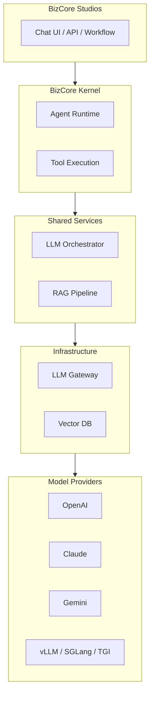

# BizCore AI

**BizCore AI is an enterprise business development foundation for the AI era and the future AGI era, designed to absorb AI system complexity through a layered architecture so developers can continuously focus on business implementation.**

**Languages**: English | [简体中文](README_ZH.md) | [日本語](README.md)

---

## Why BizCore AI

AI models evolve rapidly, protocols continue to advance, and business applications grow explosively.  
In this uncertain future, a clear division is essential: **the foundation absorbs system complexity while developers focus on business implementation**.

BizCore AI is the **full-stack enterprise development foundation** that realizes this philosophy.

---

## Seven Core Layers Plus Apps

BizCore AI is organized into seven core layers, with `apps/` as the outer product-assembly layer.

```
┌─────────────────────────────────────────────┐
│  BizCore Studios (Apps)                     │  ← Product Assembly Layer (outside the core)
│  Migration / FAQ / Assistant / Custom Apps  │
├─────────────────────────────────────────────┤
│  BizCore Control Plane                      │  ← Management / Observability / Delivery
├─────────────────────────────────────────────┤
│  BizCore Domain                             │  ← Business Domains / Industry Templates
├─────────────────────────────────────────────┤
│  BizCore Harness (Governance)               │  ← Governance / Reliability / Evaluation
├─────────────────────────────────────────────┤
│  BizCore Kernel (Runtime)                   │  ← Execution Engine / Agents / Flows
├─────────────────────────────────────────────┤
│  Shared Services                            │  ← Common Services (Gateway/RAG/Access)
├─────────────────────────────────────────────┤
│  Infrastructure                             │  ← Low-level Foundation (LLM/Storage/Cache)
├─────────────────────────────────────────────┤
│  Contracts                                  │  ← Protocol & Interface Definitions
└─────────────────────────────────────────────┘
```

| Layer | Directory | Responsibility |
|---|---|---|
| **Contracts** | `contracts/` | Cross-layer protocol, type, and interface definitions (Versioned) |
| **Infrastructure** | `infrastructure/` | LLM Providers, Storage, Cache, Queue, Sandbox, and other low-level foundations |
| **Shared** | `shared/` | LLM Gateway, RAG, Access Control, Trace, Audit, and other shared services |
| **BizCore Kernel** | `kernel/` | Agent Runtime, Flow Engine, Orchestration, Protocol implementations |
| **BizCore Harness** | `harness/` | Governance, Policy, Approval, Budget, Evaluation, Guardrails |
| **BizCore Domain** | `domain/` | Industry and business-domain models, interfaces, templates, and rules |
| **BizCore Control Plane** | `control_plane/` | The platform control plane for discovery, lifecycle, delivery, and operator UI/API |
| **BizCore Studios** | `apps/*/` | Product layer for Migration / FAQ / Assistant / custom apps |

> **Design Principle**: `contracts / infrastructure / shared / kernel / harness / domain` must not depend on `apps/`. `domain` must not depend on `control_plane`. `control_plane` can orchestrate lower layers but is not their source of truth.

---

## Key Features

### Execution Engine (BizCore Kernel)

- **Engine Patterns**: `SimpleEngine` (single Agent) / `PipelineEngine` (multi-stage, Review) / `GateEngine` (entry gate) / `RAGEngine` (retrieval-augmented) / `PEVEngine` (Plan-Execute-Verify)
- **Agent Definition**: `@agent` decorator / `AgentBlock` subclassing / `AgentClient.get("name").invoke(...)`
- **Flow Construction**: `create_flow(...).gate(...).then(...).parallel(...).review(...).build()`
- **Unified Protocols**: MCP / A2A / AG-UI / A2UI via a single API surface

### Governance (BizCore Harness)

- **Policy Engine**: Declaratively configure pre/post-execution checks and constraints
- **HITL**: Approval, interrupt, resume (ApprovalManager / Checkpointer / interrupt)
- **Context Engineering**: Token budget, turn compression, RetrievalGate, KeyNotes
- **Evaluation & Audit**: Evaluation, Replay, Budget management

### Management (BizCore Platform)

- **App Lifecycle**: Create → Configure → Execute → Observe → Deliver
- **Unified LLM Management**: Provider / Model / Secret / Local Engine managed centrally by Platform
- **Unified API**: `/api/studios/*` and `/api/studios/framework/*` as canonical routes

### Business Applications (BizCore Studios)

- **Migration Studio**: Code migration and modernization
- **Enterprise FAQ Studio**: RAG-based FAQ and knowledge management
- **Computer Assistant Studio**: General-purpose AI assistant and automation

---

## LLM Inference Infrastructure (Gateway-First)

BizCore AI forbids direct Provider SDK calls. All LLM requests go through `LLM Orchestrator → LLM Gateway`.


```mermaid
flowchart TB

subgraph APP["BizCore Studios"]
UI[Chat UI / API / Workflow]
end

subgraph KERNEL["BizCore Kernel"]
Runtime[Agent Runtime]
Tools[Tool Execution]
end

subgraph SHARED["Shared Services"]
Orchestrator[LLM Orchestrator]
RAG[RAG Pipeline]
end

subgraph INFRA["Infrastructure"]
Gateway[LLM Gateway]
Vector[Vector DB]
end

subgraph PROVIDER["Model Providers"]
OpenAI[OpenAI]
Claude[Claude]
Gemini[Gemini]
Local[vLLM / SGLang / TGI]
end

APP --> KERNEL
KERNEL --> SHARED
SHARED --> INFRA
INFRA --> PROVIDER
```

---

## Repository Structure

### Seven Core Layers
- `contracts/`: Protocol and interface definitions (Versioned)
- `infrastructure/`: Low-level foundation (LLM Provider / Storage / Cache / Queue)
- `shared/`: Shared services (Gateway / RAG / Access / Trace / Audit)
- `kernel/`: Agent Runtime / Flow Engine / Orchestration / Protocol
- `harness/`: Governance / Policy / Approval / Budget / Evaluation
- `domain/`: Canonical business-domain implementation
- `control_plane/`: Canonical BizCore control-plane implementation

### Product Layer
- `apps/`: BizCore Studios and custom apps, assembled on top of the seven core layers

### Legacy Compatibility
- `agentflow/`: Former Kernel (maintained as a re-export layer to `kernel/`)

### Development & Operations
- `plugins/`: Extensions (Blocks / Tools / Providers)
- `docs/`: External/internal documentation and design materials
- `tests/`: Automated test suite (Unit / Integration / E2E)
- `code-rules/`: Unified coding standards and lint rules
- `scripts/`: Development and maintenance utility scripts

---

## Tech Stack

| Area | Technologies |
|---|---|
| **Backend** | Python 3.13+, FastAPI, Pydantic, Uvicorn |
| **Frontend** | React, Vite, TypeScript, ESLint, Prettier |
| **AI Protocols** | MCP, A2A, AG-UI, A2UI |
| **Infrastructure** | Supabase / PostgreSQL / Turso, Pinecone / Qdrant, Redis |
| **Quality** | Ruff, mypy, pytest (80%+ coverage), ESLint, tsc |

---

## Quick Start

```bash
# Environment setup
python3 -m pip install -e ".[apps,dev]"

# Start backend (local dev port 8001)
python3 -m control_plane.main serve --port 8001

# Start frontend (separate terminal)
cd control_plane/frontend && npm install && npm run dev
```

---

## Documentation & Links

- **Documentation**: [docs/index.md](docs/index.md) | [External](docs/external/README.md) | [Internal](docs/internal/README.md) | [Studios](docs/studios.md)
- **Repository**: [GitHub](https://github.com/liushuang393/serverlessAIAgents) | [Issues](https://github.com/liushuang393/serverlessAIAgents/issues)
- **License**: [MIT License](LICENSE)

---

> Parts of the execution/training decoupling and trace design were inspired by [Microsoft Agent Lightning](https://github.com/microsoft/agent-lightning).
