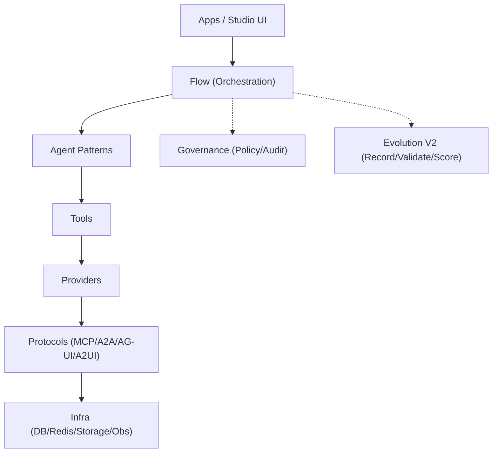
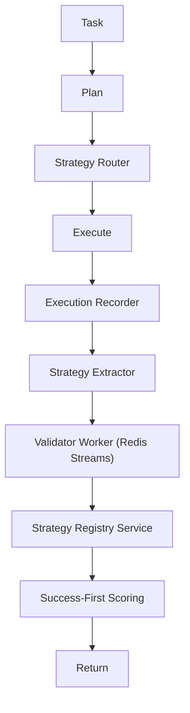

# AgentFlow

**AI 代理开发基盘与平台** — 以统一接口支持 MCP、A2A、AG-UI、A2UI 的轻量框架。

**轻量级 AI 代理开发框架**

_基于 PocketFlow 的统一协议接口_

[](https://www.python.org/downloads/)
[](tests/)
[](htmlcov/)
[](LICENSE)
[](https://github.com/astral-sh/ruff)

[文档](docs/) | [示例](examples/) | [贡献指南](CONTRIBUTING.md)

**语言**: [English](README_EN.md) | [日本語](README.md) | 简体中文

</div>

---

## ⚠️ 项目状态

> **注意**: 本项目目前处于开发阶段。
>
> - ✅ **自动化测试**: 434 个测试，92.46% 覆盖率
> - 🚧 **生产环境**: 使用前请进行充分测试

---

## 🎯 什么是 AgentFlow

轻量级 AI 代理框架，统一接口提供 **MCP / A2A / AG-UI / A2UI** 四种协议。

## 🧩 对外 3 条 Studio 产品线

面向业务客户时，统一采用以下产品主线叙事：

- `Migration Studio`
- `Enterprise FAQ Studio`
- `Computer Assistant Studio`

客户操作路径统一为：
`选择模板 -> 配置数据/权限 -> 执行 -> 查看成果物`。
详见 `docs/studios.md`。

## 🧠 设计初衷（Apps + Kernel）

- `agentflow/` 作为稳定的 Kernel 边界（编排/代理/工具/协议），能力扩展优先走插件 Blocks
- `apps/` 不是示例集合，而是“可交付、可部署的产品单元”（包含 UI/配置/审计/运维）
- `apps/platform` 作为控制平面，统一完成 app 的创建/配置/执行/观测

## 🏗️ 技术架构与应用层级

AgentFlow 采用清晰的分层模型（8 层），并把治理与进化作为横切能力：

- Apps / UI（Studio UI / CLI / SDK）
- Flow（Task/Plan/Route/Execute）
- Agent（Patterns / Coordinator）
- Tool（工具绑定 / MCP tools）
- Provider（LLM / Storage / 3rd party）
- Protocol（MCP / A2A / AG-UI / A2UI）
- Infra（DB / Redis / Queue / Observability）
- Kernel（作为稳定边界承载上述层）

横切：Governance（策略/审计）、Evolution（Self-Evolution V2）



## 🗂️ 仓库结构

- `agentflow/`: Kernel（flow/agent/tool/protocol）
- `apps/`: 产品应用（Studios、Platform 等）
- `plugins/`: 扩展能力（tools/providers/blocks）
- `contracts/`: 版本化 JSON 契约（兼容性边界）
- `docs/`: 对外/对内文档
- `tests/`: 测试集

## 🧬 Evolution V2（2026-02）

`Task -> Plan -> Strategy Router -> Execute -> Record -> Extract -> Validate -> Register -> Score -> Return`



### ✨ 主要特性

| 特性 | 说明 |
|------|------|
| 🚀 **轻量** | 核心代码 ~500 行 |
| 🔌 **4 协议** | MCP / A2A / AG-UI / A2UI |
| 🎨 **自动适配** | `@auto_adapt` 协议自动转换 |
| 🧠 **Skills 自动进化** | 越用越厉害 |
| 📦 **CLI** | `agentflow init/run/create` |
| 🔒 **类型安全** | 100% 类型注解 |
| ⚡ **异步** | 完全异步 I/O |

### 🎯 Skills 自动进化系统（NEW）

Claude Code Skills 完全兼容的自动进化能力系统：

```
用户需求 → 技能匹配 → 存在则执行
                   → 不存在则自动生成 → 验证 → 固化
= 越用越厉害
```

```python
from agentflow.skills import SkillEngine

engine = SkillEngine(auto_learn=True)
result = await engine.resolve("从PDF提取文本")

if result.generated:
    print(f"🆕 新技能自动生成: {result.skill.name}")
```

详情请参考 [Skills 指南](docs/guide-skills.md)。

### 🏗️ 内置生产级 Skills（NEW）

开箱即用的企业级技能包：

| 技能 | 说明 | 支持服务 |
|------|------|----------|
| 🗄️ **database-manager** | 数据库统一管理、CRUD、RLS | Supabase / Turso / PostgreSQL |
| 💳 **stripe-payment** | 支付与订阅管理 | Stripe Checkout / Billing |
| 🚀 **deployment-manager** | 部署与环境管理 | Vercel / Cloudflare Pages |
| 🔐 **auth-provider** | 认证与会话管理 | Supabase Auth / Clerk |
| 🔄 **model-router** | 多模型切换与成本优化 | OpenAI / Anthropic / Google |

```python
# 数据库集成
from agentflow.skills.builtin.database_manager import DatabaseManager, SupabaseConfig

db = DatabaseManager(provider="supabase", config=SupabaseConfig(
    url="https://xxx.supabase.co",
    anon_key="eyJ...",
))
await db.connect()
users = await db.select("users", filters={"status": "active"})

# 支付集成
from agentflow.skills.builtin.stripe_payment import StripePayment, StripeConfig

stripe = StripePayment(StripeConfig(secret_key="sk_..."))
session = await stripe.create_checkout_session(
    customer_email="user@example.com",
    line_items=[{"price": "price_xxx", "quantity": 1}],
    mode="subscription",
)

# 多模型切换
from agentflow.llm import ModelRouter, RoutingStrategy

router = ModelRouter.from_env()  # 从环境变量加载API密钥
response = await router.chat(messages)  # 自动选择最佳模型
```

详情请参考 [内置 Skills 指南](docs/guide-builtin-skills.md)。

### 🧠 协调模式

| 模式 | 说明 |
|------|------|
| **Supervisor** | 监督者动态选择工作者 |
| **Hierarchical** | 层级式任务分解 |
| **Sequential/Concurrent** | 顺序/并行执行 |

---

## 📦 安装

```bash
# Conda 环境
conda env create -f environment.yml
conda activate agentflow

# 或 pip
pip install -e .
```

---

## 🚀 快速开始

```bash
# 创建项目
agentflow init my-agent && cd my-agent

# 运行
agentflow run . --input '{"text": "hello"}'
```

详情请参考 [快速入门](docs/quickstart.md)。

---

## 1. 概要与特点

AgentFlow 在**单一 API 面**上统一多协议与代理协同。面向客户以 **3 条 Studio 产品线**（Migration Studio / Enterprise FAQ Studio / Computer Assistant Studio）交付；面向开发以 Kernel（`agentflow`）与插件扩展为设计前提。

| 特点                | 说明                                                                        |
| ------------------- | --------------------------------------------------------------------------- |
| **8 层架构**        | 应用、UI、流程、Agent、工具、Provider、协议、基础设施的职责分离             |
| **4 协议统一**      | MCP / A2A / AG-UI / A2UI 在同一代码库中使用                                 |
| **3 Studio 产品线** | 客户动线统一为「模板 → 配置 → 执行 → 成果物」                               |
| **开发方式可选**    | `@agent` 装饰器 / `create_flow` / AgentCoordinator 覆盖从简单到高级         |
| **Engine 模式**     | SimpleEngine / PipelineEngine / GateEngine / RAGEngine / PEVEngine 开箱即用 |
| **类型安全・异步**  | 100% 类型注解，I/O 以 async/await 为先                                      |
| **Skills 自动进化** | 随使用扩展能力的插件机制                                                    |

---

## 2. 主要机能

- **Engine 执行**: `SimpleEngine`（单 Agent）、`PipelineEngine`（多段・Review 循环）、`GateEngine`（入口审查）、`RAGEngine`（检索增强）、`PEVEngine`（Plan-Execute-Verify）
- **Agent 定义**: `@agent` 装饰器、继承 `AgentBlock`、通过 `AgentClient.get("名称").invoke(...)` 调用
- **流程构建**: `create_flow(...).gate(...).then(...).parallel(...).review(...).build()`
- **松耦合 Provider**: `get_llm()` / `get_vectordb()` / `get_db()` / `get_embedding()` 按环境获取实现
- **通道**: 多平台消息统一（MessageGateway / MessageChannelAdapter）
- **HITL**: 审批・中断・恢复（ApprovalManager / Checkpointer / interrupt）
- **Context Engineering**: 令牌预算、轮次压缩、RetrievalGate、KeyNotes 等
- **内置 Skills**: database-manager / stripe-payment / deployment-manager / auth-provider 等（可选）

---

## 3. 技术架构

**8 层结构**（自上而下）：应用 → UI → 流程 → Agent → 工具 → Provider → 协议 → 基础设施。上层仅依赖下层，契约通过 `agentflow/__init__.py` 的公开 API 使用。

**技术栈**: Python 3.13+ / FastAPI / Pydantic / Uvicorn（后端），React・Vite・TypeScript（Studio 与 apps 前端），MCP・A2A・AG-UI・A2UI（协议），PocketFlow 等（工作流基盘）。质量工具：Ruff、mypy、pytest。

---

## 4. 基盘・Platform・App 的层级与作用

| 层级                          | 作用                                                                                                                        | 示例                                                                                              |
| ----------------------------- | --------------------------------------------------------------------------------------------------------------------------- | ------------------------------------------------------------------------------------------------- |
| **Kernel（agentflow）**       | 稳定 API、Engine、Provider、协议抽象；扩展以 Plugin 优先；带副作用操作经策略与审计。                                        | `agentflow` 包、公开 API                                                                          |
| **Platform（apps/platform）** | 3 Studio 的执行动线（模板→配置→执行→成果物）与 Framework 管理 API。正轨 API：`/api/studios/*`、`/api/studios/framework/*`。 | 后端 `apps.platform.main`，前端 `apps/platform/frontend`                                          |
| **Apps（apps/\*）**           | 产品与示例应用。对应 Migration / FAQ / Assistant 等 Studio 的 app，以及编排、消息等横向 app。                               | `code_migration_assistant`、`faq_system`、`decision_governance_engine`、`market_trend_monitor` 等 |

对外说明统一为 3 Studio，协议名与内部层级不在业务面暴露。

---

## 5. 快速开始・文档・许可证

**运行前**: 默认环境为 `conda activate agentflow`。执行命令前请阅读 `code-rules/CLAUDE.md` 及目标 app 的 README。

```bash
conda activate agentflow
pip install -e ".[apps,dev]"
python -m apps.platform.main serve --port 8000
# 另开终端: cd apps/platform/frontend && npm install && npm run dev
```

- **文档**: 目录 [docs/index.md](docs/index.md)、对外 [docs/external/README.md](docs/external/README.md)、对内 [docs/internal/README.md](docs/internal/README.md)、3 Studio [docs/studios.md](docs/studios.md)
- **仓库**: [GitHub](https://github.com/liushuang393/serverlessAIAgents) | [Issues](https://github.com/liushuang393/serverlessAIAgents/issues)
- **许可证**: [MIT License](LICENSE)

执行/训练解耦与轨迹设计部分参考了 [Microsoft Agent Lightning](https://github.com/microsoft/agent-lightning) 的思路。
