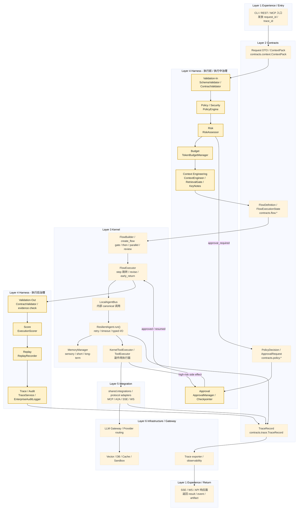
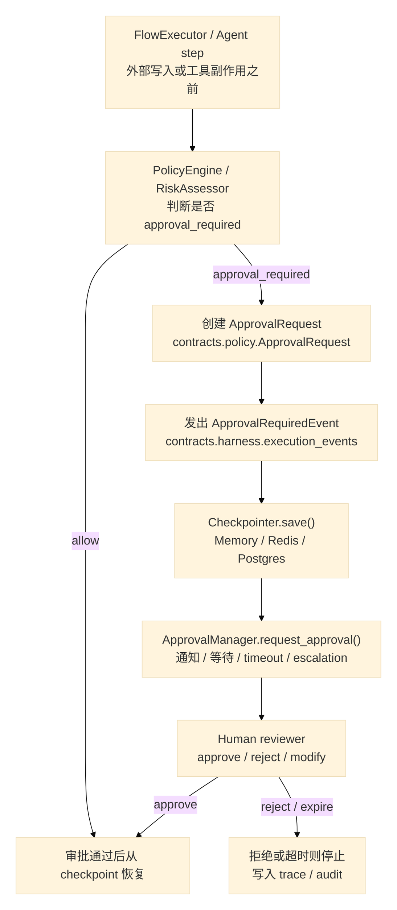
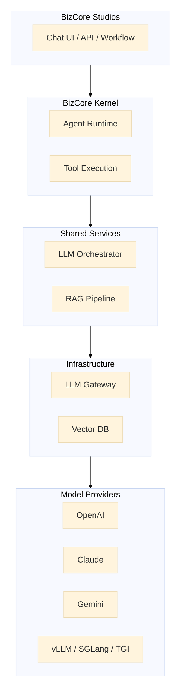

# BizCore AI

**BizCore AI 是面向 AI 时代与未来 AGI 的企业级业务开发基盘，通过分层架构承接 AI 系统复杂度，使开发者能够长期专注于业务实现。**

**语言**: [English](README_EN.md) | [日本語](README.md) | 简体中文

---

## 为什么选择 BizCore AI

AI 模型快速迭代，协议持续演进，业务应用爆发增长。  
面对这一不确定的未来，**基盘承接系统复杂度、开发者专注业务实现** 的分工不可或缺。

BizCore AI 正是实现这一哲学的 **全栈企业开发基盘**。

---

## 架构

BizCore AI 应从不同视角理解，不应把静态分层与运行时路径混成一张图。

### A. 静态架构 - 8 层（7 个核心层 + Apps 外层）

BizCore AI 总体由 8 层组成，其中包含 7 个核心层，`apps/` 作为最外侧的产品装配与交付层存在。

```
┌─────────────────────────────────────────────┐
│  BizCore Studios (Apps)                     │  ← 产品装配层（不计入核心层）
│  Migration / FAQ / Assistant / Custom Apps  │
├─────────────────────────────────────────────┤
│  BizCore Control Plane                      │  ← 管理・观测・分发
├─────────────────────────────────────────────┤
│  BizCore Domain                             │  ← 业务域模型・行业模板
├─────────────────────────────────────────────┤
│  BizCore Harness (Governance)               │  ← 治理・可靠性・评估
├─────────────────────────────────────────────┤
│  BizCore Kernel (Runtime)                   │  ← 执行引擎・Agent・流程
├─────────────────────────────────────────────┤
│  Shared Services                            │  ← 共享功能（Gateway/RAG/Access）
├─────────────────────────────────────────────┤
│  Infrastructure                             │  ← 底层基础设施（LLM/Storage/Cache）
├─────────────────────────────────────────────┤
│  Contracts                                  │  ← 协议・接口定义
└─────────────────────────────────────────────┘
```

| 层                        | 目录              | 职责                                                         |
| ------------------------- | ----------------- | ------------------------------------------------------------ |
| **Contracts**             | `contracts/`      | 全层共享的协议・类型・接口定义（Versioned）                  |
| **Infrastructure**        | `infrastructure/` | LLM Provider、Storage、Cache、Queue、Sandbox 等底层基础设施  |
| **Shared**                | `shared/`         | LLM Gateway、RAG、Access Control、Trace、Audit 等共享服务    |
| **BizCore Kernel**        | `kernel/`         | Agent Runtime、Flow Engine、Orchestration、Protocol 实现     |
| **BizCore Harness**       | `harness/`        | Governance、Policy、Approval、Budget、Evaluation、Guardrails |
| **BizCore Domain**        | `domain/`         | 行业/业务域模型、接口、模板与规则                            |
| **BizCore Control Plane** | `control_plane/`  | 平台控制面，负责发现、生命周期、分发与运营 UI/API            |
| **BizCore Studios**       | `apps/*/`         | 产品层，用于装配 Migration / FAQ / Assistant / custom apps   |

> **设计原则**: `contracts / infrastructure / shared / kernel / harness / domain` 不得依赖 `apps/`。`domain` 不得依赖 `control_plane`。`control_plane` 只能编排下层，不能反向成为下层的正本入口。

### B-1. 运行时流程


```mermaid
%%{init: {'theme': 'base', 'themeVariables': {'fontSize': '18px'}, 'flowchart': {'useMaxWidth': false, 'nodeSpacing': 40, 'rankSpacing': 70, 'diagramPadding': 24}} }%%
flowchart TB
    subgraph L1A["Layer 1 Experience / Entry"]
        direction TB
        entry["CLI / REST / MCP 入口<br/>发放 request_id / trace_id"]
    end

    subgraph L2["Layer 2 Contracts"]
        direction TB
        contract_in["Request DTO / ContextPack<br/>contracts.context.ContextPack"]
        contract_flow["FlowDefinition / FlowExecutionState<br/>contracts.flow.*"]
        contract_policy["PolicyDecision / ApprovalRequest<br/>contracts.policy.*"]
        contract_trace["TraceRecord<br/>contracts.trace.TraceRecord"]
    end

    subgraph L4A["Layer 4 Harness - 执行前 / 执行中治理"]
        direction TB
        validate_in["Validation-In<br/>SchemaValidator / ContractValidator"]
        policy["Policy / Security<br/>PolicyEngine"]
        risk["Risk<br/>RiskAssessor"]
        budget["Budget<br/>TokenBudgetManager"]
        context["Context Engineering<br/>ContextEngineer / RetrievalGate / KeyNotes"]
        approval_gate["Approval<br/>ApprovalManager / Checkpointer"]
    end

    subgraph L3["Layer 3 Kernel"]
        direction TB
        builder["FlowBuilder / create_flow<br/>gate / then / parallel / review"]
        executor["FlowExecutor<br/>step 跳转 / revise / early_return"]
        bus["LocalAgentBus<br/>内部 canonical 调用"]
        agent["ResilientAgent.run()<br/>retry / timeout / typed I/O"]
        tools["KernelToolExecutor / ToolExecutor<br/>副作用执行面"]
        memory["MemoryManager<br/>sensory / short / long-term"]
    end

    subgraph L5["Layer 5 Integration"]
        direction TB
        integration["shared.integrations / protocol adapters<br/>MCP / A2A / SSE / WS"]
    end

    subgraph L6["Layer 6 Infrastructure / Gateway"]
        direction TB
        gateway["LLM Gateway / Provider routing"]
        storage["Vector / DB / Cache / Sandbox"]
        trace_export["Trace exporter / observability"]
    end

    subgraph L4B["Layer 4 Harness - 执行后治理"]
        direction TB
        validate_out["Validation-Out<br/>ContractValidator / evidence check"]
        score["Score<br/>ExecutionScorer"]
        replay["Replay<br/>ReplayRecorder"]
        trace_audit["Trace / Audit<br/>TraceService / EnterpriseAuditLogger"]
    end

    subgraph L1B["Layer 1 Experience / Return"]
        direction TB
        return["SSE / WS / API 响应面<br/>返回 result / event / artifact"]
    end

    entry --> contract_in --> validate_in --> policy --> risk --> budget --> context --> contract_flow --> builder --> executor
    executor --> bus --> agent
    agent --> memory
    agent --> tools --> integration --> gateway
    gateway --> storage
    executor --> validate_out --> score --> replay --> trace_audit --> contract_trace --> trace_export --> return
    risk -->|approval_required| contract_policy --> approval_gate
    approval_gate -->|approved / resumed| executor
    tools -->|high-risk side effect| approval_gate
    agent --> contract_trace
    integration --> contract_trace

    classDef harness fill:#FFF2CC,stroke:#C69200,stroke-width:2px,color:#222;
    class validate_in,policy,risk,budget,context,approval_gate,validate_out,score,replay,trace_audit harness;
```

Harness 不只是前后包裹层，还会把 `ContextEngineer`、`TokenBudgetManager`、`ApprovalManager` 插入执行路径内部，使长链路多步骤执行保持有边界、可追踪、可恢复。

如果要基于这张图强化框架层之间的契约，至少应把以下边界固定下来：

- Entry → Contracts: 强制统一 `ContextPack`、`trace_id` 与标准化请求 DTO，使 UI / API / CLI 共用同一输入面
- Contracts → Kernel: 固定 `FlowDefinition`、`FlowExecutionState` 与每个 step 的输入输出 schema，使 `FlowExecutor` 的跳转可追踪
- Kernel → Harness: 把 `PolicyDecision`、`ApprovalRequest`、`ExecutionEvent` 统一成标准事件面，使审批、拒绝、恢复、审计走同一条路径
- Kernel / Integration → Trace: 每个 step 都产出 `TraceRecord` 与 artifact ID，为 Replay、Scoring、Audit 提供共用证据

### B-2. 上下文、记忆、安全与自我改进闭环


```mermaid
%%{init: {'theme': 'base', 'themeVariables': {'fontSize': '18px'}, 'flowchart': {'useMaxWidth': false, 'nodeSpacing': 40, 'rankSpacing': 70, 'diagramPadding': 24}} }%%
flowchart LR
    task["新任务 / 下一步输入"]
    ctx["ContextEngineer<br/>预算分配 / 压缩 / 注入 KeyNotes"]
    retrieve["RetrievalGate<br/>判定是否需要检索"]
    mem_recall["MemoryManager.recall()<br/>复用长短期记忆"]
    execute["FlowExecutor / ResilientAgent<br/>多步骤执行"]
    safety["Policy / Risk / Validation<br/>安全、契约、漂移检查"]
    score["ExecutionScorer<br/>质量与精度评估"]
    replay["ReplayRecorder / TraceService<br/>持久化 step 证据"]
    evolve["EvolutionEngine<br/>提取成功策略 / 注册候选 / 更新评分"]
    next_ctx["下一次运行改进<br/>压缩规则 / strategy hint / memory importance"]

    task --> ctx --> retrieve
    retrieve -->|yes| mem_recall --> execute
    retrieve -->|no| execute
    execute --> safety --> score --> replay --> evolve --> next_ctx --> ctx
```

这个闭环的目标不是单纯“跑通流程”，而是让每一步都有证据、有压缩、有回放、有反馈，从而在多步骤执行中尽量不丢精度。

### C. 横向治理子系统（Harness）

| 子系统 | 用在什么地方 | 插入位置（层 / 阶段） | 对精度与自律性的贡献 | 主要组件 |
| --- | --- | --- | --- | --- |
| Policy / Security | 判定操作是否允许，以及主体-资源-动作是否匹配策略 | Layer 2→4，入口后、工具执行前 | 阻止未授权或危险操作直接穿透 | PolicyEngine, AuthContext, PolicyDecision |
| Risk | 检测高风险、高成本、高影响分支 | Layer 4，规划后、执行前、投递前 | 明确哪些路径必须进入审批 | RiskAssessor, RiskAssessment, RiskFactor |
| Approval | 人工审批、等待、恢复、超时管理 | Layer 4，`interrupt()` 之前的停止点 | 防止非幂等操作在恢复时重复执行 | ApprovalManager, ApprovalRequest, Checkpointer |
| Validation | 检测 schema 违约、缺字段、输出结构漂移 | Layer 2↔4，入口、每步完成、最终输出 | 防止多步骤流水线静默降级 | SchemaValidator, ContractValidator |
| Budget | 控制 token、成本、上下文窗口上限 | Layer 4，构造 prompt 前、检索前、step 之间 | 避免长执行导致上下文饱和 | TokenBudgetManager |
| Context Engineering | 压缩历史、提炼要点、判断检索必要性、重建上下文 | Layer 4，每轮对话、每个 step 前 | 保持焦点，减少长上下文带来的精度下降 | ContextEngineer, RetrievalGate, KeyNotesStore |
| Replay | 复现实行过程，用于调试和框架调优 | Layer 4，每个 step 完成或失败时 | 让精度下降可以复现、定位，而不是靠猜测 | ReplayRecorder, ReplayRunner |
| Score | 对执行质量做量化评估 | Layer 4，每步后、最终结果后 | 同时评估完整性、安全性、成本与准确度 | ExecutionScorer, DimensionScore |
| Trace / Audit | 持久化 span、artifact 与决策证据 | Layer 2 / 4 / 6，贯穿所有步骤 | 为审计与自我改进提供统一证据平面 | TraceRecord, TraceService, EnterpriseAuditLogger |

Harness 应被视为沿着 Kernel step 执行路径插入的控制层，而不是外围被动观察层。

### D. 审批流程（HITL / 非幂等操作保护）


```mermaid
%%{init: {'theme': 'base', 'themeVariables': {'fontSize': '18px'}, 'flowchart': {'useMaxWidth': false, 'nodeSpacing': 36, 'rankSpacing': 64, 'diagramPadding': 24}} }%%
flowchart TD
    step["FlowExecutor / Agent step<br/>外部写入或工具副作用之前"]
    policy["PolicyEngine / RiskAssessor<br/>判断是否 approval_required"]
    req["创建 ApprovalRequest<br/>contracts.policy.ApprovalRequest"]
    event["发出 ApprovalRequiredEvent<br/>contracts.harness.execution_events"]
    save["Checkpointer.save()<br/>Memory / Redis / Postgres"]
    wait["ApprovalManager.request_approval()<br/>通知 / 等待 / timeout / escalation"]
    human["Human reviewer<br/>approve / reject / modify"]
    resume["审批通过后从 checkpoint 恢复"]
    reject["拒绝或超时则停止<br/>写入 trace / audit"]

    step --> policy
    policy -->|allow| resume
    policy -->|approval_required| req --> event --> save --> wait --> human
    human -->|approve| resume
    human -->|reject / expire| reject
```

非幂等操作不能放在 `interrupt()` 之前直接执行。必须先生成 `ApprovalRequest`，再通过 `Checkpointer` 保存停止点，然后进入审批等待，这样恢复时才不会产生重复发送或重复更新。

---

## 主要功能

### 执行引擎（BizCore Kernel）

- **Engine 模式**: `SimpleEngine`（单 Agent）/ `PipelineEngine`（多段・Review）/ `GateEngine`（入口审查）/ `RAGEngine`（检索增强）/ `PEVEngine`（Plan-Execute-Verify）
- **Agent 定义**: `@agent` 装饰器 / `AgentBlock` 继承 / `AgentClient.get("名称").invoke(...)`
- **流程构建**: `create_flow(...).gate(...).then(...).parallel(...).review(...).build()`
- **统一协议**: MCP / A2A / AG-UI / A2UI 在单一 API 面使用

### 治理（BizCore Harness）

- **策略引擎**: 以声明方式配置执行前后的判定与约束
- **HITL**: 审批・中断・恢复（ApprovalManager / Checkpointer / interrupt）
- **Context Engineering**: 令牌预算、轮次压缩、RetrievalGate、KeyNotes
- **评估・审计**: Evaluation、Replay、Budget 管理

### 管理（BizCore Platform）

- **App 生命周期**: 创建 → 配置 → 执行 → 观测 → 分发
- **LLM 统一管理**: Provider / Model / Secret / Local Engine 由 Platform 统一管理
- **统一 API**: `/api/studios/*` 与 `/api/studios/framework/apps/*` 作为正规路径

### 业务应用（BizCore Studios）

- **Migration Studio**: 代码迁移・现代化改造
- **Enterprise FAQ Studio**: 基于 RAG 的 FAQ・知识管理
- **Computer Assistant Studio**: 通用 AI 助手・自动化

---

## LLM 推理基础设施（Gateway 统一）

BizCore AI 禁止直接调用 Provider SDK，所有 LLM 请求统一走 `LLM Orchestrator → LLM Gateway`。


```mermaid
%%{init: {'theme': 'base', 'themeVariables': {'fontSize': '18px'}, 'flowchart': {'useMaxWidth': false, 'nodeSpacing': 40, 'rankSpacing': 70, 'diagramPadding': 24}} }%%
flowchart TB

subgraph APP["BizCore Studios"]
UI[Chat UI / API / Workflow]
end

subgraph KERNEL["BizCore Kernel"]
Runtime[Agent Runtime]
Tools[Tool Execution]
end

subgraph SHARED["Shared Services"]
Orchestrator[LLM Orchestrator]
RAG[RAG Pipeline]
end

subgraph INFRA["Infrastructure"]
Gateway[LLM Gateway]
Vector[Vector DB]
end

subgraph PROVIDER["Model Providers"]
OpenAI[OpenAI]
Claude[Claude]
Gemini[Gemini]
Local[vLLM / SGLang / TGI]
end

APP --> KERNEL
KERNEL --> SHARED
SHARED --> INFRA
INFRA --> PROVIDER
```

### 运行时默认值与运维注意事项

- 如果 app 没有定义 `contracts.llm`，文本生成默认并不是 settings 里的单一固定模型，而是 Gateway 的 `reasoning` 角色。默认 alias 是 `reasoning_claude`（`anthropic / claude-sonnet-4-6`），不可用时按 `coding_openai` → `cheap_gemini` → `local_vllm_default` 回退。
- 如果 app 定义了 `contracts.llm.defaults.text` 或 `contracts.llm.defaults.embedding`，这些 contract 值就是正本。FAQ 这类 app 建议显式固定到 `platform_text_default` 与 `platform_embedding_default`。
- 如果 app 没有固定 embedding 模型，默认链路是 `OLLAMA_EMBEDDING_MODEL` → `OPENAI_EMBEDDING_MODEL` → 本地 `all-MiniLM-L6-v2` → `mock`。这意味着实际默认值会受环境影响，因此生产 app 更适合通过 `contracts.llm` 固定。
- 如果 app 配置、runtime 配置和 env 都没有提供数据库，默认 DB 是 `MockDBProvider`。向量库同样未指定时，默认是 `MockVectorDBProvider(collection=default)`。
- FAQ app 现在按职责拆分数据库：`FAQ_DATABASE_URL` / `FAQ_APP_DATABASE_URL` 对应认证与会话 `app_db`，`FAQ_SQL_SOURCE_DATABASE_URL` 对应 Text2SQL 的 `sql_source_db`，RAG ingest 源则由 `contracts.rag.data_sources[]` 描述。
- RAG 配置的正本是 `contracts.rag`。`services.rag` 与 `services.vector_db` 可能仍作为迁移兼容保留，但 runtime 解析已优先使用 `contracts.rag`。

---

## 仓库结构

### 7 个核心层 + Apps 外层

- `contracts/`: 协议・接口定义（Versioned）
- `infrastructure/`: 底层基础设施（LLM Provider / Storage / Cache / Queue）
- `shared/`: 共享服务（Gateway / RAG / Access / Trace / Audit）
- `kernel/`: Agent Runtime / Flow Engine / Orchestration / Protocol
- `harness/`: Governance / Policy / Approval / Budget / Evaluation
- `domain/`: 业务域的正本实现
- `control_plane/`: BizCore Control Plane 的正本实现

### 产品层

- `apps/`: BizCore Studios 与 custom apps，作为第 8 层位于最外侧

### 迁移说明

- 迁移期间仍可能保留部分旧 import 与配置命名，但正本实现统一收敛到 `contracts/`、`infrastructure/`、`shared/`、`kernel/`、`harness/`、`domain/`、`control_plane/`

### 开发・运维

- `plugins/`: 扩展功能（Blocks / Tools / Providers）
- `docs/`: 对外/对内文档、设计资料
- `tests/`: 自动化测试集（Unit / Integration / E2E）
- `code-rules/`: 统一编码规范与 Lint 规则
- `scripts/`: 开发・维护辅助脚本

---

## 技术栈

| 领域         | 技术                                                    |
| ------------ | ------------------------------------------------------- |
| **后端**     | Python 3.13+, FastAPI, Pydantic, Uvicorn                |
| **前端**     | React, Vite, TypeScript, ESLint, Prettier               |
| **AI 协议**  | MCP, A2A, AG-UI, A2UI                                   |
| **基础设施** | Supabase / PostgreSQL / Turso, Pinecone / Qdrant, Redis |
| **质量**     | Ruff, mypy, pytest（80%+ 覆盖率）, ESLint, tsc          |

---

## 快速开始

> 各应用（FAQ System、Decision Governance Engine 等）的 DB 构建・本地启动・Docker 部署步骤，请参考各应用的 README.md。
> 此处仅记载共享基础设施（auth_service + control_plane）的启动步骤。

### 前提条件

| 工具                    | 版本  | 用途                        |
| ----------------------- | ----- | --------------------------- |
| Python                  | 3.13+ | 后端运行                    |
| conda                   | 任意  | 推荐虚拟环境（`agentflow`） |
| Docker + Docker Compose | 最新  | DB・容器启动                |
| Node.js                 | 18+   | 前端开发                    |

### 1. 环境搭建

```bash
# 创建并激活 conda 环境（推荐）
conda create -n agentflow python=3.13 -y
conda activate agentflow

# 安装依赖
pip install -e ".[apps,dev]"
```

### 2. auth_service（认证基础设施）

支持 SQLite（本地开发）和 PostgreSQL（Docker/生产）。

#### 本地启动（SQLite 自动创建，无需 DB 步骤）

```bash
conda activate agentflow

# 启动 auth_service（端口 8010）
python -m shared.auth_service.main
# 健康检查: curl http://localhost:8010/health

# 启动前端（另开终端，端口 3000）
cd shared/auth_service/frontend && npm install && npm run dev
```

#### Docker 启动（PostgreSQL）

```bash
cd shared/auth_service
docker compose up --build -d
# 健康检查: curl http://localhost:8010/health
# 停止: docker compose down
```

### 3. control_plane（平台管理）

默认使用 SQLite，无需 DB 步骤。

#### 本地启动

```bash
conda activate agentflow

# 启动 control_plane（端口 8900）
python -m control_plane.main serve
# 健康检查: curl http://localhost:8900/health

# 启动前端（另开终端，端口 3200）
cd control_plane/frontend && npm install && npm run dev
```

### 4. dev_studio（开发支持）

代码生成・CI/CD 配置・质量分析等开发支持工具。

#### 本地启动

```bash
conda activate agentflow
python -m apps.dev_studio.main
# 健康检查: curl http://localhost:8011/health
```

#### Docker 启动

```bash
cd apps/dev_studio
docker compose up --build -d
# 健康检查: curl http://localhost:8011/health
# 停止: docker compose down
```

### 服务一览

| 服务 | 后端 | 前端 | 说明 |
|---|---|---|---|
| auth_service | http://localhost:8010 | http://localhost:3000 | 认证・用户管理 |
| control_plane | http://localhost:8900 | http://localhost:3200 | 平台管理 |

### 应用调用模式一览

> 规约详情: [`code-rules/project/calling-patterns.md`](code-rules/project/calling-patterns.md)

| 应用 | 后端模式 | 前端通信 | 说明 |
| --- | --- | --- | --- |
| FAQ System | A + C | fetch + SSE | 通过 A2AHub 调用 Agent + 聊天流式传输 |
| Decision Governance Engine | B-1 + B-2 | fetch + SSE (EventSource) | PipelineEngine 驱动的 8 Agent 顺序流水线 |
| Code Migration Assistant | B-2 | fetch + SSE (EventSource) | BaseEngine 驱动的 9 Agent 异步流水线 |
| Market Trend Monitor | B-1 | fetch | kernel Flow 驱动的 7 Agent 工作流 |
| Messaging Hub | B-Coordinator | fetch + WS | ResilientAgent + A2AHub 多渠道 Agent 路由 |
| Legacy Modernization GEO | B-2 | fetch + SSE (EventSource) | BaseEngine 驱动的 11 阶段并行流水线 |
| Design Skills Engine | B-1 | — | PipelineEngine 驱动的图像生成流水线 |
| Developer Studio | A | — | Service 直接调用（纯 API） |
| Orchestration Guardian | A | — | 通过 A2AHub 调用 Agent（验证 API） |

**模式说明**: A = 单次处理、B-1 = 同步流水线、B-2 = 异步流水线 + SSE、B-Coordinator = 意图分类→路由→专业 Agent、C = 实时对话

### 各应用 README

| 应用                       | README                                                                                 | 说明                      |
| -------------------------- | -------------------------------------------------------------------------------------- | ------------------------- |
| FAQ System                 | [apps/faq_system/README.md](apps/faq_system/README.md)                                 | 基于 RAG 的 FAQ・知识管理 |
| Decision Governance Engine | [apps/decision_governance_engine/README.md](apps/decision_governance_engine/README.md) | 决策支持系统              |
| Code Migration Assistant   | [apps/code_migration_assistant/README.md](apps/code_migration_assistant/README.md)     | 代码迁移支持              |

---

## 文档・链接

- **文档**: [docs/index.md](docs/index.md) | [对外](docs/external/README.md) | [对内](docs/internal/README.md) | [Studios](docs/studios.md)
- **仓库**: [GitHub](https://github.com/liushuang393/serverlessAIAgents) | [Issues](https://github.com/liushuang393/serverlessAIAgents/issues)
- **许可证**: [MIT License](LICENSE)

---

## 致谢 — 所用开源技术

BizCore AI 的开发离不开以下优秀开源项目、工具与设计思想的支撑。
谨向所有贡献者和社区表示衷心感谢。

### 🏗️ 框架层

| 项目 | 职责 | 许可证 |
| --- | --- | --- |
| [FastAPI](https://github.com/fastapi/fastapi) | 高性能异步 Web API 框架（Kernel / Control Plane 基础） | MIT |
| [Pydantic v2](https://github.com/pydantic/pydantic) | 类型安全的数据校验与 Schema 定义（Contracts 全域） | MIT |
| [SQLAlchemy](https://github.com/sqlalchemy/sqlalchemy) | ORM 与数据库抽象（Control Plane / Auth Service） | MIT |
| [Alembic](https://github.com/sqlalchemy/alembic) | 数据库迁移管理 | MIT |
| [Uvicorn](https://github.com/encode/uvicorn) | ASGI 服务器（FastAPI 运行时） | BSD-3-Clause |
| [React](https://github.com/facebook/react) | 前端 UI 框架 | MIT |
| [Vite](https://github.com/vitejs/vite) | 高速前端构建工具 | MIT |
| [TypeScript](https://github.com/microsoft/TypeScript) | 类型安全的前端开发语言 | Apache 2.0 |

### 🤖 AI 协议层

| 项目 | 职责 | 来源 |
| --- | --- | --- |
| [Model Context Protocol (MCP)](https://modelcontextprotocol.io/) | AI 工具集成协议（Layer 5 Integration 标准） | Anthropic |
| [Agent-to-Agent Protocol (A2A)](https://github.com/google-a2a/A2A) | Agent 间通信与委托协议 | Google |
| [AG-UI Protocol](https://github.com/ag-ui-protocol/ag-ui) | Agent → UI 实时流式传输协议 | 开放标准 |

### 🛠️ 工具与基础设施层

| 项目 | 职责 | 许可证 |
| --- | --- | --- |
| [Qdrant](https://github.com/qdrant/qdrant) | 高性能向量数据库（RAG Pipeline） | Apache 2.0 |
| [Redis](https://github.com/redis/redis) | 分布式缓存与消息队列 | BSD-3-Clause |
| [PostgreSQL](https://www.postgresql.org/) | 关系型数据库 | PostgreSQL License |
| [Supabase](https://github.com/supabase/supabase) | 托管 PostgreSQL + BaaS | Apache 2.0 |
| [Ruff](https://github.com/astral-sh/ruff) | 超高速 Python Linter 与格式化工具 | MIT |
| [mypy](https://github.com/python/mypy) | Python 静态类型检查器 | MIT |
| [pytest](https://github.com/pytest-dev/pytest) | Python 测试框架 | MIT |
| [ESLint](https://github.com/eslint/eslint) / [Prettier](https://github.com/prettier/prettier) | 前端代码质量与格式化工具 | MIT |
| [Docker](https://www.docker.com/) | 容器化与部署基础设施 | Apache 2.0 |

### 🧩 内置 Skill

BizCore Studios 内置的以下 Skill 基于开源工具与服务实现。

#### web-content-fetcher（网页正文提取）

| 项目 | 职责 | 许可证 |
| --- | --- | --- |
| [Jina Reader](https://github.com/jina-ai/reader) | 从 URL 提取干净 Markdown 正文的云服务（首选） | Apache 2.0 |
| [Scrapling](https://github.com/D4Vinci/Scrapling) | 具备反爬虫能力的 Python 网页抓取库（二级降级） | MIT |
| [html2text](https://github.com/Alir3z4/html2text) | HTML 转 Markdown 转换库 | GPL-3.0 |

#### design-skills（设计图像生成）

| 项目 | 职责 | 许可证 |
| --- | --- | --- |
| [ComfyUI](https://github.com/comfyanonymous/ComfyUI) | 本地 GPU 图像生成后端（首选） | GPL-3.0 |
| [Stable Diffusion XL (SDXL)](https://github.com/Stability-AI/generative-models) | 用于本地推理的高质量文生图模型 | CreativeML Open RAIL++-M |
| [OpenAI gpt-image-1](https://platform.openai.com/docs/guides/images) | ComfyUI 不可用时的云端兜底 | — (商业 API) |

#### minimalist-entrepreneur-skills（极简创业框架技能集）

基于 Sahil Lavingia（Gumroad 创始人）所著《The Minimalist Entrepreneur》的创业支持技能包，包含 10 个结构化技能，在 `apps/messaging_hub` 中使用。

| 项目 | 职责 | 许可证 |
| --- | --- | --- |
| [slavingia/skills](https://github.com/slavingia/skills) | 极简创业框架技能集（10 个技能）的原始仓库 | MIT |
| [《The Minimalist Entrepreneur》](https://www.minimalistentrepreneur.com/) — Sahil Lavingia | 技能的思想基础书籍 | — |

### 💡 设计思想与架构参考

| 思想 / 参考来源 | 概要 |
| --- | --- |
| [Microsoft Agent Lightning](https://github.com/microsoft/agent-lightning) | BizCore 执行/训练解耦模型与分布式轨迹设计的重要参考 |
| **Clean Architecture** — Robert C. Martin | 分层隔离与依赖方向原则，7 核心层架构的设计指南 |
| **ReAct Pattern** — Yao et al., 2022 | 融合 Reasoning + Acting 的 Agent 循环设计，Kernel 运行时的理论基础 |
| **RAG（检索增强生成）** — Lewis et al., 2020 | 通过检索增强实现知识集成，RAGEngine / RetrievalGate 的理论依据 |
| **HITL（人机协同）** | 将人类监督内嵌于 AI 治理的设计思想（Harness / ApprovalManager 的根基） |
| **Gateway Pattern** — Enterprise Integration Patterns | 集中式 LLM 访问、故障转移与可观测性设计，LLM Gateway 的架构依据 |
| **Contract-First Design** | 以跨层契约先行定义接口、解耦实现的设计原则，`contracts/` 层的核心哲学 |
| **12-Factor App** — Heroku | 云原生应用设计原则，应用于配置外部化、无状态化与日志标准化 |
| **微内核 Agent（百行原型）** — 内部自研 | `@agent` 装饰器最小化 Agent 定义模式的原型。起初以约 100 行实验代码实现，现已演进为 `kernel/agent_decorator.py`（Skills 集成、Pydantic 类型校验、AgentRegistry 与 A2AHub 注册） |
