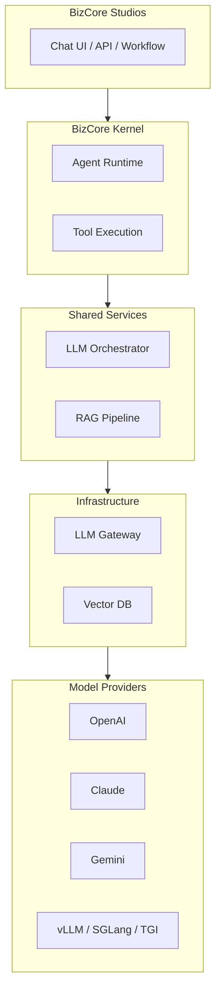

# BizCore AI

**BizCore AI 是面向 AI 时代与未来 AGI 的企业级业务开发基盘，通过分层架构承接 AI 系统复杂度，使开发者能够长期专注于业务实现。**

**语言**: [English](README_EN.md) | [日本語](README.md) | 简体中文

---

## 为什么选择 BizCore AI

AI 模型快速迭代，协议持续演进，业务应用爆发增长。  
面对这一不确定的未来，**基盘承接系统复杂度、开发者专注业务实现** 的分工不可或缺。

BizCore AI 正是实现这一哲学的 **全栈企业开发基盘**。

---

## 7 个核心层 + Apps 外层

BizCore AI 由 7 个核心层组成，`apps/` 作为外侧的产品装配与交付层存在。

```
┌─────────────────────────────────────────────┐
│  BizCore Studios (Apps)                     │  ← 产品装配层（不计入核心层）
│  Migration / FAQ / Assistant / Custom Apps  │
├─────────────────────────────────────────────┤
│  BizCore Control Plane                      │  ← 管理・观测・分发
├─────────────────────────────────────────────┤
│  BizCore Domain                             │  ← 业务域模型・行业模板
├─────────────────────────────────────────────┤
│  BizCore Harness (Governance)               │  ← 治理・可靠性・评估
├─────────────────────────────────────────────┤
│  BizCore Kernel (Runtime)                   │  ← 执行引擎・Agent・流程
├─────────────────────────────────────────────┤
│  Shared Services                            │  ← 共享功能（Gateway/RAG/Access）
├─────────────────────────────────────────────┤
│  Infrastructure                             │  ← 底层基础设施（LLM/Storage/Cache）
├─────────────────────────────────────────────┤
│  Contracts                                  │  ← 协议・接口定义
└─────────────────────────────────────────────┘
```

| 层 | 目录 | 职责 |
|---|---|---|
| **Contracts** | `contracts/` | 全层共享的协议・类型・接口定义（Versioned） |
| **Infrastructure** | `infrastructure/` | LLM Provider、Storage、Cache、Queue、Sandbox 等底层基础设施 |
| **Shared** | `shared/` | LLM Gateway、RAG、Access Control、Trace、Audit 等共享服务 |
| **BizCore Kernel** | `kernel/` | Agent Runtime、Flow Engine、Orchestration、Protocol 实现 |
| **BizCore Harness** | `harness/` | Governance、Policy、Approval、Budget、Evaluation、Guardrails |
| **BizCore Domain** | `domain/` | 行业/业务域模型、接口、模板与规则 |
| **BizCore Control Plane** | `control_plane/` | 平台控制面，负责发现、生命周期、分发与运营 UI/API |
| **BizCore Studios** | `apps/*/` | 产品层，用于装配 Migration / FAQ / Assistant / custom apps |

> **设计原则**: `contracts / infrastructure / shared / kernel / harness / domain` 不得依赖 `apps/`。`domain` 不得依赖 `control_plane`。`control_plane` 只能编排下层，不能反向成为下层的正本入口。

---

## 主要功能

### 执行引擎（BizCore Kernel）

- **Engine 模式**: `SimpleEngine`（单 Agent）/ `PipelineEngine`（多段・Review）/ `GateEngine`（入口审查）/ `RAGEngine`（检索增强）/ `PEVEngine`（Plan-Execute-Verify）
- **Agent 定义**: `@agent` 装饰器 / `AgentBlock` 继承 / `AgentClient.get("名称").invoke(...)`
- **流程构建**: `create_flow(...).gate(...).then(...).parallel(...).review(...).build()`
- **统一协议**: MCP / A2A / AG-UI / A2UI 在单一 API 面使用

### 治理（BizCore Harness）

- **策略引擎**: 以声明方式配置执行前后的判定与约束
- **HITL**: 审批・中断・恢复（ApprovalManager / Checkpointer / interrupt）
- **Context Engineering**: 令牌预算、轮次压缩、RetrievalGate、KeyNotes
- **评估・审计**: Evaluation、Replay、Budget 管理

### 管理（BizCore Platform）

- **App 生命周期**: 创建 → 配置 → 执行 → 观测 → 分发
- **LLM 统一管理**: Provider / Model / Secret / Local Engine 由 Platform 统一管理
- **统一 API**: `/api/studios/*` 与 `/api/studios/framework/apps/*` 作为正规路径

### 业务应用（BizCore Studios）

- **Migration Studio**: 代码迁移・现代化改造
- **Enterprise FAQ Studio**: 基于 RAG 的 FAQ・知识管理
- **Computer Assistant Studio**: 通用 AI 助手・自动化

---

## LLM 推理基础设施（Gateway 统一）

BizCore AI 禁止直接调用 Provider SDK，所有 LLM 请求统一走 `LLM Orchestrator → LLM Gateway`。


```mermaid
flowchart TB

subgraph APP["BizCore Studios"]
UI[Chat UI / API / Workflow]
end

subgraph KERNEL["BizCore Kernel"]
Runtime[Agent Runtime]
Tools[Tool Execution]
end

subgraph SHARED["Shared Services"]
Orchestrator[LLM Orchestrator]
RAG[RAG Pipeline]
end

subgraph INFRA["Infrastructure"]
Gateway[LLM Gateway]
Vector[Vector DB]
end

subgraph PROVIDER["Model Providers"]
OpenAI[OpenAI]
Claude[Claude]
Gemini[Gemini]
Local[vLLM / SGLang / TGI]
end

APP --> KERNEL
KERNEL --> SHARED
SHARED --> INFRA
INFRA --> PROVIDER
```

---

## 仓库结构

### 7 个核心层
- `contracts/`: 协议・接口定义（Versioned）
- `infrastructure/`: 底层基础设施（LLM Provider / Storage / Cache / Queue）
- `shared/`: 共享服务（Gateway / RAG / Access / Trace / Audit）
- `kernel/`: Agent Runtime / Flow Engine / Orchestration / Protocol
- `harness/`: Governance / Policy / Approval / Budget / Evaluation
- `domain/`: 业务域的正本实现
- `control_plane/`: BizCore Control Plane 的正本实现

### 产品层
- `apps/`: BizCore Studios 与 custom apps，位于 7 个核心层之外

### 迁移说明
- 迁移期间仍可能保留部分旧 import 与配置命名，但正本实现统一收敛到 `contracts/`、`infrastructure/`、`shared/`、`kernel/`、`harness/`、`domain/`、`control_plane/`

### 开发・运维
- `plugins/`: 扩展功能（Blocks / Tools / Providers）
- `docs/`: 对外/对内文档、设计资料
- `tests/`: 自动化测试集（Unit / Integration / E2E）
- `code-rules/`: 统一编码规范与 Lint 规则
- `scripts/`: 开发・维护辅助脚本

---

## 技术栈

| 领域 | 技术 |
|---|---|
| **后端** | Python 3.13+, FastAPI, Pydantic, Uvicorn |
| **前端** | React, Vite, TypeScript, ESLint, Prettier |
| **AI 协议** | MCP, A2A, AG-UI, A2UI |
| **基础设施** | Supabase / PostgreSQL / Turso, Pinecone / Qdrant, Redis |
| **质量** | Ruff, mypy, pytest（80%+ 覆盖率）, ESLint, tsc |

---

## 快速开始

```bash
# 环境搭建
python3 -m pip install -e ".[apps,dev]"

# 后端启动（本地开发端口 8001）
python3 -m control_plane.main serve --port 8001

# 前端启动（另开终端）
cd control_plane/frontend && npm install && npm run dev
```

---

## 文档・链接

- **文档**: [docs/index.md](docs/index.md) | [对外](docs/external/README.md) | [对内](docs/internal/README.md) | [Studios](docs/studios.md)
- **仓库**: [GitHub](https://github.com/liushuang393/serverlessAIAgents) | [Issues](https://github.com/liushuang393/serverlessAIAgents/issues)
- **许可证**: [MIT License](LICENSE)

---

> 执行/训练解耦与轨迹设计部分参考了 [Microsoft Agent Lightning](https://github.com/microsoft/agent-lightning) 的思路。
