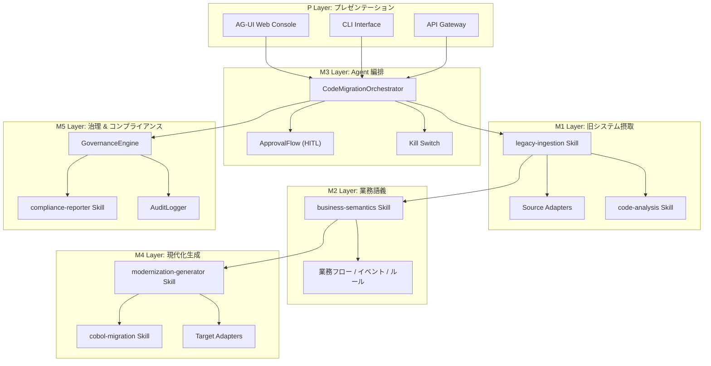
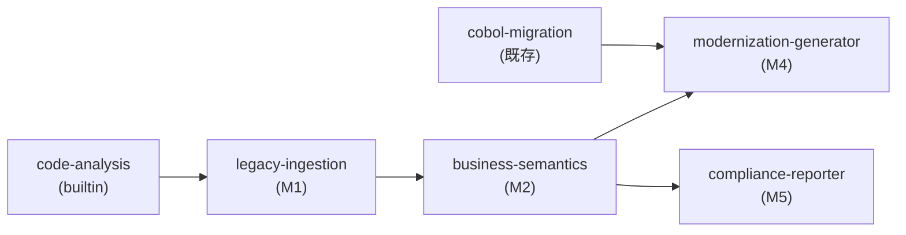
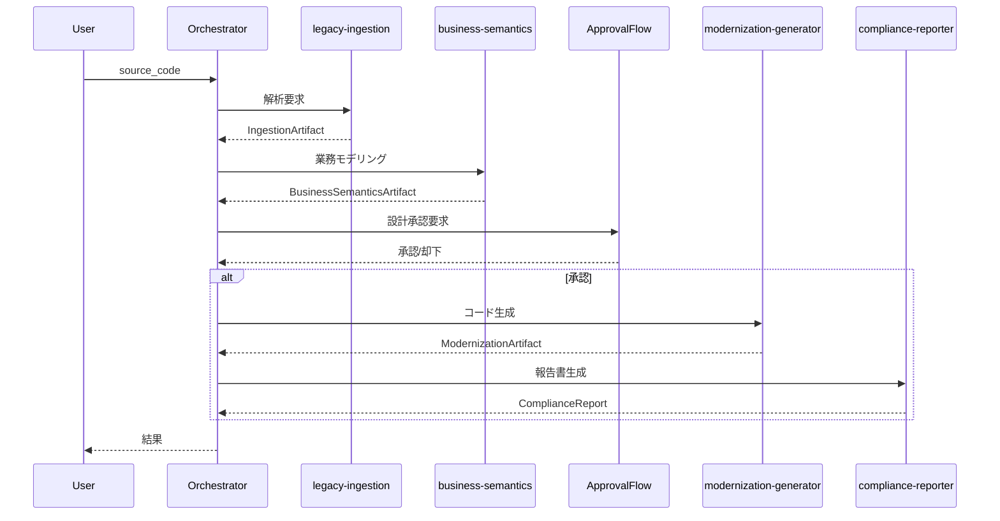

# Legacy-to-Agent™ Enterprise Modernization Platform - 総体設計書

## 1. 製品ポジショニング

**一句話要約:**
> AI Agent がレガシーシステムを「理解 → 運用 → 改修」する新プラットフォーム

**ブランド名:** Legacy-to-Agent™ Enterprise Modernization Platform

---

## 2. 5層アーキテクチャ



---

## 3. Skill 依存グラフ



**自動依存解決:** `SkillEngine._resolve_dependencies()` が `depends_on` を解析し、
未登録の依存 Skill を再帰的に解決（最大深度 3）。

---

## 4. Agent 編排設計

### 7工程固定パイプライン

```
分析 → 設計 → [HITL承認] → 変換 → テスト → 差分検証 → 品質裁定 → 限定修正
```

### HITL 承認ポイント

| チェックポイント | リスクレベル | 承認対象 |
|----------------|-----------|---------|
| 設計工程後 | HIGH | 移行設計全体（変換ルール、マッピング） |

### Kill Switch

- `CodeMigrationEngine.kill()` でフラグ設定
- 各工程開始前にチェック → `killed` なら即停止
- 停止理由を返却

---

## 5. 製品パッケージ

| パッケージ | 入口メソッド | 実行範囲 | 対象顧客 |
|-----------|-----------|---------|---------|
| **A. Assessment** | `orchestrator.assess()` | 分析 + 業務モデリング + 報告書 | 初期診断 |
| **B. Modernization** | `orchestrator.modernize()` | 全7工程 + HITL + テスト | 完全移行 |
| **C. Agent Platform** | `orchestrator.platform_mode()` | 持続運用 Agent | 運用保守 |

---

## 6. GovernanceEngine 統合

```python
# engine.py での統合
self._governance = GovernanceEngine()

# 各工程の監査ログ記録
# → AuditLogger が操作履歴を保存
# → compliance-reporter Skill が集約して報告書生成
```

### 監査データフロー

```
Agent 操作 → GovernanceEngine.evaluate_tool()
  → AuditEvent 記録
  → compliance-reporter Skill が集約
  → 日本語の監査報告書
```

---

## 7. データフロー


