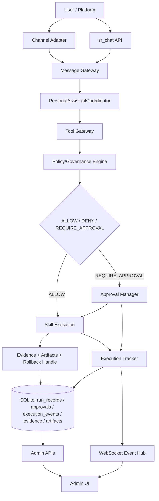

# Messaging Hub 全体アーキテクチャ（凍結版）

## 目的

`apps/messaging_hub/docs/改善.md` に基づき、Messaging Hub を「マルチチャネル入口 + 安全実行オーケストレーション + 証跡中心運用」の構成で定義する。

## レイヤー責務

- 入口層: `sr_chat` API と外部チャネル（Telegram/Slack/Discord 等）
- 編成層: `messaging_hub` Coordinator と `agentflow` の Intent/Policy/Governance
- 実行層: Skill Gateway 経由の OS/Network/Browser 呼び出し
- 統制層: 承認・監査・トレース・証跡・ロールバック情報

## Mermaid

## 境界の固定

- `agentflow`: ガバナンス判定、plugin manifest 検証、署名ポリシー、共通契約型
- `messaging_hub`: チャネル統合、sr_chat API、承認UI/API、実行トレース、SQLite 永続化

## 非機能要件

- 既存 API 非破壊（追加のみ）
- 実行イベントは標準イベント名 + 旧イベント名併送
- すべての副作用操作を証跡化
