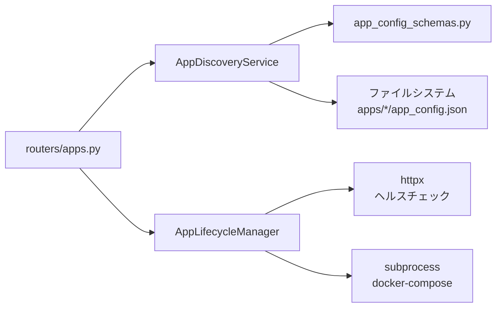

# App 管理 API 設計書

> **最終更新**: 2026-02-14
> **Router**: `apps/platform/routers/apps.py`
> **Prefix**: `/api/apps`

---

## 1. エンドポイント一覧

| メソッド | パス | 説明 |
|---------|------|------|
| `GET` | `/api/apps` | 全 App 一覧取得 |
| `GET` | `/api/apps/{app_name}` | App 詳細取得 |
| `GET` | `/api/apps/{app_name}/health` | ヘルスチェック |
| `POST` | `/api/apps/{app_name}/start` | App 起動 |
| `POST` | `/api/apps/{app_name}/stop` | App 停止 |
| `POST` | `/api/apps/refresh` | App 一覧を再スキャン |

---

## 2. レスポンスモデル

### GET /api/apps

```json
{
  "apps": [
    {
      "name": "faq_system",
      "display_name": "FAQ システム",
      "version": "1.0.0",
      "icon": "💬",
      "status": "healthy",
      "ports": { "api": 8001, "frontend": null },
      "agent_count": 3,
      "tags": ["faq", "rag"]
    }
  ],
  "total": 6
}
```

### GET /api/apps/{app_name}

```json
{
  "name": "faq_system",
  "display_name": "FAQ システム",
  "description": "社内FAQ/SQL分析/営業資料画像生成",
  "version": "1.0.0",
  "icon": "💬",
  "status": "healthy",
  "ports": { "api": 8001, "frontend": null, "db": 5433, "redis": null },
  "entry_points": {
    "api_module": "apps.faq_system.main:app",
    "health": "/health"
  },
  "agents": [
    { "name": "FAQAgent", "module": "agentflow.agents.faq_agent", "capabilities": ["faq", "rag"] }
  ],
  "services": { "rag": { "collections": ["faq_knowledge"] } },
  "dependencies": { "database": "postgresql", "redis": false },
  "tags": ["faq", "rag"],
  "config_path": "apps/faq_system/app_config.json"
}
```

### GET /api/apps/{app_name}/health

```json
{
  "app_name": "faq_system",
  "status": "healthy",
  "response_time_ms": 42,
  "checked_at": "2026-02-14T10:30:00Z",
  "details": { "uptime": "2h 15m" }
}
```

### POST /api/apps/{app_name}/start, /stop

```json
{
  "app_name": "faq_system",
  "action": "start",
  "success": true,
  "message": "App started successfully"
}
```

### POST /api/apps/refresh

```json
{
  "discovered": 6,
  "new": ["inventory_manager"],
  "removed": [],
  "unchanged": ["faq_system", "market_trend_monitor", "decision_governance_engine"]
}
```

---

## 3. エラーレスポンス

全エンドポイント共通:

```json
{
  "detail": "App not found: unknown_app",
  "error_code": "APP_NOT_FOUND"
}
```

| HTTP | error_code | 説明 |
|------|-----------|------|
| 404 | `APP_NOT_FOUND` | 指定 App が存在しない |
| 503 | `APP_UNHEALTHY` | App がヘルスチェックに応答しない |
| 500 | `LIFECYCLE_ERROR` | 起動/停止操作に失敗 |
| 422 | `VALIDATION_ERROR` | リクエストパラメータ不正 |

---

## 4. 依存関係



---

## 5. 既存 API との共存

新規 `/api/apps/*` は既存ルーターと独立:

| Prefix | Router | 状態 |
|--------|--------|------|
| `/api/gallery/*` | `gallery.py` | 既存（変更なし） |
| `/api/components/*` | `components.py` | 既存（変更なし） |
| `/api/publish/*` | `publish.py` | 既存（変更なし） |
| `/api/dashboard/*` | `dashboard.py` | 既存（変更なし） |
| `/api/apps/*` | `apps.py` | **新規** |

