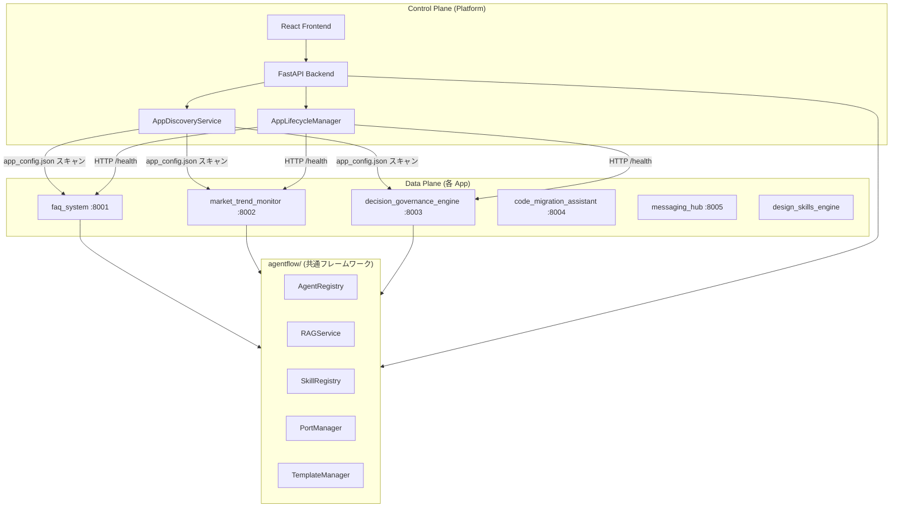
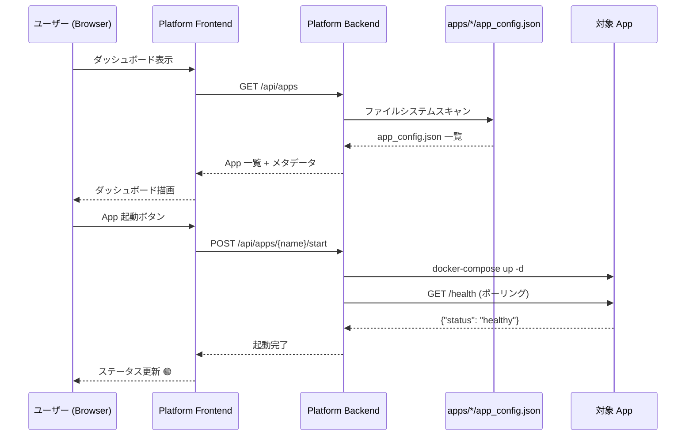

# Platform アーキテクチャ設計書

> **最終更新**: 2026-02-14
> **対象**: `apps/platform` — AgentFlow 統合管理プラットフォーム

---

## 1. 設計思想: Control Plane / Data Plane 分離

Platform は **管理画面（Control Plane）** であり、**実行エンジン（Data Plane）** ではない。
各 App は独立してデプロイ・実行され、Platform はそれらを発見・監視・操作する。



### 原則

| 原則 | 説明 |
|------|------|
| **App 独立性** | 各 App は Platform なしでも単独起動・動作可能 |
| **マニフェスト駆動** | `app_config.json` が唯一の契約。Platform はこれを読むだけ |
| **フレームワーク層共有** | 共通機能は `agentflow/` に実装。App が直接 import |
| **Platform は可視化** | 管理・監視・操作の UI を提供。ビジネスロジックは持たない |

---

## 2. レイヤ構成

```mermaid
graph LR
    subgraph L1["UI 層"]
        React["React + Vite + Tailwind"]
    end
    subgraph L2["API 層"]
        Apps["/api/apps/*"]
        Gallery["/api/gallery/*"]
        Components["/api/components/*"]
        Publish["/api/publish/*"]
        Dashboard["/api/dashboard/*"]
    end
    subgraph L3["Service 層"]
        AppDisc["AppDiscoveryService"]
        AppLife["AppLifecycleManager"]
        GallerySvc["GalleryService"]
        CompLib["ComponentLibrary"]
        PubOrch["PublishOrchestrator"]
        TenantDash["TenantDashboard"]
    end
    subgraph L4["Framework 層"]
        AF["agentflow/*"]
    end

    L1 --> L2
    L2 --> L3
    L3 --> L4
```



---

## 3. ディレクトリ構造（改造後）

```
apps/platform/
├── docs/                          # 設計ドキュメント（本ファイル群）
├── frontend/                      # React + Vite (Phase 2)
│   └── src/
│       ├── pages/                 # Dashboard, AppManager, etc.
│       └── components/            # 共通 UI コンポーネント
├── agents/                        # 既存: Gallery/Publish/Analytics Agent
├── routers/
│   ├── gallery.py                 # 既存
│   ├── components.py              # 既存
│   ├── publish.py                 # 既存
│   ├── dashboard.py               # 既存
│   └── apps.py                    # 新規: App 管理 API
├── schemas/
│   ├── gallery_schemas.py         # 既存
│   ├── component_schemas.py       # 既存
│   ├── publish_schemas.py         # 既存
│   └── app_config_schemas.py      # 新規: app_config.json Pydantic モデル
├── services/
│   ├── gallery_service.py         # 既存
│   ├── component_library.py       # 既存
│   ├── publish_orchestrator.py    # 既存
│   ├── tenant_dashboard.py        # 既存
│   ├── app_discovery.py           # 新規: App 発見・登録
│   └── app_lifecycle.py           # 新規: 起動/停止/ヘルスチェック
├── engine.py                      # 既存（拡張）
├── main.py                        # 既存（拡張）
└── __init__.py                    # 既存（拡張）
```

---

## 4. データフロー



---

## 5. 技術スタック

| 層 | 技術 | 備考 |
|----|------|------|
| Frontend | React 18 + TypeScript 5 + Vite + Tailwind CSS | Phase 2 で実装 |
| Backend | FastAPI + Pydantic v2 + Python 3.13+ | 既存基盤を拡張 |
| 通信 | REST + SSE | 既存パターンを踏襲 |
| 保存 | ファイルシステム (`app_config.json`) | DB 不要。軽量設計 |
| 監視 | HTTP ヘルスチェック | 各 App の `/health` を定期ポーリング |

