# Platform アーキテクチャ設計書

> **最終更新**: 2026-02-23
> **対象**: `apps/platform` — AgentFlow 統合管理プラットフォーム

---

## 1. 設計思想: Control Plane / Data Plane 分離

Platform は **管理画面（Control Plane）** であり、**実行エンジン（Data Plane）** ではない。
各 App は独立してデプロイ・実行され、Platform はそれらを発見・監視・操作する。

```mermaid
graph TB
    subgraph ControlPlane["Control Plane (Platform)"]
        UI["React Frontend"]
        API["FastAPI Backend"]
        Discovery["AppDiscoveryService"]
        Lifecycle["AppLifecycleManager"]
    end

    subgraph DataPlane["Data Plane (各 App)"]
        A1["faq_system :8001"]
        A2["market_trend_monitor :8002"]
        A3["decision_governance_engine :8003"]
        A4["code_migration_assistant :8004"]
        A5["messaging_hub :8005"]
        A6["design_skills_engine"]
    end

    subgraph Framework["agentflow/ (共通フレームワーク)"]
        AR["AgentRegistry"]
        RAG["RAGService"]
        SK["SkillRegistry"]
        PM["PortManager"]
        TM["TemplateManager"]
    end

    UI --> API
    API --> Discovery
    API --> Lifecycle
    Discovery -->|"app_config.json スキャン"| A1
    Discovery -->|"app_config.json スキャン"| A2
    Discovery -->|"app_config.json スキャン"| A3
    Lifecycle -->|"HTTP /health"| A1
    Lifecycle -->|"HTTP /health"| A2
    Lifecycle -->|"HTTP /health"| A3
    A1 --> Framework
    A2 --> Framework
    A3 --> Framework
    API --> Framework
```



### 原則

| 原則 | 説明 |
|------|------|
| **App 独立性** | 各 App は Platform なしでも単独起動・動作可能 |
| **マニフェスト駆動** | `app_config.json` が唯一の契約。Platform はこれを読むだけ |
| **フレームワーク層共有** | 共通機能は `agentflow/` に実装。App が直接 import |
| **Platform は可視化** | 管理・監視・操作の UI を提供。ビジネスロジックは持たない |

---

## 2. レイヤ構成

```mermaid
graph LR
    subgraph L1["UI 層"]
        React["React + Vite + Tailwind"]
    end
    subgraph L2["API 層"]
        Apps["/api/studios/framework/apps/*"]
        Gallery["/api/studios/framework/gallery/*"]
        Components["/api/studios/framework/components/*"]
        Publish["/api/studios/framework/publish/*"]
        Dashboard["/api/studios/framework/dashboard/*"]
    end
    subgraph L3["Service 層"]
        AppDisc["AppDiscoveryService"]
        AppLife["AppLifecycleManager"]
        GallerySvc["GalleryService"]
        CompLib["ComponentLibrary"]
        PubOrch["PublishOrchestrator"]
        TenantDash["TenantDashboard"]
    end
    subgraph L4["Framework 層"]
        AF["agentflow/*"]
    end

    L1 --> L2
    L2 --> L3
    L3 --> L4
```



---

## 3. ディレクトリ構造（改造後）

```
apps/platform/
├── docs/                          # 設計ドキュメント（本ファイル群）
├── frontend/                      # React + Vite (Phase 2)
│   └── src/
│       ├── pages/                 # Dashboard, AppManager, etc.
│       └── components/            # 共通 UI コンポーネント
├── agents/                        # 既存: Gallery/Publish/Analytics Agent
├── routers/
│   ├── gallery.py                 # 既存
│   ├── components.py              # 既存
│   ├── publish.py                 # 既存
│   ├── dashboard.py               # 既存
│   └── apps.py                    # 新規: App 管理 API
├── schemas/
│   ├── gallery_schemas.py         # 既存
│   ├── component_schemas.py       # 既存
│   ├── publish_schemas.py         # 既存
│   └── app_config_schemas.py      # 新規: app_config.json Pydantic モデル
├── services/
│   ├── gallery_service.py         # 既存
│   ├── component_library.py       # 既存
│   ├── publish_orchestrator.py    # 既存
│   ├── tenant_dashboard.py        # 既存
│   ├── app_discovery.py           # 新規: App 発見・登録
│   └── app_lifecycle.py           # 新規: 起動/停止/ヘルスチェック
├── engine.py                      # 既存（拡張）
├── main.py                        # 既存（拡張）
└── __init__.py                    # 既存（拡張）
```

---

## 4. データフロー

```mermaid
sequenceDiagram
    participant U as ユーザー (Browser)
    participant FE as Platform Frontend
    participant BE as Platform Backend
    participant FS as apps/*/app_config.json
    participant APP as 対象 App

    U->>FE: ダッシュボード表示
    FE->>BE: GET /api/studios/framework/apps
    BE->>FS: ファイルシステムスキャン
    FS-->>BE: app_config.json 一覧
    BE-->>FE: App 一覧 + メタデータ
    FE-->>U: ダッシュボード描画

    U->>FE: App 起動ボタン
    FE->>BE: POST /api/studios/framework/apps/{name}/start
    BE->>APP: docker-compose up -d
    BE->>APP: GET /health (ポーリング)
    APP-->>BE: {"status": "healthy"}
    BE-->>FE: 起動完了
    FE-->>U: ステータス更新 🟢
```



---

## 5. 技術スタック

| 層 | 技術 | 備考 |
|----|------|------|
| Frontend | React 18 + TypeScript 5 + Vite + Tailwind CSS | Phase 2 で実装 |
| Backend | FastAPI + Pydantic v2 + Python 3.13+ | 既存基盤を拡張 |
| 通信 | REST + SSE | 既存パターンを踏襲 |
| 保存 | ファイルシステム (`app_config.json`) | DB 不要。軽量設計 |
| 監視 | HTTP ヘルスチェック | 各 App の `/health` を定期ポーリング |

---

## 6. CLI 駆動自癒アーキテクチャ（2026-02）

Platform は起動系アクションに対して「事前準備 + 失敗時調査」を標準化する。

```mermaid
sequenceDiagram
    participant FE as AppDetail (Frontend)
    participant API as apps router
    participant LC as AppLifecycleManager
    participant RM as CLIRuntimeManager
    participant CR as RuntimeCommandResolver
    participant DS as CLIDiagnosticService

    FE->>API: POST /apps/{app}/local-start|start|publish
    API->>LC: action 実行
    LC->>RM: preflight(detect/install/auth)
    LC->>CR: resolve commands (README > runtime.commands > fallback)
    LC->>LC: コマンド実行
    alt 失敗時
        LC->>DS: diagnose_action_failure(...)
        DS->>RM: run_diagnostic_prompt(read_only/plan)
        RM-->>DS: 構造化結果
        DS-->>LC: diagnostic payload
    end
    LC-->>API: AppActionResult + diagnostic?
    API-->>FE: 同一レスポンス
```



### 設計意図

- **安全第一**: CLI 診断は既定で `read_only/plan`。自動改変を行わない。
- **契約優先**: app 固有差分は `runtime.cli` と `runtime.commands` で明示上書き。
- **説明可能性**: `command_source` と `diagnostic` を同時返却し、UI 側で同位置表示する。

### 主要コンポーネント

- `agentflow/tools/cli/runtime_manager.py`
  - CLI 検出、インストール、認証、診断実行を統一
- `apps/platform/services/runtime_command_resolver.py`
  - README から起動コマンド抽出、fallback 決定
- `apps/platform/services/cli_diagnostic_service.py`
  - 起動失敗文脈の整形、診断結果の構造化

---

## 7. Platform API 追加契約

- `GET /api/studios/framework/apps/{app_name}/cli/status`
- `POST /api/studios/framework/apps/{app_name}/cli/setup`

既存 action（`publish/start/stop/local-start`）レスポンス拡張:

- `command_source`: 解決元（`readme` / `runtime` / `fallback`）
- `diagnostic?`: 失敗時 CLI 診断情報（非永続・当該レスポンスのみ）
