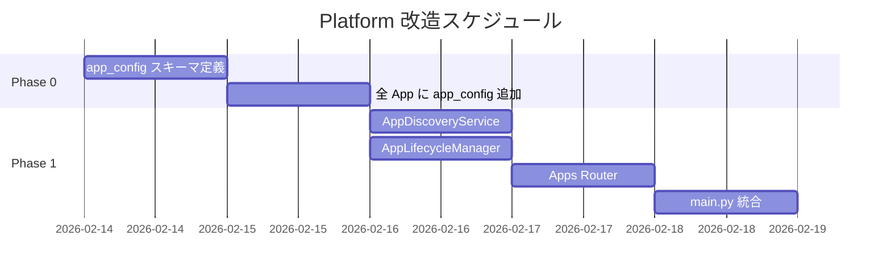

# Platform 改造計画書

> **作成日**: 2026-02-14
> **目的**: `apps/platform` を「API/CLI のみ」から「全 App 統合管理プラットフォーム」へ改造
> **スコープ**: 本ファイルは今回の改善専用。完了後はアーカイブ扱い。

---

## 1. 現状の課題

| # | 課題 | 影響 |
|---|------|------|
| 1 | Platform に UI がない | CLI/Swagger のみ。非技術者が使えない |
| 2 | 各 App の構成がバラバラ | `app_config.json` は market_trend_monitor のみ |
| 3 | Platform が他 App を認識しない | Dashboard は空（全項目ゼロ） |
| 4 | 横断的な Agent/RAG/Skill 可視化がない | 各 App が独自管理。全体像が見えない |
| 5 | 新規 App 作成が手動 | CLI を複数回実行。手順漏れリスク |
| 6 | インメモリ保存 | 再起動でデータ消失 |

---

## 2. 改造フェーズ

### Phase 0: 標準化（本改造の基盤）

**目標**: 全 App に `app_config.json` を配置し、Platform が発見可能にする

| タスク | 成果物 | 工数目安 |
|--------|--------|---------|
| `app_config.json` Pydantic スキーマ定義 | `schemas/app_config_schemas.py` | 0.5日 |
| 全 6 App に `app_config.json` 追加 | `apps/*/app_config.json` × 6 | 0.5日 |

### Phase 1: Backend サービス

**目標**: App 発見・管理 API を実装

| タスク | 成果物 | 工数目安 |
|--------|--------|---------|
| AppDiscoveryService | `services/app_discovery.py` | 1日 |
| AppLifecycleManager | `services/app_lifecycle.py` | 1日 |
| Apps Router | `routers/apps.py` | 1日 |
| main.py 統合 | `main.py` + `routers/__init__.py` 更新 | 0.5日 |

### Phase 2: Frontend（将来）

**目標**: React 管理画面を追加

| タスク | 成果物 | 工数目安 |
|--------|--------|---------|
| React + Vite セットアップ | `frontend/` | 1日 |
| Dashboard ページ | 全 App 一覧・ステータス | 2日 |
| App 詳細ページ | Agent/RAG/Config 表示 | 2日 |
| New App ウィザード | テンプレート生成 UI | 2日 |

### Phase 3: 統合（将来）

**目標**: Agent 自動発見、RAG/Skill 管理 UI

---

## 3. 今回の実装スコープ（Phase 0 + Phase 1）

---

## 4. 品質基準

| 項目 | 基準 |
|------|------|
| 型安全 | 100% 型アノテーション。`Any` 最小化 |
| エラー処理 | 全 I/O 操作に try/except。意味のあるエラーメッセージ |
| ファイルサイズ | 各ファイル 300 行以内（code-rules 準拠） |
| テスト | 新規コードに対応するユニットテスト |
| ドキュメント | Google スタイル Docstring |
| 非同期 | I/O 操作は async-first |

---

## 5. リスクと対策

| リスク | 対策 |
|--------|------|
| `app_config.json` の仕様変更が頻発 | Pydantic で厳密にバリデーション。バージョンフィールド付き |
| ヘルスチェックが App に負荷 | ポーリング間隔を設定可能に（デフォルト 30 秒） |
| 既存 App の構造が多様 | `app_config.json` は最小限の必須フィールドのみ。残りは optional |
| インメモリ保存の限界 | Phase 0-1 はファイルシステムベース。DB は Phase 2 以降で検討 |

---

## 6. 完了条件（DoD）

- [ ] 全 App に `app_config.json` が存在する
- [ ] `GET /api/studios/framework/apps` が全 App の情報を返す
- [ ] `GET /api/studios/framework/apps/{name}` が App 詳細（Agent 一覧含む）を返す
- [ ] `GET /api/studios/framework/apps/{name}/health` がヘルスチェック結果を返す
- [ ] `POST /api/studios/framework/apps/{name}/start` / `stop` が動作する
- [ ] 既存の Gallery/Components/Publish/Dashboard API が壊れていない
- [ ] Pydantic バリデーションが全エンドポイントで機能する
- [ ] 新規コードに型アノテーションが 100% 付与されている
