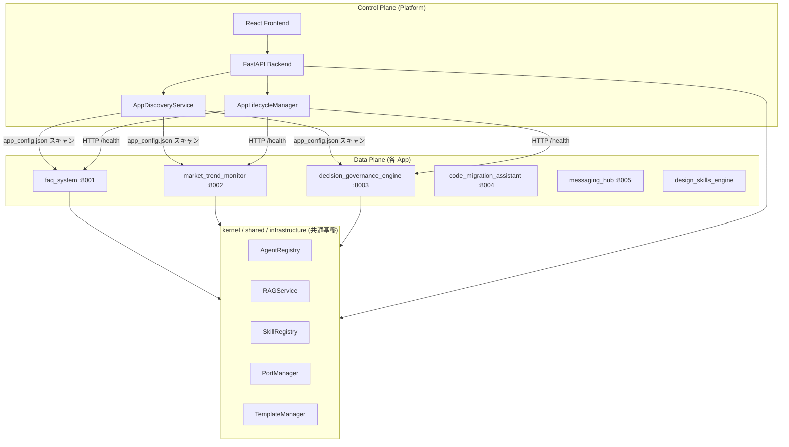
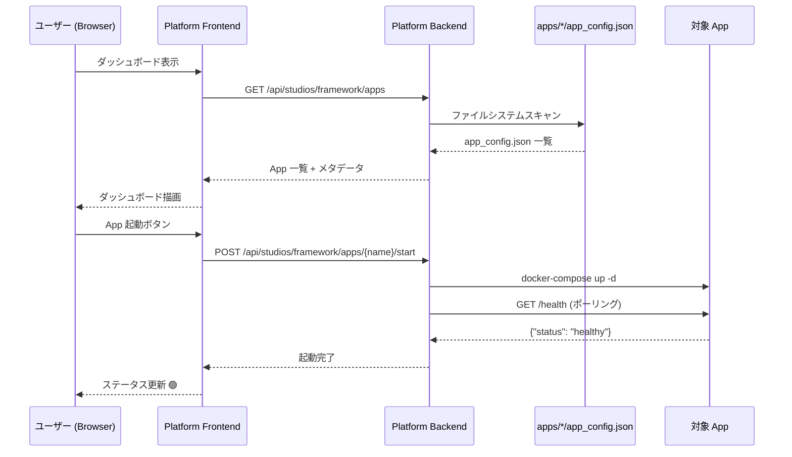
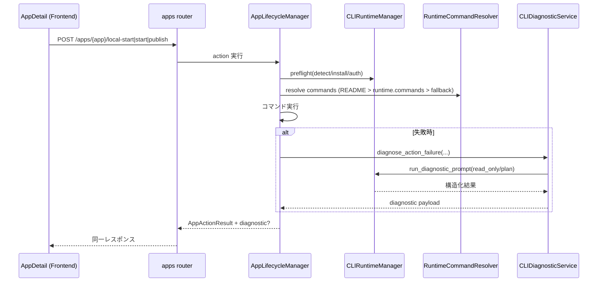

# Platform アーキテクチャ設計書

> **最終更新**: 2026-02-23
> **対象**: `control_plane` — BizCore 統合管理プラットフォーム

---

## 1. 設計思想: Control Plane / Data Plane 分離

Platform は **管理画面（Control Plane）** であり、**実行エンジン（Data Plane）** ではない。
各 App は独立してデプロイ・実行され、Platform はそれらを発見・監視・操作する。



### 原則

| 原則                     | 説明                                                                               |
| ------------------------ | ---------------------------------------------------------------------------------- |
| **App 独立性**           | 各 App は Platform なしでも単独起動・動作可能                                      |
| **マニフェスト駆動**     | `app_config.json` が唯一の契約。Platform はこれを読むだけ                          |
| **フレームワーク層共有** | 共通機能は `kernel/` `shared/` `infrastructure/` に実装。App が責務に応じて import |
| **Platform は可視化**    | 管理・監視・操作の UI を提供。ビジネスロジックは持たない                           |

---

## 2. レイヤ構成

```mermaid
graph LR
    subgraph L1["UI 層"]
        React["React + Vite + Tailwind"]
    end
    subgraph L2["API 層"]
        Apps["/api/studios/framework/apps/*"]
        Gallery["/api/studios/framework/gallery/*"]
        Components["/api/studios/framework/components/*"]
        Publish["/api/studios/framework/publish/*"]
        Dashboard["/api/studios/framework/dashboard/*"]
    end
    subgraph L3["Service 層"]
        AppDisc["AppDiscoveryService"]
        AppLife["AppLifecycleManager"]
        GallerySvc["GalleryService"]
        CompLib["ComponentLibrary"]
        PubOrch["PublishOrchestrator"]
        TenantDash["TenantDashboard"]
    end
    subgraph L4["Framework 層"]
        AF["kernel/* + shared/* + infrastructure/*"]
    end

    L1 --> L2
    L2 --> L3
    L3 --> L4
```



---

## 3. ディレクトリ構造（改造後）

```
control_plane/
├── docs/                          # 設計ドキュメント（本ファイル群）
├── frontend/                      # React + Vite (Phase 2)
│   └── src/
│       ├── pages/                 # Dashboard, AppManager, etc.
│       └── components/            # 共通 UI コンポーネント
├── agents/                        # 既存: Gallery/Publish/Analytics Agent
├── routers/
│   ├── gallery.py                 # 既存
│   ├── components.py              # 既存
│   ├── publish.py                 # 既存
│   ├── dashboard.py               # 既存
│   └── apps.py                    # 新規: App 管理 API
├── schemas/
│   ├── gallery_schemas.py         # 既存
│   ├── component_schemas.py       # 既存
│   ├── publish_schemas.py         # 既存
│   └── app_config_schemas.py      # 新規: app_config.json Pydantic モデル
├── services/
│   ├── gallery_service.py         # 既存
│   ├── component_library.py       # 既存
│   ├── publish_orchestrator.py    # 既存
│   ├── tenant_dashboard.py        # 既存
│   ├── app_discovery.py           # 新規: App 発見・登録
│   └── app_lifecycle.py           # 新規: 起動/停止/ヘルスチェック
├── engine.py                      # 既存（拡張）
├── main.py                        # 既存（拡張）
└── __init__.py                    # 既存（拡張）
```

---

## 4. データフロー



### 4.1 App 一覧/詳細 API の応答方針（2026-03）

- `GET /api/studios/framework/apps` は既定で `wait_for_health=false`（non-blocking）。
- `GET /api/studios/framework/apps/{app_name}` も既定で `wait_for_health=false`。
- 初回応答は `status=unknown` を許容し、ヘルスはバックグラウンドで更新する。
- ヘルス完了待機が必要な呼び出しは `?wait_for_health=true` を指定する。

---

## 5. 技術スタック

| 層       | 技術                                          | 備考                                 |
| -------- | --------------------------------------------- | ------------------------------------ |
| Frontend | React 18 + TypeScript 5 + Vite + Tailwind CSS | Phase 2 で実装                       |
| Backend  | FastAPI + Pydantic v2 + Python 3.13+          | 既存基盤を拡張                       |
| 通信     | REST + SSE                                    | 既存パターンを踏襲                   |
| 保存     | ファイルシステム (`app_config.json`)          | DB 不要。軽量設計                    |
| 監視     | HTTP ヘルスチェック                           | 各 App の `/health` を定期ポーリング |

---

## 6. CLI 駆動自癒アーキテクチャ（2026-02）

Platform は起動系アクションに対して「事前準備 + 失敗時調査」を標準化する。



### 設計意図

- **安全第一**: CLI 診断は既定で `read_only/plan`。自動改変を行わない。
- **契約優先**: app 固有差分は `runtime.cli` と `runtime.commands` で明示上書き。
- **説明可能性**: `command_source` と `diagnostic` を同時返却し、UI 側で同位置表示する。

### 主要コンポーネント

- `kernel/tools/cli/runtime_manager.py`
  - CLI 検出、インストール、認証、診断実行を統一
- `control_plane/services/runtime_command_resolver.py`
  - README から起動コマンド抽出、fallback 決定
- `control_plane/services/cli_diagnostic_service.py`
  - 起動失敗文脈の整形、診断結果の構造化

---

## 7. Platform API 追加契約

- `GET /api/studios/framework/apps/{app_name}/cli/status`
- `POST /api/studios/framework/apps/{app_name}/cli/setup`

既存 action（`publish/start/stop/local-start`）レスポンス拡張:

- `command_source`: 解決元（`readme` / `runtime` / `fallback`）
- `diagnostic?`: 失敗時 CLI 診断情報（非永続・当該レスポンスのみ）
