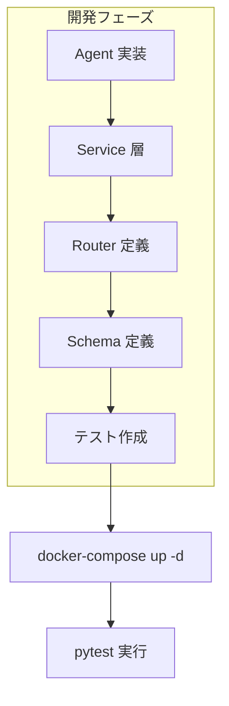
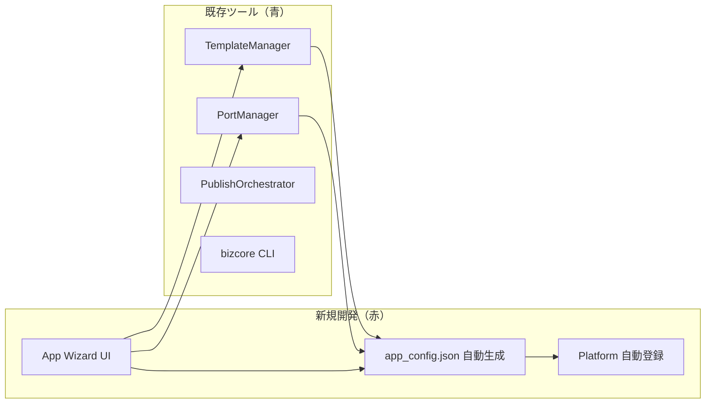

# 新規 App 開発ワークフロー設計

> **最終更新**: 2026-02-23
> **対象**: Platform から新規 App を追加する際の統一手順

---

## 1. 概要

新規 App 作成時、以下の 7 ステップを統一フローとして実行する。
Platform UI（Phase 2）完成後はウィザード形式で自動化される。


---

## 2. 各ステップ詳細

### ① 計画

App の基本情報を決定する。

| 項目 | 例 | 備考 |
|------|-----|------|
| App 名 | `inventory_manager` | snake_case 必須 |
| 表示名 | `在庫管理システム` | UI 表示用 |
| Agent 数 | 3 | 初期見込み |
| DB 種別 | `postgresql` | postgresql / sqlite / none |
| Redis | `true` | キャッシュ利用有無 |
| Frontend | `true` | React UI 有無 |

### ② テンプレート生成

既存ツール `TemplateManager` を使用:

```bash
# 対話モードで基盤生成
python -m control_plane.cli.main template generate fullstack-app \
  apps/inventory_manager -i

# パラメータ指定モード
python -m control_plane.cli.main template generate fullstack-app \
  apps/inventory_manager \
  -p app_name=inventory_manager \
  -p app_title="在庫管理システム" \
  -p db_name=inventory_db \
  -p redis_enabled=true \
  -p frontend_enabled=true
```

**生成物**: `docker-compose.yml`, `api.py`, `config/`, `db/`, `routers/`, `services/`, `schemas/`, `tests/`, `frontend/`

### ③ ポート割り当て

既存ツール `PortManager` を使用:

```bash
curl -X POST http://localhost:8000/api/studios/framework/apps/ports/rebalance \
  -H "Content-Type: application/json" \
  -d '{"dry_run": false}'
```

**自動検出対象**:
- システム使用中ポート（socket テスト）
- Docker コンテナ使用中ポート
- 既存 `apps/*/.env` の設定ポート
- `apps/*/docker-compose.yml` のポート

**生成物**: `.env`, `.env.example`（DB/Redis/API/Frontend のポート設定）

### ④ app_config.json 作成

Platform が認識するためのマニフェストファイルを配置:

```bash
# 自動生成（将来の Platform UI 機能）
# 現時点では手動作成
cat > apps/inventory_manager/app_config.json << 'EOF'
{
  "name": "inventory_manager",
  "display_name": "在庫管理システム",
  "version": "1.0.0",
  "icon": "📦",
  "ports": { "api": 8006, "frontend": 3006, "db": 5438 },
  "entry_points": {
    "api_module": "apps.inventory_manager.api:app",
    "health": "/health"
  },
  "agents": [],
  "dependencies": { "database": "postgresql", "redis": true },
  "tags": ["inventory", "warehouse"]
}
EOF
```

### ⑤ 開発・実装

Agent / Service / Router を実装する。



### ⑥ Platform 登録確認

Platform API で App が正しく認識されることを確認:

```bash
# App 一覧を再スキャン
curl -X POST http://localhost:8000/api/studios/framework/apps/refresh

# 新規 App が表示されることを確認
curl "http://localhost:8000/api/studios/framework/apps/inventory_manager?wait_for_health=true"

# ヘルスチェック
curl http://localhost:8000/api/studios/framework/apps/inventory_manager/health
```

補足:

- `GET /api/studios/framework/apps` と `GET /api/studios/framework/apps/{app}` は既定で `wait_for_health=false`（non-blocking）。
- 安定検証（待機）をしたい場合は `?wait_for_health=true` を付与する。

### ⑦ デプロイ

既存の `PublishOrchestrator` または手動デプロイ:

```bash
# Docker デプロイ
cd apps/inventory_manager && docker-compose up -d

# Vercel (フロントエンドのみ)
cd apps/inventory_manager/frontend && vercel deploy
```

---

## 3. ツール対応表



| ステップ | 使用ツール | 状態 |
|----------|-----------|------|
| ② テンプレート生成 | `TemplateManager` + CLI | ✅ 既存 |
| ③ ポート割り当て | `PortManager` | ✅ 既存 |
| ④ app_config.json | 手動 → 将来自動生成 | 🔴 新規 |
| ⑥ Platform 確認 | `AppDiscoveryService` | 🔴 新規 |
| ⑦ デプロイ | `PublishOrchestrator` | ✅ 既存 |

---

## 4. 将来の自動化（Phase 2 以降）

Platform UI に「New App」ウィザードを実装し、①〜④ を GUI 操作で完結させる:

1. フォーム入力 → App 名、Agent 構成、DB/Redis 設定
2. TemplateManager で基盤生成
3. PortManager でポート自動割り当て
4. `app_config.json` 自動生成
5. Platform に即座に反映

---

## 5. 運用起動/自癒フロー（Platform 実装）

新規 App 追加後の運用起動は、以下の固定順序で処理される。

1. `CLI preflight`（`codex` / `claude` の検出・必要時インストール・認証確認）
2. コマンド解決
   - `backend_dev/frontend_dev`: `README > runtime.commands > fallback`
   - `start/publish/stop`: `runtime.commands > fallback`（README 前景コマンドは使わない）
3. `start/stop` は `execution_mode` を先に判定
   - 優先順位: docker 稼働中 > local PID 稼働中 > compose-first default
4. `local-start/start/stop/publish` 失敗時は AI 修復ループを自動実行
   - 順序: `codex` 2 回 → `claude` 2 回
   - scope: 対象 app + platform ライフサイクル関連ファイル
5. action response に `execution_mode` と `repair`（試行履歴）を同梱

### local-start の標準意味

- backend + frontend を同時起動する（frontend が無い App は backend のみ）
- PID 存在だけでなく backend health / frontend 待受を確認する
- 起動直後に片系が停止した場合は失敗としてログ末尾を返す

### 実装時チェックポイント

- README に標準起動コマンドを明示する
- `runtime.commands.start/publish/stop` は compose コマンドを明示する
- `runtime.cli` で CLI インストール/認証/診断コマンドを app 単位に上書きする
