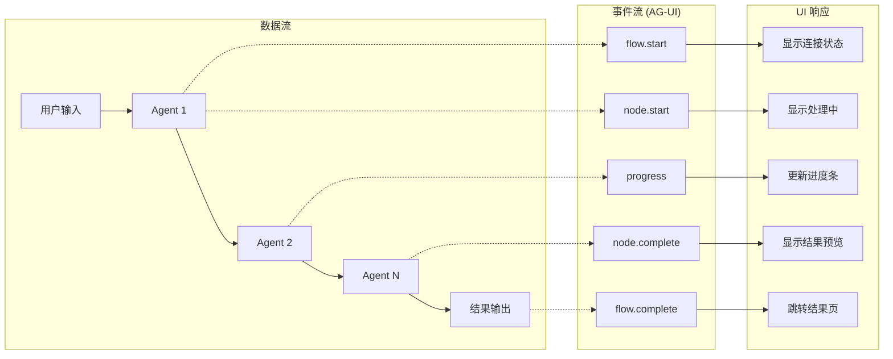

# AgentFlow 快速学习指南

> **目标**: 让 AI 和人类开发者在 30 分钟内理解 AgentFlow 核心架构

---

## 📖 目录

1. [框架哲学 (道)](#1-框架哲学-道)
2. [架构设计 (法)](#2-架构设计-法)
3. [开发方法 (术)](#3-开发方法-术)
4. [工具链 (器)](#4-工具链-器)
5. [速查表](#5-速查表)

---

## 1. 框架哲学 (道)

### 核心理念

```
┌─────────────────────────────────────────────────────────────────┐
│                      AgentFlow 设计哲学                          │
├─────────────────────────────────────────────────────────────────┤
│                                                                 │
│  🎯 目标：让 AI 应用开发标准化、简单化                            │
│                                                                 │
│  ┌──────────────┐     ┌──────────────┐     ┌──────────────┐   │
│  │   App 关注   │     │  框架提供    │     │   协议统一   │   │
│  │  业务逻辑    │ ←→  │  技术实现    │ ←→  │  互联互通    │   │
│  └──────────────┘     └──────────────┘     └──────────────┘   │
│                                                                 │
│  App 开发者只需要：                                              │
│  • 定义 Agent 职责（提示词）                                     │
│  • 定义工作流程（谁先谁后）                                      │
│  • 定义输入输出（Schema）                                       │
│  • 定义 UI 展示（可选）                                         │
│                                                                 │
│  框架自动处理：                                                  │
│  • LLM 调用、重试、负载均衡                                      │
│  • SSE/WebSocket 通信                                           │
│  • 状态管理、持久化                                              │
│  • 错误处理、日志监控                                            │
│                                                                 │
└─────────────────────────────────────────────────────────────────┘
```

### 为什么选择 AgentFlow？

| 传统方式                  | AgentFlow                       |
| ------------------------- | ------------------------------- |
| 每个应用重复实现 LLM 调用 | 统一 Provider，一行代码切换模型 |
| 手动处理 SSE 连接         | `useAgentStream` Hook 自动管理  |
| 各自实现错误处理          | 框架统一错误分类与重试          |
| 状态管理代码分散          | `createAgentStore` 工厂统一     |
| 协议适配繁琐              | MCP/A2A/AG-UI/A2UI 四协议统一   |

---

## 2. 架构设计 (法)

### 8 层架构

```
┌─────────────────────────────────────────────────────────────────┐
│                    AgentFlow 8层架构                             │
├─────────────────────────────────────────────────────────────────┤
│                                                                 │
│  L1 📱 应用层      apps/ (decision_governance_engine, ...)      │
│                         ↑ 只写业务代码                          │
│  ─────────────────────────────────────────────────────────────  │
│  L2 🎨 UI层        @agentflow/ui (Hooks, Components)            │
│                    agentflow/protocols/a2ui (服务端组件)         │
│                         ↑ 统一前端 SDK                          │
│  ─────────────────────────────────────────────────────────────  │
│  L3 🔄 流程层      @agent / Engines / AgentCoordinator      │
│                         ↑ 三种开发方式                          │
│  ─────────────────────────────────────────────────────────────  │
│  L4 🤖 Agent层     AgentBlock / @agent 装饰器                   │
│                         ↑ Agent 基类                            │
│  ─────────────────────────────────────────────────────────────  │
│  L5 🛠️ 工具层     @tool / MCP Tools / Skills                   │
│                         ↑ 工具注册与调用                        │
│  ─────────────────────────────────────────────────────────────  │
│  L6 🔌 Provider层  get_llm() / get_db() / get_vectordb()        │
│                         ↑ 松耦合资源访问                        │
│  ─────────────────────────────────────────────────────────────  │
│  L7 🌐 协议层      MCP / A2A / AG-UI / A2UI                     │
│                         ↑ 四协议互联互通                        │
│  ─────────────────────────────────────────────────────────────  │
│  L8 💾 基础设施层  OpenAI / Anthropic / Supabase / Redis        │
│                         ↑ 可替换的外部服务                      │
│                                                                 │
└─────────────────────────────────────────────────────────────────┘
```

### 目录结构

```
serverlessAIAgents/
├── agentflow/              # 框架核心
│   ├── core/               # 引擎、注册表、验证器
│   ├── protocols/          # MCP/A2A/AG-UI/A2UI
│   ├── providers/          # LLM/DB/Vector Provider
│   ├── sdk/                # 前后端 SDK (新增)
│   │   ├── frontend/       # @agentflow/ui
│   │   └── api/            # agentflow.sdk.api
│   ├── patterns/           # 设计模式
│   ├── memory/             # 记忆系统
│   └── skills/             # 技能系统
│
├── apps/                   # 应用目录
│   ├── decision_governance_engine/
│   ├── market_trend_monitor/
│   └── code_migration_assistant/
│
├── studio/                 # 可视化编辑器
└── docs/                   # 文档
```

### 核心概念



---

## 3. 开发方法 (术)

### 方式 1: @agent 装饰器（推荐）

最简单的方式，适合大多数场景：

```python
from agentflow import agent, tool

@agent
class AnalyzerAgent:
    """分析用户输入并提取关键信息."""

    system_prompt = """
    你是一个专业的分析师。
    分析用户的问题，提取关键信息。
    """

    @tool
    def search_database(self, query: str) -> list:
        """搜索数据库."""
        # 工具实现
        return []

# 使用
result = await AnalyzerAgent().invoke({"question": "..."})
```

### 方式 2: Engine Pattern（多 Agent 协调・推奨）

适合多个 Agent 协作的场景，4種類の予定義パターンから選択：

```python
from agentflow.engines import PipelineEngine

# PipelineEngine を使用（複数Agent + Review）
engine = PipelineEngine(
    stages=[
        {"name": "gate", "agent": GateAgent, "gate": True},
        {"name": "analysis", "agents": [AnalyzerAgent, PlannerAgent], "parallel": True},
        {"name": "review", "agent": ReviewerAgent, "review": True},
    ],
    max_revisions=2,
)

# 同步执行
result = await engine.run({"task": "..."})

# 流式执行（获取 AG-UI 事件）
async for event in engine.run_stream({"task": "..."}):
    print(event)  # engine.start, stage.start, progress, ...
```

### 方式 3: YAML 配置（声明式）

适合复杂工作流：

```yaml
# agent.yaml
name: decision-flow
version: 1.0.0

agents:
  - id: gatekeeper
    type: GatekeeperAgent
    config:
      max_tokens: 1000

  - id: analyzer
    type: AnalyzerAgent
    depends_on: [gatekeeper]

  - id: reviewer
    type: ReviewerAgent
    depends_on: [analyzer]

workflow:
  entry: gatekeeper
  transitions:
    gatekeeper:
      success: analyzer
      reject: end
    analyzer:
      complete: reviewer
    reviewer:
      approve: end
      revise: analyzer
```

```python
from apps.decision_governance_engine import DecisionEngine

# PipelineEngine を使用
engine = DecisionEngine()
result = await engine.run({"question": "..."})
```

### 前端开发

使用 `@agentflow/ui` SDK：

```tsx
import {
  useAgentStream,
  createAgentStore,
  AgentProgress,
  NotificationProvider,
} from "@agentflow/ui";

// 1. 创建 Store（只定义业务状态）
const useMyStore = createAgentStore({
  name: "my-app",
  initialState: {
    question: "",
    options: [],
  },
});

// 2. 使用 SSE Hook
function ProcessingPage() {
  const { agents, isComplete, start } = useAgentStream({
    endpoint: "/api/my-app/stream",
    agents: [
      { id: "analyzer", name: "分析", label: "数据分析" },
      { id: "planner", name: "规划", label: "制定方案" },
    ],
  });

  return (
    <div>
      <button onClick={() => start({ question: "..." })}>开始处理</button>
      <AgentProgress agents={agents} />
    </div>
  );
}
```

### 后端 API

使用 `agentflow.sdk.api` SDK：

```python
from fastapi import FastAPI
from agentflow.sdk.api import create_agent_router
from my_app.engine import MyEngine

app = FastAPI()

# 自动生成标准端点
router = create_agent_router(
    engine=MyEngine,
    prefix="/api/my-app",
)

app.include_router(router)

# 自动生成：
# GET  /api/my-app/health
# GET  /api/my-app/agents
# POST /api/my-app/process
# GET  /api/my-app/stream (SSE)
```

---

## 4. 工具链 (器)

### CLI 命令

```bash
# 创建项目
agentflow create my-agent --template decision

# 运行项目
agentflow run

# 测试
agentflow test

# 打开可视化编辑器
agentflow studio

# 检查配置
agentflow validate

# 部署
agentflow deploy
```

### Provider 使用

```python
from agentflow import get_llm, get_db, get_vectordb, get_embedding

# LLM（自动检测 OpenAI/Anthropic/Ollama）
llm = get_llm()
response = await llm.chat([{"role": "user", "content": "hello"}])

# 数据库（自动检测 Supabase/PostgreSQL/SQLite）
db = get_db()
users = await db.select("users", filters={"active": True})

# 向量数据库（自动检测 FAISS/Qdrant/Weaviate/Supabase/ChromaDB）
# 环境变量: VECTOR_DATABASE_TYPE=qdrant
vdb = get_vectordb()
await vdb.connect()
results = await vdb.search(query="query text", query_embedding=[...], top_k=5)

# Embedding
emb = get_embedding()
vector = await emb.embed_text("Hello world")
```

### 协议使用

```python
# MCP - 外部工具
from agentflow.protocols import MCPClient
mcp = MCPClient("mcp-server-url")
tools = await mcp.list_tools()

# A2A - Agent 通信
from agentflow.protocols import A2AClient, AgentCard
card = AgentCard(name="MyAgent", skills=[...])
result = await A2AClient.call("remote-agent", task)

# AG-UI - 实时事件
from agentflow.protocols import AGUIEventEmitter
emitter = AGUIEventEmitter(flow_id)
await emitter.emit_node_start("analyzer")
await emitter.emit_progress(50, 100)

# A2UI - 声明式 UI
from agentflow.protocols import A2UIEmitter, TextComponent
emitter = A2UIEmitter()
emitter.emit(TextComponent(text="Hello"))
```

---

## 5. 速查表

### 命令速查

| 命令                      | 说明             |
| ------------------------- | ---------------- |
| `agentflow create <name>` | 创建新项目       |
| `agentflow run`           | 运行项目         |
| `agentflow test`          | 运行测试         |
| `agentflow studio`        | 打开可视化编辑器 |
| `agentflow validate`      | 验证配置         |

### 装饰器速查

| 装饰器   | 说明       | 示例                           |
| -------- | ---------- | ------------------------------ |
| `@agent` | 定义 Agent | `@agent class MyAgent: ...`    |
| `@tool`  | 定义工具   | `@tool def search(): ...`      |
| `@skill` | 定义技能   | `@skill class QuerySkill: ...` |

### Hook 速查

| Hook              | 说明       |
| ----------------- | ---------- |
| `useAgentStream`  | SSE 流处理 |
| `useNotification` | 通知系统   |

### Provider 速查

| 函数              | 说明                | 环境变量                             |
| ----------------- | ------------------- | ------------------------------------ |
| `get_llm()`       | 获取 LLM Provider   | `LLM_PROVIDER`, `OPENAI_API_KEY`     |
| `get_db()`        | 获取数据库 Provider | `DATABASE_URL`, `SUPABASE_URL`       |
| `get_vectordb()`  | 获取向量数据库      | `VECTOR_DATABASE_TYPE`, `QDRANT_URL` |
| `get_embedding()` | 获取 Embedding      | `EMBEDDING_PROVIDER`                 |

### Context Engineering 速查

| 组件                    | 说明              | 导入                                                         |
| ----------------------- | ----------------- | ------------------------------------------------------------ |
| `ContextEngineer`       | 统合接口（推荐）  | `from agentflow import ContextEngineer`                      |
| `TokenBudgetManager`    | Token 预算管理    | `from agentflow import TokenBudgetManager`                   |
| `ToolRelevanceSelector` | 工具相关性选择    | `from agentflow import ToolRelevanceSelector`                |
| `RetrievalGate`         | RAG 检索判定      | `from agentflow import RetrievalGate`                        |
| `KeyNotesStore`         | 重要 Notes 永续化 | `from agentflow import KeyNotesStore`                        |
| `TurnBasedCompressor`   | 轮数压缩          | `from agentflow import TurnBasedCompressor`                  |
| `ResultSummarizer`      | 结果过滤          | `from agentflow.patterns.deep_agent import ResultSummarizer` |

### Context Engineering 预算速查

| 配置项                 | 默认值 | 说明                |
| ---------------------- | ------ | ------------------- |
| `system_prompt_budget` | 500    | 系统提示 Token 预算 |
| `tools_budget`         | 300    | 工具描述预算        |
| `rag_context_budget`   | 2000   | RAG 上下文预算      |
| `history_budget`       | 4000   | 会话历史预算        |
| `turn_threshold`       | 10     | 压缩触发轮数        |
| `max_tools`            | 7      | 最大暴露工具数      |

### VectorDB 速查

| 类型     | 环境变量                        | 特点          |
| -------- | ------------------------------- | ------------- |
| FAISS    | `VECTOR_DATABASE_TYPE=faiss`    | 本地高速、GPU |
| Qdrant   | `VECTOR_DATABASE_TYPE=qdrant`   | 生产推荐      |
| Weaviate | `VECTOR_DATABASE_TYPE=weaviate` | 语义搜索      |
| Supabase | `VECTOR_DATABASE_TYPE=supabase` | pgvector      |
| ChromaDB | `VECTOR_DATABASE_TYPE=chromadb` | 开发默认      |

### AG-UI 事件速查

| 事件            | 触发时机       |
| --------------- | -------------- |
| `flow.start`    | 工作流开始     |
| `node.start`    | Agent 开始处理 |
| `progress`      | 进度更新       |
| `node.complete` | Agent 完成     |
| `flow.complete` | 工作流完成     |
| `flow.error`    | 发生错误       |

### 错误码速查

| 错误码                 | 说明         | 可重试 |
| ---------------------- | ------------ | ------ |
| `VALIDATION_ERROR`     | 输入验证失败 | ❌     |
| `AUTHENTICATION_ERROR` | 认证失败     | ❌     |
| `NOT_FOUND`            | 资源不存在   | ❌     |
| `RATE_LIMITED`         | 请求过多     | ✅     |
| `SERVER_ERROR`         | 服务器错误   | ✅     |
| `NETWORK_ERROR`        | 网络错误     | ✅     |

---

型エラーを減らす: code-rules/global/mypy-avoid-patterns.md に従って修正し、AI にコードを書かせる際もこのルールを参照させる。
進捗確認: python scripts/mypy_error_summary.py でコード別・ファイル別の残り件数を確認。
その他のチェックだけ通したい
./check.sh all --no-type-check または make check-nomypy を使用。

## 📚 更多资源

- **[Context Engineering 指南](./context-engineering.md)** - ⭐ 上下文预算管理详细教程
- [框架抽象改进计划](./FRAMEWORK_ABSTRACTION_PLAN.md)
- [@agentflow/ui 文档](../agentflow/sdk/frontend/README.md)
- [示例应用](../apps/)
- [API 文档](./api.md)

---

_文档版本: v1.0 | 更新日期: 2026-01-03_
