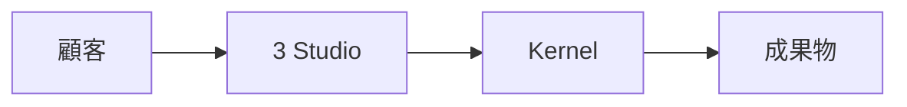
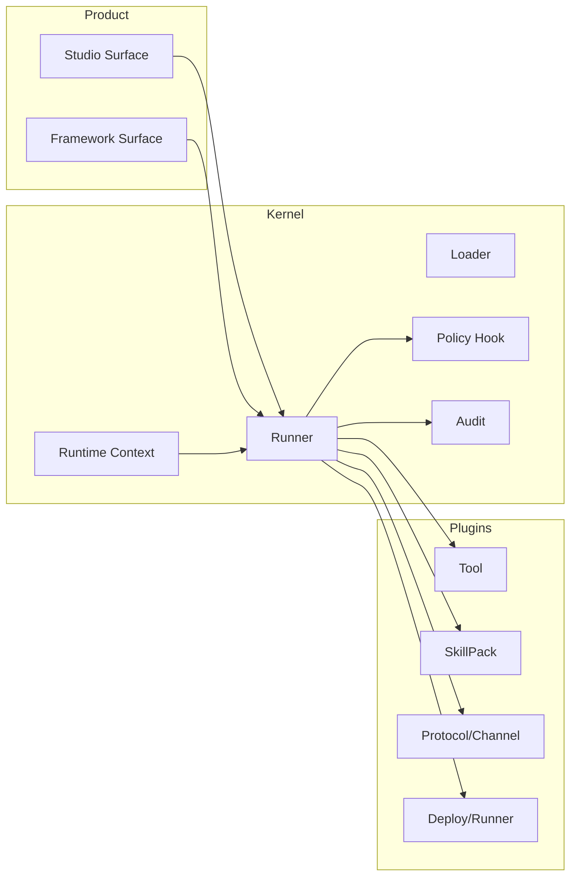

# アーキテクチャ概要

## 1. 全体方針

- 対外提供は 3 Studio を主線にする。
- Kernel は安定境界のみを保持する。
- 機能拡張は Plugin First で行う。

## 2. 外部向けビュー（成果導線）

## 3. 内部向けビュー（境界/ガバナンス）

## 4. 正規 API 面

- Studio: `/api/studios/*`
- Framework: `/api/studios/framework/*`

旧 `/api/agents` などの経路は提供しない。
