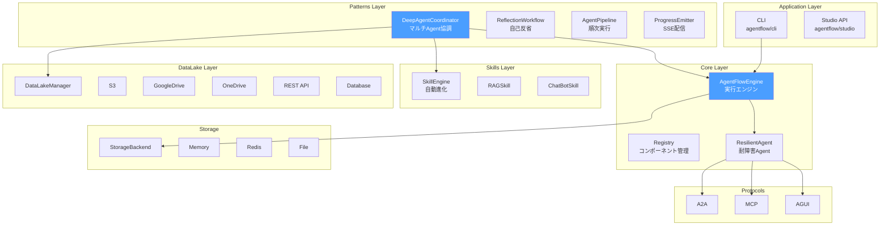

# DeepAgentCoordinator 技術実装ガイド

> バージョン: 2.0.0
> 更新日: 2026-01-13
> ステータス: **実装完了**

---

## 0. システム全体アーキテクチャ



---

## 1. アーキテクチャ概要

### 1.1 設計思想

DeepAgentCoordinator は **LangChain DeepAgents** の思想を取り入れた統一協調パターンです。

```
┌─────────────────────────────────────────────────────────────────────────────┐
│                          DeepAgentCoordinator                               │
│  ┌───────────────────────────────────────────────────────────────────────┐  │
│  │ 認知分析 → タスク分解 → Agent選択 → 並行実行 → 品質評審 → 自己進化  │  │
│  └───────────────────────────────────────────────────────────────────────┘  │
└─────────────────────────────────────────────────────────────────────────────┘
           │                         │                         │
           ▼                         ▼                         ▼
┌─────────────────────┐  ┌─────────────────────┐  ┌─────────────────────┐
│   Storage Layer     │  │   Context Layer     │  │   Agent Layer       │
├─────────────────────┤  ├─────────────────────┤  ├─────────────────────┤
│ RuntimeStore        │  │ ContextCompressor   │  │ AgentPool           │
│ ├─MemoryRuntime     │  │ ConversationManager │  │ ├─6 PreDefined      │
│ └─VirtualFilesystem │  │ └─AutoSummarize     │  │ ├─DynamicAgent      │
├─────────────────────┤  ├─────────────────────┤  │ └─Tools/Skills/MCP  │
│ EvolutionStore      │  │ ProgressManager     │  └─────────────────────┘
│ └─MemoryEvolution   │  │ └─AgentMessage      │
└─────────────────────┘  └─────────────────────┘
```

### 1.2 コアコンポーネント

| コンポーネント | 責務 | ファイル |
|----------------|------|----------|
| `DeepAgentCoordinator` | メイン協調器 | `patterns/deep_agent.py` |
| `AgentPool` | Agent管理 + Tools/Skills/MCP | 同上 |
| `ProgressManager` | 進捗管理、Agent通信 | 同上 |
| `ContextCompressor` | コンテキスト圧縮 | 同上 |
| `ConversationManager` | 対話管理・自動要約 | 同上 |
| `Evolver` | 自己進化システム | 同上 |
| `RuntimeStore` | 一時データ + VFS | 同上 |
| `EvolutionStore` | 進化データ永続化 | 同上 |

---

## 2. インストール・設定

### 2.1 基本インポート

```python
from agentflow.patterns.deep_agent import (
    # メインクラス
    DeepAgentCoordinator,
    
    # データモデル
    TodoItem,
    TaskStatus,
    AgentType,
    AgentMessage,
    MessageType,
    CognitiveAnalysis,
    QualityReview,
    
    # ストレージ
    RuntimeStore,
    EvolutionStore,
    MemoryRuntimeStore,
    MemoryEvolutionStore,
    
    # コンテキスト管理
    ContextCompressor,
    ConversationManager,
    
    # Agent管理
    AgentPool,
    DynamicAgent,
    
    # 進化
    Evolver,
    EvolutionRecord,
)
```

### 2.2 基本使用例

```python
import asyncio
from agentflow.patterns.deep_agent import DeepAgentCoordinator

async def main():
    # 最もシンプルな使用法（LLMなし）
    coordinator = DeepAgentCoordinator(
        max_iterations=10,
        quality_threshold=70.0,
    )
    
    result = await coordinator.execute("市場分析を行い、投資提案を作成")
    print(result)

asyncio.run(main())
```

### 2.3 LLMクライアント付き

```python
from agentflow.providers import get_llm

async def main():
    llm = get_llm()  # 環境変数から自動検出
    
    coordinator = DeepAgentCoordinator(
        llm_client=llm,
        max_iterations=10,
        quality_threshold=75.0,
        enable_evolution=True,  # 自己進化を有効化
    )
    
    result = await coordinator.execute("競合分析レポートを作成")
    print(result)
```

---

## 3. ストレージ層

### 3.1 三層設計

| 層 | 名称 | ライフサイクル | 用途 |
|----|------|----------------|------|
| **L1** | RuntimeStore | 一時 | 実行中データ、VFS |
| **L2** | App Session | 業務永続 | App固有データ |
| **L3** | EvolutionStore | 永久 | 成功パターン、学習 |

### 3.2 RuntimeStore 使用例

```python
from agentflow.patterns.deep_agent import MemoryRuntimeStore

store = MemoryRuntimeStore()

# コンテキスト保存
await store.save_context("session:123", {"user": "alice"})

# チェックポイント保存
await store.save_checkpoint("cp-001", {"phase": "execute", "progress": 50})

# Virtual Filesystem
await store.write_artifact("/reports/analysis.md", "# 分析レポート\n...")
content = await store.read_artifact("/reports/analysis.md")
files = await store.list_artifacts("/reports")
```

### 3.3 統一StorageBackend

```python
from agentflow.storage import get_backend, MemoryStorageBackend

# 環境変数から自動選択
backend = get_backend()

# 明示的に指定
backend = get_backend("memory://", namespace="myapp")

# Key-Value 操作
await backend.set("key", {"data": "value"}, ttl=3600)
data = await backend.get("key")

# Virtual Filesystem
await backend.write_file("/data.json", '{"key": "value"}')
```

---

## 4. Checkpoint/Recovery

### 4.1 チェックポイント保存

```python
coordinator = DeepAgentCoordinator(llm_client=llm)

# 実行中にチェックポイントを保存
checkpoint_id = await coordinator.save_checkpoint("execute", {"retry_count": 1})

# チェックポイント一覧
checkpoints = await coordinator.list_checkpoints()
```

### 4.2 チェックポイントから再開

```python
# 障害復旧シナリオ
new_coordinator = DeepAgentCoordinator(
    llm_client=llm,
    runtime_store=shared_store,  # 同じストアを共有
)

result = await new_coordinator.resume_from_checkpoint(
    checkpoint_id="cp-abc123",
    task="元のタスク",
)
```

---

## 5. コンテキスト管理

### 5.1 ContextCompressor

```python
from agentflow.patterns.deep_agent import ContextCompressor, CompactionStrategy

compressor = ContextCompressor(llm_client=llm)

# メッセージを圧縮
compressed, result = await compressor.compact(
    messages,
    max_tokens=4000,
    strategy=CompactionStrategy.HYBRID,
)

# メモリ統計
stats = compressor.get_memory_stats()
```

### 5.2 ConversationManager（自動要約）

```python
from agentflow.patterns.deep_agent import ConversationManager

manager = ConversationManager(
    llm_client=llm,
    max_tokens=4000,
    warning_threshold=0.8,  # 80%で警告
    recent_keep_count=5,    # 直近5件は完全保持
)

# メッセージ追加
manager.add_message(message)

# 要約が必要か確認
if manager.needs_summarization():
    result = await manager.auto_summarize()
    print(f"圧縮率: {result['compression_ratio']}")

# LLMに渡すコンテキスト取得
context = manager.get_context()
```

---

## 6. カスタムAgent追加

### 6.1 AgentPool概要

AgentPoolは6種類の汎用Agentを提供し、カスタムAgentの追加も可能です。

| Agent種別 | 役割 | デフォルト |
|-----------|------|------------|
| `RESEARCH` | 調査・検索 | ✓ |
| `ANALYSIS` | 分析・推論 | ✓ |
| `PLANNING` | 計画・設計 | ✓ |
| `EXECUTION` | 実行・操作 | ✓ |
| `REVIEW` | 審査・検証 | ✓ |
| `REPORT` | 報告・総括 | ✓ |
| カスタム | 業務固有 | 追加可能 |

### 6.2 カスタムAgent作成

```python
from agentflow.core.agent_block import AgentBlock
from typing import Any

class FinanceAnalystAgent(AgentBlock):
    """財務分析専門Agent."""

    def __init__(self, llm_client: Any = None, **kwargs: Any) -> None:
        super().__init__(**kwargs)
        self._llm = llm_client

    async def run(self, input_data: dict[str, Any]) -> dict[str, Any]:
        """財務分析を実行."""
        task = input_data.get("task", "")

        # LLMを使用した分析
        if self._llm:
            messages = [
                {"role": "system", "content": "あなたは財務分析の専門家です。"},
                {"role": "user", "content": task},
            ]
            response = await self._llm.chat(messages)
            return {
                "agent": "finance_analyst",
                "output": response.content,
                "status": "success",
            }

        return {"agent": "finance_analyst", "error": "LLM not configured"}
```

### 6.3 AgentPoolへの登録

```python
from agentflow.patterns.deep_agent import DeepAgentCoordinator, AgentPool

# 方法1: 初期化時に登録
custom_agents = {
    "finance_analyst": FinanceAnalystAgent(llm_client=llm),
    "legal_reviewer": LegalReviewerAgent(llm_client=llm),
}

pool = AgentPool(
    llm_client=llm,
    predefined_agents=custom_agents,
)

coordinator = DeepAgentCoordinator(
    llm_client=llm,
    agent_pool=pool,
)

# 方法2: 実行時に追加
coordinator.agent_pool.register_agent("risk_assessor", RiskAssessorAgent(llm_client=llm))

# 登録済みAgent一覧
print(coordinator.agent_pool.list_agents())
# ['research', 'analysis', 'planning', 'execution', 'review', 'report',
#  'finance_analyst', 'legal_reviewer', 'risk_assessor']
```

### 6.4 Tools/Skills/MCPバインディング

```python
# Agent種別ごとのデフォルトツール設定
pool.set_default_binding(
    agent_type="finance_analyst",
    tools=["calculate", "format_currency"],
    skills=["rag", "bi_analytics"],
    mcp_tools=["mcp://filesystem/read_file"],
)

# ツール取得
tools = pool.get_tools_for_agent("finance_analyst")
skills = pool.get_skills_for_agent("finance_analyst")
```

### 6.5 DynamicAgent（簡易Agent）

```python
from agentflow.patterns.deep_agent import DynamicAgent

# 簡易的なAgent作成
agent = DynamicAgent(
    name="quick_summarizer",
    system_prompt="あなたは要約の専門家です。簡潔に要約してください。",
    llm_client=llm,
)

result = await agent.run({"task": "この文章を要約してください..."})
```

---

## 7. マルチテナント対応

### 7.1 TenantContext

```python
from agentflow.multi_tenant import TenantContext, TenantManager, ResourceLimits

# テナントコンテキスト作成
tenant = TenantContext(
    tenant_id="acme-corp",
    organization_name="Acme Corporation",
    resource_limits=ResourceLimits.enterprise(),
)

# ストレージキープレフィックス
print(tenant.storage_prefix)  # "tenant:acme-corp:"
print(tenant.prefixed_key("users"))  # "tenant:acme-corp:users"
```

### 7.2 TenantManager

```python
manager = TenantManager()

# テナント作成
await manager.create_tenant(
    tenant_id="acme-corp",
    organization_name="Acme Corporation",
)

# 現在のテナントを設定
manager.set_current("acme-corp")

# クエリにテナントフィルタを適用
filtered_query = manager.apply_filter({"status": "active"})
# {"status": "active", "tenant_id": "acme-corp"}
```

---

## 8. PolicyEngine（RBAC/ABAC/PBAC）

### 8.1 基本使用

```python
from agentflow.security.policy_engine import PolicyEngine, AuthContext, AuthMode

engine = PolicyEngine()

# RBAC による認可
result = await engine.authorize(
    AuthContext(
        subject={"role": "analyst"},
        action="read",
    ),
    mode=AuthMode.RBAC,
)

print(result.allowed)  # True/False
```

### 8.2 ABAC（属性ベース）

```python
result = await engine.authorize(
    AuthContext(
        subject={"role": "analyst", "department": "finance"},
        resource={"type": "report", "sensitivity": "high", "department": "finance"},
        action="read",
    ),
    mode=AuthMode.ABAC,
)
```

### 8.3 PBAC（ポリシーベース）

```python
from agentflow.security.policy_engine import Policy, AuthDecision

# ポリシー追加
engine.add_policy(Policy(
    policy_id="finance-reports",
    name="Finance Reports Access",
    subject_conditions={"department": "finance"},
    resource_conditions={"type": "report"},
    action_conditions=["read", "export"],
    effect=AuthDecision.ALLOW,
    priority=10,
))

result = await engine.authorize(context, mode=AuthMode.PBAC)
```

---

## 9. BI Analytics Skill

### 9.1 データ接続

```python
from agentflow.skills.builtin.bi_analytics import (
    DataConnector,
    MemoryConnector,
    BIAnalyzer,
    ChartGenerator,
    ChartType,
)

# メモリコネクタ（テスト用）
connector = MemoryConnector()
connector.add_sample_data()
await connector.connect()

# クエリ実行
data = await connector.query("SELECT * FROM sales")
```

### 9.2 分析

```python
analyzer = BIAnalyzer()

# 統計分析
result = await analyzer.analyze(data, "statistical", column="amount")

# トレンド分析
result = await analyzer.analyze(data, "trend", column="amount")

# 異常検出
result = await analyzer.analyze(data, "anomaly", column="amount")

# 相関分析
result = await analyzer.analyze(data, "correlation")

# 分布分析
result = await analyzer.analyze(data, "distribution", column="amount")

print(result.summary)
print(result.insights)
```

### 9.3 可視化

```python
generator = ChartGenerator()

# 棒グラフ
chart = await generator.generate(data, ChartType.BAR, x="category", y="amount")

# ECharts形式で出力
echarts_config = chart.to_echarts()

# Chart.js形式で出力
chartjs_config = chart.to_chartjs()
```

---

## 10. FAQ System Skill

```python
from agentflow.skills.builtin.faq_system import FAQManager

faq = FAQManager(llm_client=llm)

# FAQ追加
await faq.add_question(
    question="パスワードをリセットするには？",
    answer="設定画面から「パスワード変更」を選択してください。",
    category="アカウント",
    tags=["パスワード", "セキュリティ"],
)

# 検索
results = await faq.search("パスワード リセット")

# 回答生成（LLM使用）
answer = await faq.generate_answer("パスワードを忘れました")
```

---

## 11. テスト

### 11.1 テストファイル一覧

| ファイル | テスト数 | 内容 |
|----------|----------|------|
| `test_deep_agent.py` | 101 | DeepAgentCoordinator全般 |
| `test_storage_backend.py` | 23 | StorageBackend |
| `test_multi_tenant.py` | 21 | マルチテナント |
| `test_policy_engine.py` | 21 | PolicyEngine |
| `test_bi_analytics.py` | 22 | BI Analytics |

### 11.2 テスト実行

```bash
# 全テスト
python -m pytest tests/unit/test_deep_agent.py -v

# 特定クラス
python -m pytest tests/unit/test_deep_agent.py::TestCheckpointRecovery -v

# カバレッジ付き
python -m pytest tests/unit/ --cov=agentflow --cov-report=html
```

---

## 12. Patterns 統合ガイド

### 12.1 現行 Patterns

| Pattern | 用途 | 推奨代替 |
|---------|------|----------|
| `reflection.py` | 自己反省 | ✅ 継続使用 |
| `supervisor.py` | 監督制御 | → DeepAgentCoordinator |
| `hierarchical.py` | 階層実行 | → DeepAgentCoordinator |
| `multi_agent.py` | マルチAgent | → DeepAgentCoordinator |
| `planner.py` | 計画実行 | → DeepAgentCoordinator |
| `agent_pipeline.py` | パイプライン | ✅ 継続使用 |
| `coordinator.py` | 基底クラス | ✅ 継続使用 |

### 12.2 Pattern 選択ガイド

```
┌─────────────────────────────────────────────────────────────┐
│                    タスクの複雑度判定                        │
├─────────────────────────────────────────────────────────────┤
│                                                             │
│  シンプル（1-2ステップ）                                    │
│    → agent_pipeline.py                                      │
│                                                             │
│  中程度（3-5ステップ、明確な順序）                          │
│    → reflection.py（自己改善が必要な場合）                  │
│    → agent_pipeline.py（単純な順次実行）                    │
│                                                             │
│  複雑（多ステップ、依存関係、並行実行）                     │
│    → DeepAgentCoordinator                                   │
│                                                             │
└─────────────────────────────────────────────────────────────┘
```

---

## 13. App リファクタリング推奨

### 13.1 Decision Governance Engine

**現状**: 独自の `PipelineEngine` + 7つの Agent

**推奨**: `DeepAgentCoordinator` + `DeepAgentAdapter`

```python
# services/deep_agent_adapter.py（既存）
from agentflow.patterns.deep_agent import DeepAgentCoordinator

class DecisionEngine:
    def __init__(self):
        self._deep_coordinator = DeepAgentCoordinator(
            llm_client=llm,
            predefined_agents={
                "dao": DaoAgent(),
                "fa": FaAgent(),
                "shu": ShuAgent(),
                "qi": QiAgent(),
            },
            enable_evolution=True,
        )
```

**メリット**:
- 認知分析による意図理解
- 自動タスク分解
- 品質評審とリトライ
- 成功パターン学習

### 13.2 Code Migration Assistant

**現状**: 独自の `Orchestrator` + 5つの Agent

**推奨**: `DeepAgentCoordinator`

```python
coordinator = DeepAgentCoordinator(
    llm_client=llm,
    predefined_agents={
        "coordinator": CoordinatorAgent(),
        "transform": TransformAgent(),
        "checker": CheckerAgent(),
        "fixer": FixerAgent(),
        "testgen": TestGenAgent(),
    },
    max_iterations=15,  # 移行は複雑なので多めに
    quality_threshold=85.0,  # 品質重視
)

result = await coordinator.execute("COBOLからJavaへの移行")
```

**メリット**:
- チェックポイントによる長時間タスク対応
- Virtual Filesystem でアーティファクト管理
- 自動リトライと品質保証

### 13.3 Market Trend Monitor

**現状**: 実装途中

**推奨**: `DeepAgentCoordinator` + `BIAnalyzer`

```python
from agentflow.patterns.deep_agent import DeepAgentCoordinator
from agentflow.skills.builtin.bi_analytics import BIAnalyzer

coordinator = DeepAgentCoordinator(
    llm_client=llm,
    predefined_agents={
        "data_collector": DataCollectorAgent(),
        "analyzer": AnalyzerAgent(bi_analyzer=BIAnalyzer()),
        "reporter": ReporterAgent(),
    },
)

result = await coordinator.execute("2024年Q1の市場トレンドを分析")
```

---

## 14. Patterns 整理結果

### 14.1 削除済みPatterns

以下のPatternsは `DeepAgentCoordinator` に機能統合されたため、削除されました：

| Pattern | 削除理由 | 移行先 |
|---------|----------|--------|
| `supervisor.py` | SupervisorCoordinator → DeepAgentCoordinator | `AgentPool` で Agent 管理 |
| `hierarchical.py` | HierarchicalCoordinator → DeepAgentCoordinator | 認知分析 + タスク分解 |
| `multi_agent.py` | MultiAgentWorkflow → DeepAgentCoordinator | 並行実行 + 品質評審 |
| `planner.py` | PlannerAgent → DeepAgentCoordinator | TodoList + 自動計画 |

**移行方法**: 既存の `SupervisorCoordinator` などを使用している場合は、`DeepAgentCoordinator` に移行してください。

### 14.2 現在の Patterns 構成

```
agentflow/patterns/
├── __init__.py           # 統一エクスポート
├── coordinator.py        # 基底クラス（CoordinatorBase）
├── deep_agent.py         # 主要Pattern（DeepAgentCoordinator）
├── reflection.py         # 自己反省（ReflectionWorkflow）
├── agent_pipeline.py     # シンプルパイプライン（AgentPipeline）
├── progress_emitter.py   # SSE配信（ProgressEmitter）
└── shared_context.py     # 共有コンテキスト（SharedContext）
```

### 14.3 エクスポート一覧

```python
from agentflow.patterns import (
    # 主要クラス
    DeepAgentCoordinator,    # マルチAgent協調
    ReflectionWorkflow,       # 自己反省ワークフロー
    AgentPipeline,            # 順次実行パイプライン

    # 基盤クラス
    CoordinatorBase,          # 協調器基底クラス
    SharedContext,            # 共有コンテキスト
    ProgressEmitter,          # SSE進捗配信

    # Agent管理
    AgentPool,                # Agentプール
    DynamicAgent,             # 動的Agent
)
```

---

## 15. プロジェクト構成

### 15.1 モジュール構成

```
agentflow/
├── core/           # コアエンジン（AgentFlowEngine, Registry, etc.）
├── patterns/       # 協調パターン（DeepAgentCoordinator, etc.）
├── datalake/       # データ接続（DataLakeManager, Connectors）
├── skills/         # Skill システム（自動進化、RAG、ChatBot）
├── providers/      # LLM/Tool プロバイダー
├── storage/        # 統一ストレージ
├── protocols/      # A2A, MCP, AGUI プロトコル
└── cli/            # コマンドラインツール
```

### 15.2 テスト構成

```
tests/
├── unit/           # 単体テスト（52ファイル）
├── integration/    # 統合テスト（3ファイル）
└── fixtures/       # テストフィクスチャ
```

---

## 16. 変更履歴

| 日付 | バージョン | 変更内容 |
|------|-----------|---------|
| 2026-01-13 | 2.0.0 | Patterns整理完了、廃止Patterns削除 |
| 2026-01-13 | 1.5.0 | DataLake統合、Connectors追加 |
| 2026-01-12 | 1.0.0 | 初版リリース |

---

*ドキュメント更新日: 2026-01-13*
*バージョン: 2.0.0*
