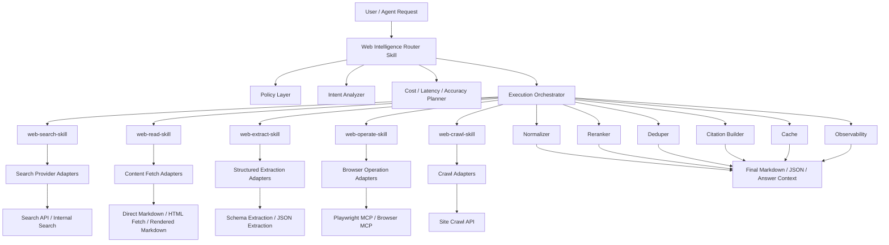
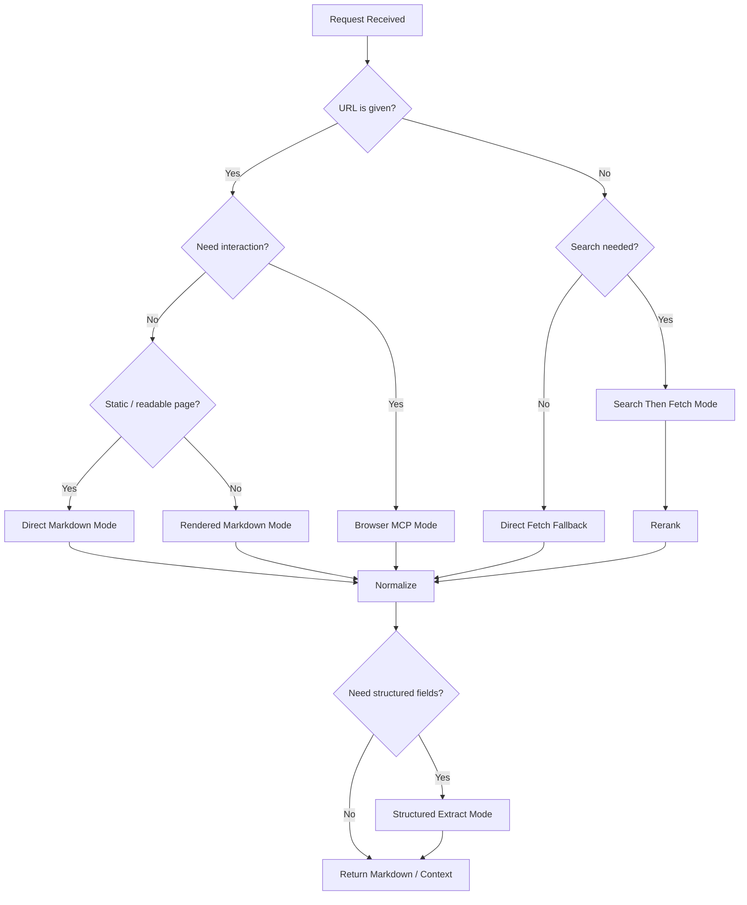
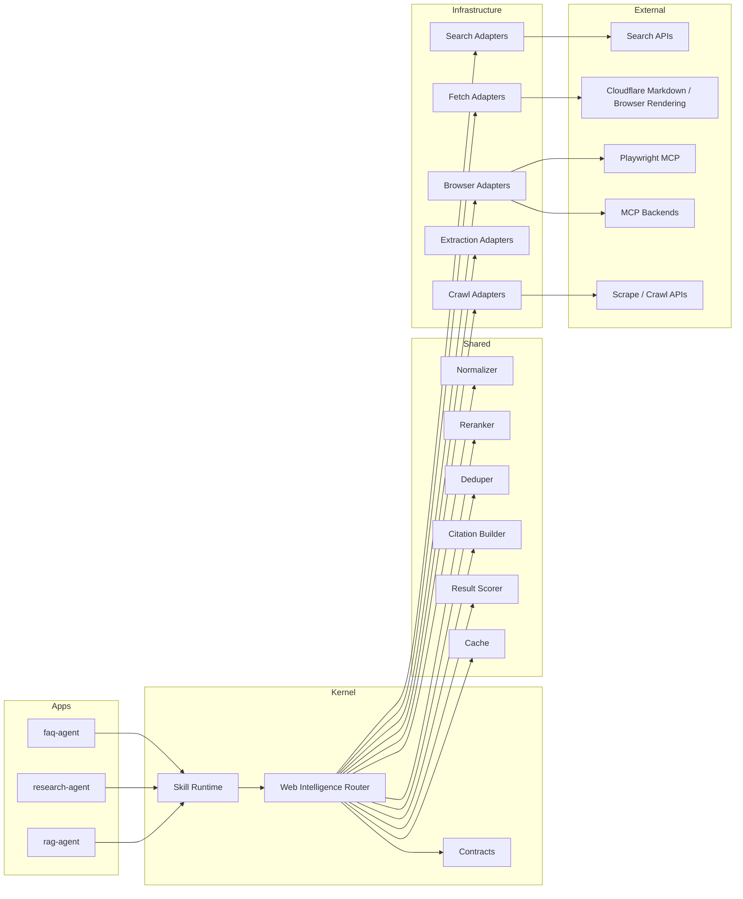

1. **先に重構版の設計を完成**
   - 重構版アーキテクチャ図（Mermaid）
   - skill 分割案 + ディレクトリ構成
   - 統一 Router のインターフェース設計
   - ルーティング規則
   - provider 適配層サンプル

2. **その後に、上記を前提にした AI 指示書（日本語）**
   - 「Web 検索・取得・整理・操作」の再設計用
   - patch ではなく再構築前提
   - skill 主導、script/API/MCP を基盤化

外部前提としては、現時点では **Markdown を AI 向けの既定読取形式に置く** のがかなり有力です。
Cloudflare の Markdown for Agents は `Accept: text/markdown` による Markdown 返却をサポートしており、
AI 処理に適して token waste を減らす方針を明示しています。
加えて Browser Rendering API では `/markdown` `/links` `/json` `/crawl` などが用意されていて、
静的取得で足りない場合に段階的に上げられます。ブラウザ操作側は Playwright MCP が
accessibility tree ベースで軽量・決定的な automation を提供し、
MCP 自体は LLM と外部ツール・データ源の標準接続として位置づけられています。([Cloudflare Docs][1])

---

# 1. 重構版アーキテクチャ図（Mermaid）

## 1-1. 全体構成図



---

## 1-2. 取得モード切替図



---

## 1-3. 層構造図（agentflow への載せ方）



---

# 2. skill 分割方案 + ディレクトリ構造

## 2-1. 分割方針

単一の「browser skill」や単一の「web fetcher」に寄せず、責務で分けます。

### 必須 skill

- `web-intelligence-router`
- `web-search`
- `web-read`
- `web-extract`
- `web-operate`
- `web-crawl`

### 共通基盤

- `shared/web/`
- `infrastructure/providers/web/`

---

## 2-2. 推奨ディレクトリ構成

```text
agentflow/
├─ apps/
│  ├─ faq_agent/
│  ├─ research_agent/
│  └─ rag_agent/
│
├─ kernel/
│  ├─ skills/
│  │  ├─ web_intelligence_router/
│  │  │  ├─ SKILL.md
│  │  │  ├─ router.py
│  │  │  ├─ policy.py
│  │  │  ├─ planner.py
│  │  │  └─ contracts.py
│  │  ├─ web_search/
│  │  │  ├─ SKILL.md
│  │  │  └─ skill.py
│  │  ├─ web_read/
│  │  │  ├─ SKILL.md
│  │  │  └─ skill.py
│  │  ├─ web_extract/
│  │  │  ├─ SKILL.md
│  │  │  └─ skill.py
│  │  ├─ web_operate/
│  │  │  ├─ SKILL.md
│  │  │  └─ skill.py
│  │  └─ web_crawl/
│  │     ├─ SKILL.md
│  │     └─ skill.py
│  │
│  └─ contracts/
│     ├─ web_intelligence.py
│     ├─ search.py
│     ├─ fetch.py
│     ├─ extraction.py
│     └─ browser.py
│
├─ shared/
│  └─ web/
│     ├─ normalizer.py
│     ├─ markdown_pipeline.py
│     ├─ reranker.py
│     ├─ deduper.py
│     ├─ citation_builder.py
│     ├─ quality_score.py
│     ├─ cache.py
│     └─ domain_policy.py
│
├─ infrastructure/
│  └─ providers/
│     └─ web/
│        ├─ search/
│        │  ├─ base.py
│        │  ├─ internal_search.py
│        │  └─ external_search_api.py
│        ├─ fetch/
│        │  ├─ base.py
│        │  ├─ direct_markdown_fetcher.py
│        │  ├─ html_readability_fetcher.py
│        │  ├─ rendered_markdown_fetcher.py
│        │  └─ fallback_chain.py
│        ├─ extract/
│        │  ├─ base.py
│        │  ├─ schema_extractor.py
│        │  └─ browser_json_extractor.py
│        ├─ browser/
│        │  ├─ base.py
│        │  ├─ playwright_mcp_operator.py
│        │  └─ traditional_mcp_operator.py
│        └─ crawl/
│           ├─ base.py
│           ├─ site_crawl_provider.py
│           └─ recursive_fetch_provider.py
│
└─ tests/
   ├─ unit/
   ├─ integration/
   └─ e2e/
```

---

## 2-3. skill ごとの責務

### `web-intelligence-router`

- 要求解釈
- ルーティング
- provider 選定
- fallback 制御
- 成果物統合

### `web-search`

- query から候補 URL 群を収集
- source ranking 前の粗召回

### `web-read`

- URL から本文取得
- Markdown 正規化
- ページ読取専用

### `web-extract`

- 構造化抽出
- schema 指定抽出
- price / date / title / table / metadata など

### `web-operate`

- ログイン
- click / type / expand
- download
- SPA / JS 強依存ページの操作

### `web-crawl`

- サイト内巡回
- 複数ページ収集
- RAG 取込前処理

---

# 3. 統一 Router のインターフェース設計

## 3-1. 入出力契約

```python
from pydantic import BaseModel, Field
from typing import Any, Literal

class WebIntent(BaseModel):
    intent: Literal[
        "search",
        "read_url",
        "extract",
        "compare",
        "monitor",
        "operate",
        "crawl"
    ]
    query: str | None = None
    url: str | None = None
    urls: list[str] | None = None
    task: str | None = None

class QualityConstraints(BaseModel):
    accuracy: Literal["high", "normal", "low"] = "normal"
    latency: Literal["low", "normal", "relaxed"] = "normal"
    budget: Literal["low", "normal", "high"] = "normal"
    freshness: Literal["realtime", "recent", "stable"] = "recent"
    auth_required: bool = False
    interaction_required: bool = False
    structured_output: bool = False

class ExtractionSchema(BaseModel):
    name: str
    json_schema: dict[str, Any] | None = None

class WebRouterInput(BaseModel):
    request_id: str
    intent: WebIntent
    constraints: QualityConstraints = Field(default_factory=QualityConstraints)
    extraction_schema: ExtractionSchema | None = None
    allowed_domains: list[str] | None = None
    blocked_domains: list[str] | None = None

class EvidenceItem(BaseModel):
    url: str
    title: str | None = None
    snippet: str | None = None
    markdown: str | None = None
    metadata: dict[str, Any] = Field(default_factory=dict)
    confidence: float = 0.0

class WebRouterOutput(BaseModel):
    mode_used: Literal[
        "direct_markdown",
        "html_readability",
        "rendered_markdown",
        "search_then_fetch",
        "browser_mcp",
        "crawl_mode"
    ]
    answer_markdown: str | None = None
    extracted_data: dict[str, Any] | list[dict[str, Any]] | None = None
    evidence: list[EvidenceItem] = Field(default_factory=list)
    citations: list[str] = Field(default_factory=list)
    latency_ms: int | None = None
    estimated_cost_level: Literal["low", "medium", "high"] = "low"
    confidence: float = 0.0
    fallback_used: bool = False
```

---

## 3-2. Router インターフェース

```python
from abc import ABC, abstractmethod

class WebRetrievalRouter(ABC):
    @abstractmethod
    async def execute(self, req: WebRouterInput) -> WebRouterOutput:
        raise NotImplementedError
```

---

# 4. ルーティング規則

## 4-1. 設計原則

### 原則

1. **まず安い方法**
2. **必要なら段階昇格**
3. **interaction は最後**
4. **構造化抽出は読取後に分離実行**
5. **検索と読取を混ぜない**
6. **rerank と quality score を必須化**

Cloudflare 側は Markdown を AI 処理に向く形式として位置づけ、Browser Rendering API では Markdown 抽出・リンク抽出・JSON 抽出・crawl を用途別に提供しています。よって、既定経路を「Markdown 優先」にするのは合理的です。([Cloudflare Docs][1])

---

## 4-2. 推奨ルール

### ルール A: URL 指定 + 読むだけ

- `url` あり
- `interaction_required = false`
- `structured_output = false`

→ `direct_markdown` を最優先
→ 失敗時 `html_readability`
→ さらに失敗時 `rendered_markdown`

### ルール B: URL 指定 + 動的ページ

- `url` あり
- JS 依存高
- 初回取得失敗

→ `rendered_markdown`

### ルール C: URL 指定 + ログイン / クリック / 展開必要

- `auth_required = true` または `interaction_required = true`

→ `browser_mcp`

Playwright MCP は accessibility tree ベースで、視覚モデル不要・軽量・決定的な browser automation を特徴としているため、操作用途に向いています。([GitHub][2])

### ルール D: query のみ

- `query` のみ
- URL 未知

→ `search_then_fetch`

1. search
2. top-k fetch
3. normalize
4. rerank
5. answer / extract

### ルール E: schema 抽出

- `structured_output = true`
- `extraction_schema != None`

→ 読取結果に対して `web-extract`
→ 必要なら `/json` 系の structured extraction を使う

### ルール F: サイト全体取得

- `intent = crawl`

→ `web-crawl`

---

## 4-3. ルーティング擬似コード

```python
async def route(req: WebRouterInput) -> WebRouterOutput:
    if req.constraints.auth_required or req.constraints.interaction_required:
        return await run_browser_mode(req)

    if req.intent.intent == "crawl":
        return await run_crawl_mode(req)

    if req.intent.url:
        result = await try_direct_markdown(req)
        if result:
            return maybe_extract(req, result)

        result = await try_html_readability(req)
        if result:
            return maybe_extract(req, result)

        result = await try_rendered_markdown(req)
        if result:
            return maybe_extract(req, result)

        return await run_browser_mode(req)

    if req.intent.query:
        candidates = await run_search(req)
        fetched = await fetch_top_candidates(req, candidates)
        ranked = await rerank_results(req, fetched)
        merged = await build_response(req, ranked)
        return maybe_extract(req, merged)

    return WebRouterOutput(
        mode_used="direct_markdown",
        answer_markdown="No retrievable content.",
        confidence=0.0,
        fallback_used=False
    )
```

---

# 5. provider 適配層サンプル

## 5-1. Fetch Provider Base

```python
from abc import ABC, abstractmethod

class FetchResult:
    def __init__(self, ok: bool, markdown: str | None = None, metadata: dict | None = None):
        self.ok = ok
        self.markdown = markdown
        self.metadata = metadata or {}

class ContentFetchProvider(ABC):
    name: str

    @abstractmethod
    async def fetch(self, url: str) -> FetchResult:
        raise NotImplementedError
```

---

## 5-2. Direct Markdown Fetcher

```python
import httpx

class DirectMarkdownFetcher(ContentFetchProvider):
    name = "direct_markdown"

    async def fetch(self, url: str) -> FetchResult:
        headers = {
            "Accept": "text/markdown, text/html;q=0.9, */*;q=0.1"
        }
        async with httpx.AsyncClient(timeout=20) as client:
            resp = await client.get(url, headers=headers, follow_redirects=True)

        content_type = resp.headers.get("content-type", "")
        if resp.status_code == 200 and "text/markdown" in content_type:
            return FetchResult(
                ok=True,
                markdown=resp.text,
                metadata={
                    "content_type": content_type,
                    "markdown_tokens": resp.headers.get("x-markdown-tokens")
                }
            )

        return FetchResult(ok=False, metadata={"status_code": resp.status_code})
```

Cloudflare は `Accept: text/markdown` による Markdown 返却と `x-markdown-tokens` を案内しています。([Cloudflare Docs][1])

---

## 5-3. Rendered Markdown Fetcher

```python
import httpx

class RenderedMarkdownFetcher(ContentFetchProvider):
    name = "rendered_markdown"

    def __init__(self, account_id: str, api_token: str):
        self.account_id = account_id
        self.api_token = api_token

    async def fetch(self, url: str) -> FetchResult:
        endpoint = f"https://api.cloudflare.com/client/v4/accounts/{self.account_id}/browser-rendering/markdown"
        headers = {
            "Authorization": f"Bearer {self.api_token}",
            "Content-Type": "application/json"
        }
        payload = {"url": url}

        async with httpx.AsyncClient(timeout=40) as client:
            resp = await client.post(endpoint, headers=headers, json=payload)

        if resp.status_code == 200:
            data = resp.json()
            return FetchResult(
                ok=True,
                markdown=data.get("result", {}).get("markdown"),
                metadata={"provider": "cloudflare_browser_rendering"}
            )
        return FetchResult(ok=False, metadata={"status_code": resp.status_code})
```

Browser Rendering REST API の `/markdown` は URL または HTML を Markdown に変換する公式手段です。([Cloudflare Docs][3])

---

## 5-4. Browser Operator Base

```python
class BrowserOperationRequest(BaseModel):
    url: str
    steps: list[dict]
    return_markdown: bool = True

class BrowserOperationResult(BaseModel):
    ok: bool
    markdown: str | None = None
    artifacts: dict[str, Any] = {}
    metadata: dict[str, Any] = {}
```

```python
class BrowserOperator(ABC):
    @abstractmethod
    async def run(self, req: BrowserOperationRequest) -> BrowserOperationResult:
        raise NotImplementedError
```

---

## 5-5. Playwright MCP Operator Sample

```python
class PlaywrightMCPOperator(BrowserOperator):
    async def run(self, req: BrowserOperationRequest) -> BrowserOperationResult:
        # 実際は MCP client を通じて
        # navigate / click / fill / extract を順次実行
        # ここでは構造のみ示す
        return BrowserOperationResult(
            ok=True,
            markdown="# extracted content after browser interaction",
            metadata={"provider": "playwright_mcp"}
        )
```

Playwright MCP は browser automation を accessibility tree ベースで提供し、視覚依存を避ける設計です。操作主体のページで向いています。([GitHub][2])

---

# 6. 実装方針の要点

## 6-1. やってはいけないこと

- 各 Agent 内に `_should_use_browser()` を散在させる
- search / read / operate を 1 skill に押し込む
- 旧 browser 実装に追い patch を当て続ける
- fetch と extract と summarization を強結合する

## 6-2. やるべきこと

- browser 判断を Router に収束
- 既存「网页整理」機能を `web-read` の共通パイプラインへ昇格
- skill は orchestration、provider は execution に分離
- 結果ごとに `confidence / cost / latency / fallback_used` を必ず残す
- rerank を標準化

---

# 7. AI 指示書（日本語）

**agentflow における Web 検索・取得・閲覧・操作機能の全面再構築指示書**

### 目的

既存の Web 関連機能について、局所的な patch や一時的な追加実装ではなく、**skill 主導・Router 主導・provider 分離** の方針で全面再構築する。
対象は以下を含む。

- Web 検索
- URL 読取
- Web ページ整理（Markdown 化）
- 構造化抽出
- 動的ページ対応
- ブラウザ操作
- サイト巡回
- 取得結果の正規化・評価・引用生成

本再構築は、**高精度・低遅延・低コスト** の両立を目的とし、利用シーンに応じて取得方式を自動切替できる構成を目標とする。

---

### 基本方針

1. **patch 禁止**
   既存の個別 Agent 内ロジックへ条件追加して延命しないこと。既存機能は参照してよいが、設計の中心は新しい Router に置くこと。

2. **skill を主入口とすること**
   Agent は個別に browser 判定・検索判定を持たず、必ず統一 skill を経由すること。

3. **Router を中心に据えること**
   すべての Web 関連要求は `web-intelligence-router` に集約すること。

4. **取得方式は段階的に選択すること**
   原則として最も安価で高速な方式から試行し、必要時のみ上位手段へ昇格すること。

5. **読取と操作を分離すること**
   「読む」ことと「操作する」ことを同一 skill に混在させないこと。

6. **Markdown を標準読取形式とすること**
   AI 処理用の正文形式は Markdown を標準とし、HTML は中間形式として扱うこと。

7. **構造化抽出は別 skill とすること**
   price, date, title, table, FAQ, schema 出力等は `web-extract` に責務分離すること。

8. **MCP は用途別に使い分けること**
   - 操作系: Browser MCP / Playwright MCP
   - バックエンド接続: Traditional MCP
   - 読取系: Markdown / fetch 系 provider

---

### 新アーキテクチャ

必ず以下の skill に分割すること。

- `web-intelligence-router`
- `web-search`
- `web-read`
- `web-extract`
- `web-operate`
- `web-crawl`

また、共通処理は skill 内に重複実装せず、以下へ集約すること。

- `shared/web/normalizer.py`
- `shared/web/markdown_pipeline.py`
- `shared/web/reranker.py`
- `shared/web/deduper.py`
- `shared/web/citation_builder.py`
- `shared/web/quality_score.py`
- `shared/web/cache.py`

provider 依存実装は以下に配置すること。

- `infrastructure/providers/web/search/`
- `infrastructure/providers/web/fetch/`
- `infrastructure/providers/web/extract/`
- `infrastructure/providers/web/browser/`
- `infrastructure/providers/web/crawl/`

---

### ルーティング規則

Router は次の優先順位で取得方式を決定すること。

#### 1. URL 指定・読取のみ

- interaction 不要
- auth 不要
- schema 抽出不要

処理順:

1. direct markdown
2. html readability
3. rendered markdown
4. browser fallback

#### 2. URL 指定・動的ページ

- JS 依存高
- 通常 fetch 失敗
- 画面描画後本文が出る

処理:

- rendered markdown

#### 3. URL 指定・操作必要

- login 必須
- click / expand / pagination 必須
- SPA で DOM 操作が必要

処理:

- browser MCP

#### 4. query のみ

- URL 不明
- 複数候補から選別必要

処理:

1. search
2. top-k fetch
3. normalize
4. rerank
5. answer / extract

#### 5. 構造化抽出

- JSON schema 指定あり
- フィールド抽出目的

処理:

- 読取完了後に `web-extract`

#### 6. サイト全体取得

- 複数ページ取込
- ナレッジ化前処理
- ドメイン内巡回必要

処理:

- `web-crawl`

---

### 実装要求

以下を必須要件とすること。

#### 必須要件

- すべての mode で `confidence` を返すこと
- `latency_ms` を計測すること
- `estimated_cost_level` を記録すること
- fallback 発動有無を記録すること
- citation 生成処理を統一すること
- 同一ページの重複取得を避ける cache を持つこと
- 許可ドメイン / 禁止ドメイン制御を可能にすること

#### 品質要件

- Markdown 正規化を必須化すること
- 不要な nav/footer/script/style を除去すること
- rerank を導入すること
- 同一内容の重複ページは dedupe すること
- 取得失敗時は mode を昇格して再試行すること

#### 禁止事項

- Agent 側へ browser 条件分岐を残さないこと
- skill 間で同じ fetch ロジックを複製しないこと
- HTML 生文をそのまま最終入力に渡さないこと
- 例外時に browser を常時最終手段へ固定しないこと

---

### 実装優先順位

以下の順で構築すること。

#### Phase 1

- contracts 定義
- Router 入出力定義
- 基本 routing 実装

#### Phase 2

- web-read 再構築
- 既存网页整理機能の shared 化
- Markdown pipeline 共通化

#### Phase 3

- web-search / web-extract 分離
- rerank / dedupe / citation builder 実装

#### Phase 4

- web-operate 実装
- Playwright MCP 接続
- auth / interaction フロー対応

#### Phase 5

- web-crawl 実装
- observability / metrics / fallback 分析
- domain success profile 学習

---

### 成果物要求

最終成果物として以下を必ず作成すること。

1. Router のインターフェース定義
2. skill 分割後のディレクトリ構成
3. provider adapter ベースクラス群
4. fallback chain 実装
5. unit test
6. integration test
7. e2e test
8. Mermaid アーキテクチャ図
9. 各 skill の SKILL.md #`web-intelligence-router` / `web-read` / `web-operate`
10. 導入手順書

---

### 最終ゴール

最終的に、agentflow は以下を満たすこと。

- 同一入口から Web 検索・読取・抽出・操作・巡回を呼び分けられること
- 場面に応じて自動的に最適な取得方式へ切替できること
- 読取は低コスト、操作は必要時のみ高機能に昇格すること
- 既存の网页整理機能を部分機能ではなく基盤能力として再利用できること
- 今後 provider 追加時も Router と adapter の差し替えだけで拡張できること

---

# 8. 仕上げの推奨方針

今回の設計で一番大事なのは、**「検索」「読取」「抽出」「操作」を分けること**です。
そのうえで、既定経路を **Markdown 優先** にしておくと、速度・コスト・AI 可読性のバランスが取りやすいです。Cloudflare 側も AI 向け Markdown 化を前提にした機能を出しており、Browser Rendering は `/markdown` `/links` `/json` `/crawl` を用途別に切り出しています。Playwright MCP は操作に寄せる、MCP は接続規約として使う、という整理がいちばんきれいです。([Cloudflare Docs][1])
