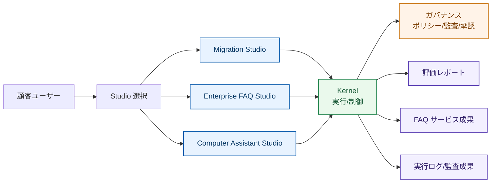

# 製品概要（3 Studio）

## 提供価値

- `Migration Studio`: 移行前評価、リスク可視化、提案作成
- `Enterprise FAQ Studio`: 引用付き回答、索引運用、運用レポート
- `Computer Assistant Studio`: 制御付き実行、監査ログ、記憶管理

## 外部向けアーキテクチャ（成果導線重視）

## 顧客への説明定型

1. 3 Studio から目的に合う製品線を選択
2. テンプレートを選び、データ/権限を設定
3. 実行
4. 成果物を確認
