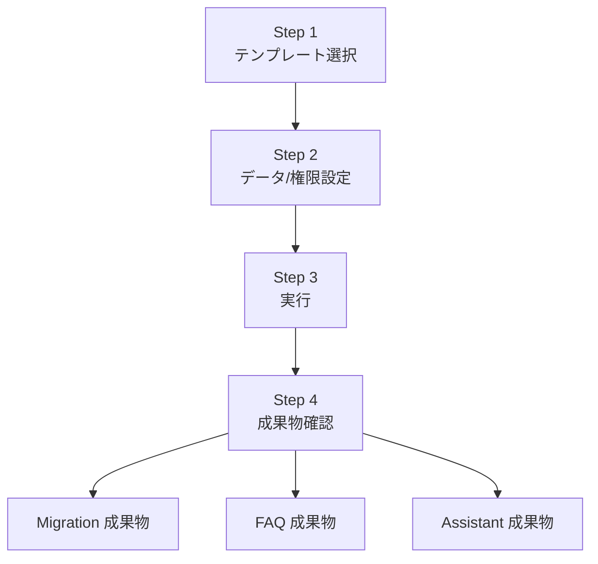

# Studio 利用フロー

## 標準 4 ステップ

1. テンプレート選択
2. データ/権限設定
3. 実行
4. 成果物確認

## Studio 別の主成果物

- Migration: リスク一覧、証跡、移行提案
- FAQ: 引用付き回答、索引状態、運用レポート
- Assistant: タスク結果、実行ログ、セキュリティ監査

## フロー図

```mermaid
flowchart TD
    A["Step 1\nテンプレート選択"] --> B["Step 2\nデータ/権限設定"]
    B --> C["Step 3\n実行"]
    C --> D["Step 4\n成果物確認"]

    D --> M["Migration 成果物"]
    D --> F["FAQ 成果物"]
    D --> S["Assistant 成果物"]
```
