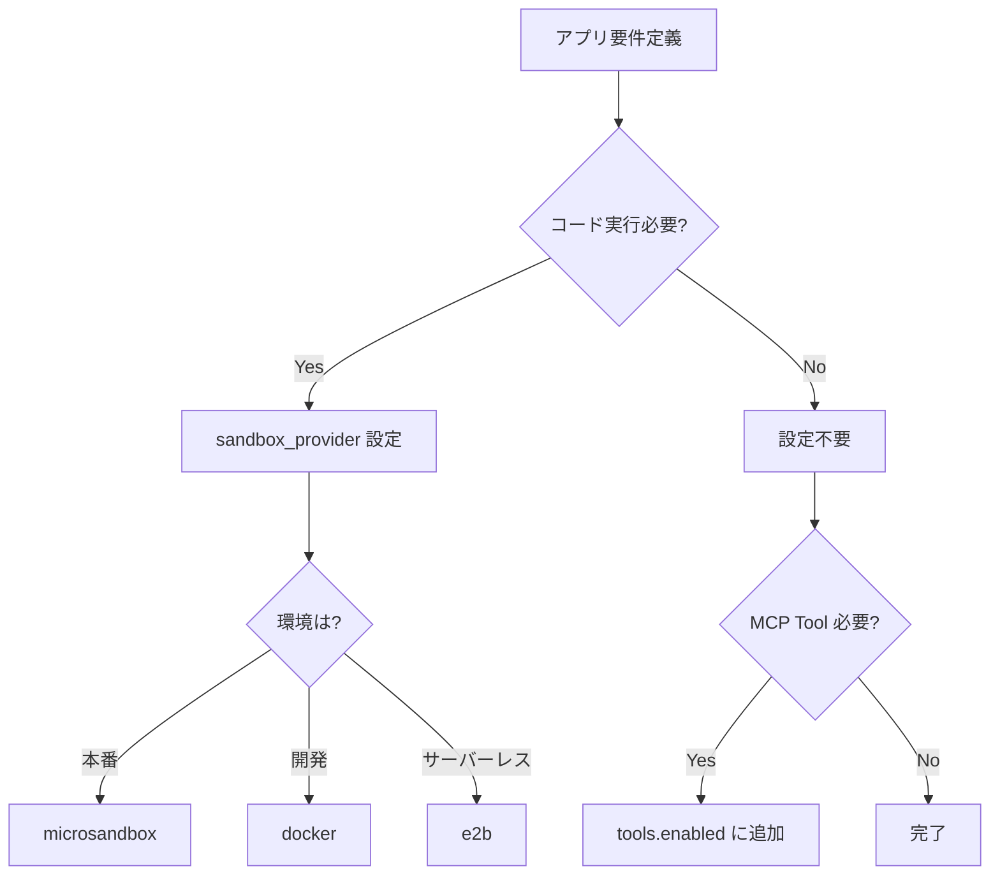

# Agent 開発ガイド

AgentFlow で Agent を開発する手順と、Tool/MCP 設定のカスタマイズ方法を説明します。

---

## 📋 目次

1. [Agent 作成方式](#agent-作成方式)
2. [Tool・MCP 設定](#toolmcp-設定)
3. [サンドボックス設定](#サンドボックス設定)
4. [アプリ固有設定（Spring Boot 方式）](#アプリ固有設定spring-boot-方式)

---

## 🤖 Agent 作成方式

AgentFlow は **3つの Agent 作成方式** を提供します。

### 方式1: @agent デコレータ（最も簡単・推奨）

設定ゼロ、1行でAgent定義。

```python
from agentflow import agent, tool

@agent
class QAAgent:
    """質問応答Agent"""
    
    system_prompt = "あなたは親切なアシスタントです"
    skills = ["chatbot", "rag"]  # オプション: Skills を使用
    
    # サンドボックス設定（オプション）
    sandbox_provider = "microsandbox"  # コード実行を有効化
    
    @tool
    def search_database(self, query: str) -> list:
        """DBを検索"""
        return []

# 呼び出し
result = await AgentClient.get("QAAgent").invoke({"question": "..."})
```

**適用シーン**:
- ✅ 単一Agentの簡単なタスク
- ✅ プロトタイプ開発
- ✅ クイックスタート

---

### 方式2: ResilientAgent 継承（型安全・業務向け）

Pydantic スキーマで型安全な I/O を保証。

```python
from agentflow.core.resilient_agent import ResilientAgent
from pydantic import BaseModel

class MyInput(BaseModel):
    question: str
    context: str | None = None

class MyOutput(BaseModel):
    answer: str
    confidence: float

class MyAgent(ResilientAgent[MyInput, MyOutput]):
    """型安全なAgent"""
    
    name = "MyAgent"
    timeout_seconds = 60
    max_retries = 3
    
    async def process(self, input_data: MyInput) -> MyOutput:
        prompt = self._load_skill_prompt("analysis")
        response = await self._call_llm(prompt)
        return MyOutput(answer=response, confidence=0.9)
```

**適用シーン**:
- ✅ 業務システム
- ✅ 型安全性が重要
- ✅ リトライ・タイムアウト制御

---

### 方式3: create_flow（複数Agent協調）

複数 Agent を順次/並行実行。

```python
from agentflow.flow import create_flow

flow = (
    create_flow("decision-engine")
    .gate(GatekeeperAgent, check=lambda r: r["is_acceptable"])
    .then(ClarificationAgent)
    .then(DaoAgent, FaAgent, ShuAgent, QiAgent)
    .review(ReviewAgent, retry_from="dao", max_revisions=2)
    .build()
)

# 同期実行
result = await flow.run({"task": "..."})

# SSEストリーム
async for event in flow.run_stream({"task": "..."}):
    print(f"{event['type']}: {event.get('node', '')}")
```

**適用シーン**:
- ✅ 複雑なワークフロー
- ✅ マルチAgent協調
- ✅ 進捗追跡が必要

---

## 🔧 Tool・MCP 設定

### フレームワークデフォルト Tool

AgentFlow は以下の内蔵 Tool を提供（設定不要で利用可能）:

| Tool 名 | 説明 | 有効化条件 |
|--------|------|-----------|
| `execute_python` | Python コード実行 | `sandbox_provider` 設定時 |

### MCP Tool 設定（agent.yaml）

```yaml
protocols:
  mcp:
    tools:
      - mcp://text-tools/format     # 使用する Tool
      - mcp://database/query
    resources:
      - mcp://dictionaries/english  # 使用する Resource
```

### @tool デコレータ（カスタム Tool）

```python
@agent
class MyAgent:
    @tool
    def custom_search(self, query: str) -> list:
        """カスタム検索機能"""
        return my_db.search(query)
    
    @tool(cache=True, ttl=3600)
    def cached_fetch(self, url: str) -> str:
        """キャッシュ付き取得"""
        return fetch(url)
```

---

## 🐳 サンドボックス設定

コード実行サンドボックスの Provider を設定。

### サポート Provider

| Provider | 説明 | 推奨用途 |
|----------|------|---------|
| `microsandbox` | microVM ベース（**デフォルト・推奨**）| 本番環境 |
| `docker` | コンテナベース | 開発・オンプレ |
| `e2b` | クラウド SaaS | サーバーレス |

### 設定方法

```python
@agent
class AnalysisAgent:
    sandbox_provider = "microsandbox"  # サンドボックス有効化
    # → execute_python Tool が自動的に利用可能
```

**設定しない場合**: サンドボックス機能は無効（Tool も登録されない）

---

## ⚙️ アプリ固有設定（Spring Boot 方式）

Spring Boot の AutoConfiguration 思想に基づき、AgentFlow は以下の優先順位で設定を適用:

```
アプリ固有設定 > フレームワークデフォルト
```

### 設定ファイル構成

```
my-app/
├── agentflow.yaml          # アプリ固有設定（フレームワーク設定を上書き）
├── agents/
│   ├── agent.yaml          # Agent 固有設定
│   └── my_agent.py
└── tools/
    └── custom_tools.py     # カスタム Tool
```

### agentflow.yaml（アプリ固有設定）

```yaml
# アプリ全体のデフォルト設定
defaults:
  sandbox_provider: microsandbox  # デフォルト Sandbox
  timeout_seconds: 300            # デフォルトタイムアウト
  max_retries: 3                  # デフォルトリトライ回数

# 使用する Tool リスト（ホワイトリスト方式）
tools:
  enabled:
    - execute_python            # サンドボックス
    - mcp://text-tools/format   # MCP Tool
    - mcp://database/query
  disabled:
    - mcp://dangerous/tool      # 明示的に無効化

# MCP サーバー設定
mcp:
  servers:
    - url: http://localhost:3000
      name: text-tools
    - url: http://localhost:3001
      name: database

# LLM 設定
llm:
  provider: azure_openai        # openai | azure_openai | anthropic
  model: gpt-4o
  temperature: 0.5

# 環境別設定
profiles:
  development:
    sandbox_provider: docker    # 開発時は Docker
    llm:
      model: gpt-4o-mini        # コスト削減
  production:
    sandbox_provider: microsandbox
    llm:
      model: gpt-4o
```

### Tool 選択ガイドライン

**アプリ開発時の Tool 選定フロー**:



### 設定例: データ分析アプリ

```yaml
# agentflow.yaml
defaults:
  sandbox_provider: microsandbox  # コード実行を有効化

tools:
  enabled:
    - execute_python              # データ分析
    - mcp://database/query        # DB クエリ
    - mcp://charts/render         # グラフ生成

llm:
  model: gpt-4o
  temperature: 0.2                # 分析用に低め
```

### 設定例: チャットボットアプリ

```yaml
# agentflow.yaml
# サンドボックス不要なので設定なし

tools:
  enabled:
    - mcp://web-search/search     # Web 検索
    - mcp://knowledge/rag         # RAG

llm:
  model: gpt-4o-mini              # コスト重視
  temperature: 0.7                # 対話用
```

---

## 📝 設定優先順位まとめ

| レベル | 設定場所 | 説明 |
|--------|---------|------|
| 1（最高）| Agent クラス属性 | `sandbox_provider = "docker"` |
| 2 | agent.yaml | Agent 固有設定 |
| 3 | agentflow.yaml | アプリ全体設定 |
| 4（最低）| フレームワークデフォルト | 何も設定しない場合 |

---

## 🚀 クイックスタート

### 1. 新しいアプリを作成

```bash
agentflow create my-app --template basic
cd my-app
```

### 2. agentflow.yaml を編集

```yaml
defaults:
  sandbox_provider: microsandbox  # 必要なら設定

tools:
  enabled:
    - execute_python
    # 必要な MCP Tool を追加
```

### 3. Agent を定義

```python
@agent
class MyAgent:
    system_prompt = "..."
    # sandbox_provider は agentflow.yaml から継承
```

### 4. 実行

```bash
agentflow run .
```

---

## 📚 関連ドキュメント

- [Skills ガイド](guide-skills.md) - Skills の使い方
- [MCP プロトコル](protocols.md) - MCP 詳細
- [CLI リファレンス](cli.md) - CLI コマンド一覧

