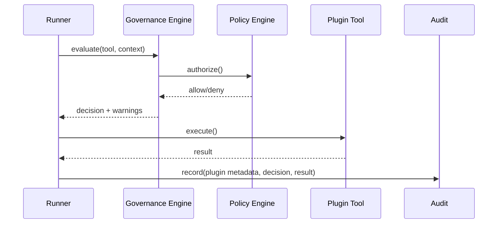

# Kernel アーキテクチャ（内部）

## 1. Kernel の安定境界

Kernel に含める:

- Plugin Loader
- Runner / Agent 実行モデル
- Tool 標準契約
- Policy Hook
- Audit 連鎖
- Runtime Context

Kernel から除外する:

- 外部プロトコル実装本体
- 製品別業務ロジック
- 企業個別コネクタ
- 実験機能の本体実装

## 2. ガバナンス経路

## 3. 実装判断ルール

1. Core 不変要素でない機能は Plugin 化する。
2. Studio で副作用ツールを使う場合は `plugin_id + manifest` を必須にする。
3. Framework モードは開発利便性のため警告許可を維持する。
