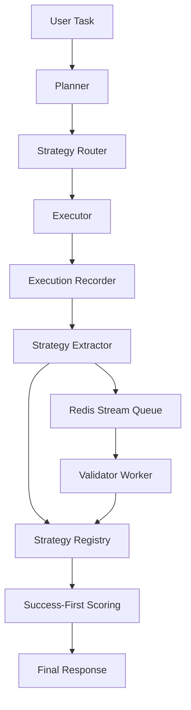

# Evolution V2 アーキテクチャ

最終更新: 2026-02-20

## 概要

AgentFlow は Evolution Layer を導入し、成功経路の抽出・検証・再利用を標準フローに統合する。

- 目的: 反復試行の削減、成功率の向上、企業内での安全な知見継承
- 方針: Postgres 主体、SQLite 互換、Redis Streams 検証キュー
- 検索順序: `tenant+app -> tenant+product_line -> global_verified`

## 実行フロー

## Strategy Service API

- `POST /v1/strategies/search`
- `POST /v1/strategies/register`
- `POST /v1/strategies/{strategy_id}/score-update`
- `POST /v1/validations/result`
- `POST /v1/executions/events:batch`
- `GET /v1/health`

## Retrieval Gate V2

以下の固定ルールを使用する。

1. `explicit_request=True` または `recent_failures>=2` -> `deep_retrieval`
2. `self_confidence>=0.82` かつ `complexity<=0.35` かつ `novelty<=0.40` かつ `staleness_risk=low` -> `skip`
3. `self_confidence<0.55` または `complexity>=0.70` または `novelty>=0.65` -> `deep_retrieval`
4. それ以外 -> `light_retrieval`

## 疑義（Suspect）判定

以下のいずれかで `suspect` へ降格し、検証キューへ投入する。

- `failure_streak >= 2`
- `success_7d < success_30d * 0.8`
- `environment_fingerprint mismatch`
- `last_verified_at` が `max_age_days(30)` を超過

## 主要ファイル

- `agentflow/evolution/*`
- `agentflow/orchestration/orchestrator.py`
- `agentflow/orchestration/executor.py`
- `agentflow/context/retrieval_gate.py`
- `agentflow/context/context_engineer.py`
- `agentflow/evolution/storage/models.py`
- `contracts/evolution/*.json`
