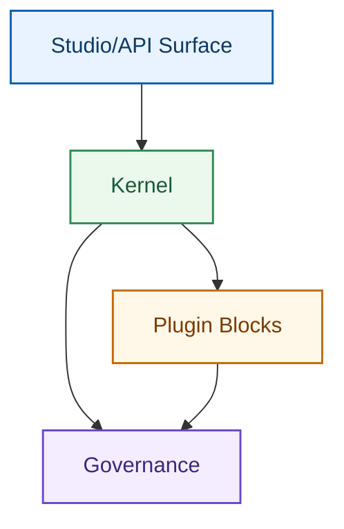

# レイヤー設計

## 1. 論理レイヤー

1. Product Surface（3 Studio）
2. Platform API Surface（`/api/studios/*`）
3. Kernel（Loader / Runner / Policy Hook / Audit / Runtime Context）
4. Plugin Blocks（Tool / SkillPack / Protocol Adapter / Channel / Deploy / Runner）
5. Governance（Risk / Permission / Signature / Audit）

## 2. 設計原則

1. 製品固有ロジックを Kernel に入れない。
2. プロトコルの具体実装を Kernel に入れない。
3. 副作用操作は必ずガバナンス連鎖を通す。
4. Core 追加前に公式 Plugin 化を検討する。

## 3. 内部向けレイヤー図（境界重視）

