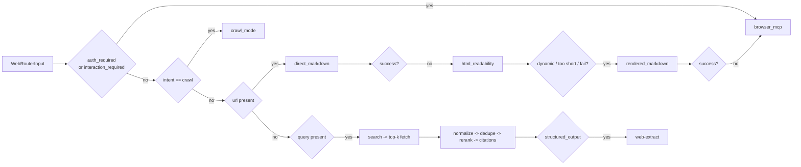

# Web Intelligence Architecture

Web Intelligence 7章の実装方針と責務分担をまとめる。

## 概要

- 入口は `kernel/web/intelligence_router.py` の `WebIntelligenceRouter`
- 実 orchestration は `shared/web/router_service.py` の `DefaultWebRetrievalRouter`
- provider 実装は `infrastructure/providers/web/` に集約
- canonical 契約は `contracts/web/contracts.py`

## Routing Order

## Provider Responsibilities

- `search/`
  - external search API を優先
  - `.env` に API key が無い場合のみ internal fallback
- `fetch/`
  - `direct_markdown -> html_readability -> rendered_markdown`
  - 各段で `reason`, `provider`, `fallback_used`, `dynamic_hint` を metadata に保持
- `extract/`
  - `title/date/price/table/faq/summary` を deterministic に抽出
  - schema 不一致は空文字ではなく欠損扱い
- `browser/`
  - 既定は Playwright MCP
  - `legacy_playwright` は互換 fallback
- `crawl/`
  - same-domain を維持しながら fetch pipeline を再利用

## Data Flow

1. skill script が `WebRouterInput` を構築する
2. router が mode を決定する
3. provider 実行後に `dedupe / rerank / citation / quality score` を共通適用する
4. `structured_output=true` の場合は抽出を追加する
5. `WebRouterOutput.metadata` に mode 別の observability を格納する

## 層構造

- `contracts`: `BrowserActionStep`, `WebRouterInput`, `WebRouterOutput`, `WebRetrievalRouter`
- `shared`: orchestration, cache, citation, rerank, normalization
- `infrastructure`: search/fetch/extract/browser/crawl provider
- `kernel`: 外部公開入口と skill runtime 接続
