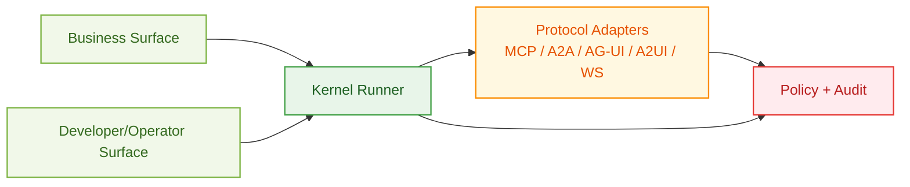

# Protocols and Adapters (Internal)

Last Updated: 2026-02-17
Audience: Developer / Operator

## 1. Scope

This document is for internal implementation. Business users should not be exposed to protocol-level details.

- Business surface: only Studio workflow and artifacts
- Developer/operator surface: protocol adapters, channel wiring, policy controls

## 2. Protocol Position in Architecture

## 3. Protocol Usage Policy

1. Protocols are implementation detail, not product entry.
2. Side-effect operations must go through policy and audit chain.
3. Protocol adapters are pluginized; do not hardcode them into product logic.
4. Business profile audit does not enforce protocol-surface checks (A2A/MCP/stream).
5. Developer profile audit keeps protocol checks enabled.

## 4. Adapter Categories

- MCP adapter: tool/resource integration
- A2A adapter: agent-to-agent coordination
- AG-UI/A2UI adapter: UI event and component transport
- WebSocket adapter: bidirectional session interaction

## 5. Operational Checklist

- Declare adapter capabilities and risk tier in plugin manifest.
- Bind required permissions explicitly.
- Validate compatibility against kernel and product line versions.
- Capture audit records for adapter execution paths.
