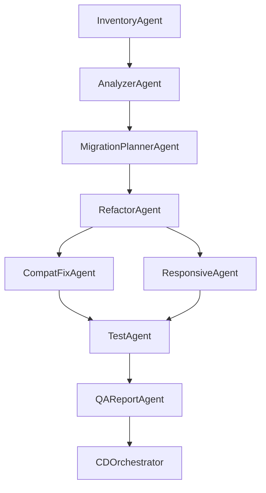

# 旧フロントエンド → レスポンシブ現代フロントエンド移行システム設計書

## 1. プロジェクト概要

### 1.1 ビジネス目標
**入力**: 大量の HTML / JSP / ES5 JS / 旧版 CSS ファイル群
**出力**: TypeScript + React (or SolidJS) ベースのコンポーネント化フロントエンド
- CSS Grid / Flexbox を活用したレスポンシブデザイン
- WCAG 2.2 AA 準拠のアクセシビリティ
- Safari / Edge / Chrome / Firefox 及び iOS / Android / Windows / macOS / iPadOS での無障害レンダリング

### 1.2 既存ai_blocksライブラリの活用
本プロジェクトは既存の`ai_blocks`ライブラリのコアコンポーネントを最大限活用し、不足部分のみ追加実装します：

**活用可能なコンポーネント**:
- `ai_blocks.core.memory.VectorMemory`: コード解析結果の記憶・検索
- `ai_blocks.core.tool.ToolManager`: 各種変換ツールの管理
- `ai_blocks.core.parser.HTMLParser`: HTMLファイル解析
- `ai_blocks.core.router.LLMBasedRouter`: 処理フロー制御
- `ai_blocks.architectures.prompt_chaining.PromptChain`: 段階的変換処理

## 2. エージェント構成とワークフロー


======================================
```mermaid
graph TD
  subgraph UI/API層
    A1[チャットUI<br>（Next.js / Gradio）]
    A2[API Gateway<br>（FastAPI）]
  end

  subgraph 推論・オーケストレーション
    B1[LLM 推論サーバ<br>（vLLM / TGI）]
    B2[Agent Controller<br>（LangGraph / CrewAI）]
    B3[ツールラッパー<br>（SearchTool / Python Executor）]
  end

  subgraph RAG基盤
    C1[ドキュメント埋め込み<br>(LangChain Embedding)]
    C2[ベクトルDB<br>(Qdrant / FAISS)]
    C3[検索パイプライン<br>(Retriever)]
  end

  subgraph モニタリング・DevOps
    D1[ログ / メトリクス<br>(Prometheus / OpenTelemetry)]
    D2[学習・実験管理<br>(wandb / mlflow)]
    D3[CI/CDパイプライン<br>(GitHub Actions)]
  end

  A1 --> A2 --> B2
  B2 --> B1
  B2 --> B3
  B2 --> C3 --> C2
  C3 --> C1
  B2 --> D1
  B1 --> D1
```
### 2.1 エージェント詳細仕様

| エージェント | 主要責任 | 入力→出力 | ai_blocks活用 |
|-------------|---------|-----------|---------------|
| InventoryAgent | Git リポジトリ清単 & 依存バージョンスキャン | repo → manifest.json | `ToolManager` + 新規ツール |
| AnalyzerAgent | AST 解析、テンプレートエンジン検出、インラインスクリプト特定 | manifest → issue_list.json | `HTMLParser` + `VectorMemory` |
| MigrationPlannerAgent | 移行ブループリント生成：技術スタック、ページ別戦略、優先度 | issue_list → plan.yaml | `LLMBasedRouter` + `PromptChain` |
| RefactorAgent | plan に従い JSP → TSX、コンポーネント分割、Tailwind 導入 | plan.yaml → patch_PR | `PromptChain` + 新規ツール |
| CompatFixAgent | MDN データベースと Can I Use API を活用した Polyfill 設定生成 | patch_PR → patch_PR | `ToolManager` + 新規ツール |
| ResponsiveAgent | @media / container queries、Flex/Grid レイアウト生成 | patch_PR → patch_PR | `PromptChain` + 新規ツール |
| TestAgent | Playwright＋axe-core 自動化：4ブラウザ×3解像度×WCAG | patch_PR → test_report.json | `ToolManager` + 新規ツール |
| QAReportAgent | カバレッジ、Lighthouse スコア、視覚回帰差異の集約 | test_report → report.pdf | `VectorMemory` + 新規ツール |
| CDOrchestrator | 自動 PR 作成、CI/CD トリガー、グレースケールリリース | report.pdf → deployment | `ToolManager` + 新規ツール |

## 3. 品質保証とテスト戦略

### 3.1 多段階テスト構成

| 段階 | 手段 | ツール | 基準値 |
|------|------|--------|--------|
| 静的解析 | ESLint (TypeScript)、stylelint (CSS) | SonarQube プラグイン | エラー 0 件 |
| 単体テスト | React Testing Library / Vitest | 既存テストフレームワーク | カバレッジ 80%+ |
| 統合テスト | Playwright Cloud / Matrix | Edge 124, Safari 18 TP… | 全ブラウザ通過 |
| パフォーマンス | Lighthouse CI | 自動化スクリプト | LCP < 2.5s, CLS < 0.1 |
| アクセシビリティ | axe-core + pa11y | 自動化テスト | WCAG 2.2 AA 全通過 |
| 視覚回帰 | Percy / reg-suit | 画像比較 | フレーム差 < 0.1 |
| レポート | Allure + mkdocs‑material | 自動生成 | PDF / HTML 双出力 |

### 3.2 テスト実行環境
- **ブラウザマトリックス**: Chrome 131+, Firefox 133+, Safari 18+, Edge 131+
- **デバイス**: Desktop (1920x1080), Tablet (768x1024), Mobile (375x667)
- **OS**: Windows 11, macOS Sonoma, iOS 18, Android 14

## 4. アーキテクチャ設計

### 4.1 システム構成図

```
┌────────────────────────────────────────────┐
│  Browser / CLI / API Client               │
└──────┬──────────────────┬─────────────────┘
       │ GraphQL Gateway  │
       ▼                  ▼
   ┌─────────┐       ┌──────────┐
   │ Orchestr│──────▶│ Event Bus│ Kafka
   │  ator    │       └──────────┘
   └─▲──┬──▲──┘              ▲
     │  │  │                 │
╭────┴╮┴──┴╮╭───────╮  ╭──────┴─────╮
│Agent Runner│  …  │Agent Runner│
╰───────┬────╯      ╰───────┬─────╯
        │  Container (Docker)│
        ▼                   ▼
  Runtime SDK (lib)   Model Gateway (vLLM/Bedrock)
```

### 4.2 コンポーネント詳細

**Agent Runner**: 各エージェントを独立したコンテナイメージとしてパッケージ化。`agent‑sdk` を通じてログ & トレーシングを注入。

**Orchestrator**: Temporal を使用（リトライ/補償をサポート）。フロー記述は YAML または Python DSL を使用。

**Event Bus**: Kafka を使用。トピック粒度は `projectID.stage.agentName` で、サブスクリプションと監査を容易にする。

**Model Gateway**: LLM 呼び出しの統一封装（OpenAI、Bedrock、Ollama、vLLM）。自動リトライとコスト追跡機能付き。

**CI/CD**: GitHub Actions + ArgoCD。テスト通過→k8s グレースケール。失敗時は前バージョンに自動ロールバック。

**Observability**: OpenTelemetry + Prometheus + Grafana。ビジネス指標（転換率、初回画面 TTI）をサイドカーで収集。

## 5. 実装ステップ

### 5.1 フェーズ1: プロジェクト初期化
1. `products/frontend_migration/` ディレクトリ作成
2. 既存 `ai_blocks` ライブラリの依存関係設定
3. Docker 環境とローカル開発環境のセットアップ

### 5.2 フェーズ2: コアエージェント実装
1. 既存コンポーネントを活用したベースエージェント作成
2. 不足機能の追加実装（AST解析、CSS変換等）
3. エージェント間通信インターフェースの定義

### 5.3 フェーズ3: ワークフロー編成
1. Temporal DSL によるワークフロー定義
2. エラーハンドリングとリトライ機構の実装
3. 進捗監視とログ収集システムの構築

### 5.4 フェーズ4: テストとデバッグ
1. ローカル環境での `docker‑compose up → make e2e` テスト
2. 各エージェントの単体テスト実装
3. 統合テストとパフォーマンステストの実行

### 5.5 フェーズ5: CI/CD統合
1. GitHub Actions への統合
2. Kubernetes デプロイメント設定
3. Argo Rollout によるブルーグリーンデプロイメント
4. Grafana による LCP/エラー率リアルタイム監視とアラート設定

## 6. リスク管理と対策

### 6.1 技術的リスク
- **レガシーコード解析の複雑性**: 段階的移行とフォールバック機構を実装
- **ブラウザ互換性問題**: 包括的なテストマトリックスと Polyfill 自動生成
- **パフォーマンス劣化**: 継続的な監視とボトルネック自動検出

### 6.2 運用リスク
- **デプロイメント失敗**: 自動ロールバックとカナリアリリース
- **監視盲点**: 多層監視とアラート設定
- **スケーラビリティ**: Kubernetes HPA とリソース監視

## 7. 成功指標

### 7.1 技術指標
- コード変換精度: 95%以上
- テスト自動化カバレッジ: 90%以上
- デプロイメント成功率: 99%以上

### 7.2 ビジネス指標
- 開発効率向上: 70%以上
- バグ発生率削減: 80%以上
- ユーザー体験スコア向上: 30%以上
