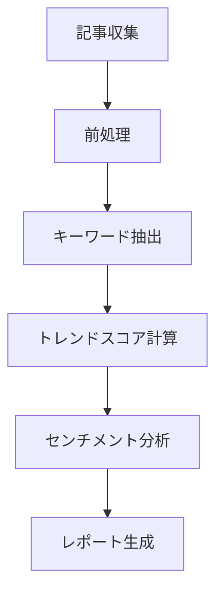

# 市場動向分析 SOP（Standard Operating Procedure）

## 1. 目的

市場動向を定量的・定性的に分析し、意思決定支援のためのインサイトを抽出する。

## 2. 分析フロー

## 3. 入力要件

| 項目 | 必須 | 説明 |
|------|------|------|
| articles | ○ | 分析対象記事配列 |
| articles[].id | ○ | 一意識別子 |
| articles[].title | ○ | 記事タイトル |
| articles[].content | × | 記事本文 |
| articles[].source | × | ソース種別 |
| analysis_options | × | 分析オプション |

## 4. 処理ステップ詳細

### 4.1 入力検証（確定性）

- `scripts/validate_input.py` を使用
- 必須フィールドの存在確認
- 型の正規化
- 境界値チェック

### 4.2 キーワード抽出（確定性）

- `scripts/extract_keywords.py` を使用
- ストップワード除外
- 技術キーワード重み付け
- TF-IDF相当のスコアリング

### 4.3 トレンドスコア計算（LLM推論）

- キーワード頻度から基礎スコア算出
- LLMによる文脈的重要度評価
- 時系列での成長率計算

### 4.4 センチメント分析（LLM推論）

- 3段階評価: positive / negative / neutral
- 信頼度スコア付与
- バイアス軽減のためのプロンプト設計

### 4.5 レポート骨格生成（確定性）

- `scripts/generate_report_skeleton.py` を使用
- テンプレートベースの構造生成
- LLM生成部分のプレースホルダー配置

## 5. 出力検証（Acceptance Criteria）

□ trends配列が存在する
□ 各trendに必須フィールドが含まれる
  - topic: 文字列
  - score: 0.0-1.0
  - sentiment: enum
  - growth_rate: -1.0 to 1.0
□ 入力articles数 > 0 なら trends数 >= 1
□ メタデータに分析タイムスタンプ

## 6. エラー処理

| エラー種別 | 対処 |
|-----------|------|
| 空入力 | 空trendsを返却（正常終了） |
| 不正フォーマット | ValidationError発生 |
| LLM呼び出し失敗 | センチメント=neutral でフォールバック |
| タイムアウト | 部分結果を返却 |

## 7. 監査ログ

分析実行時に以下を記録:
- 実行タイムスタンプ
- 入力記事数
- 抽出トレンド数
- 使用LLMモデル
- 処理時間

